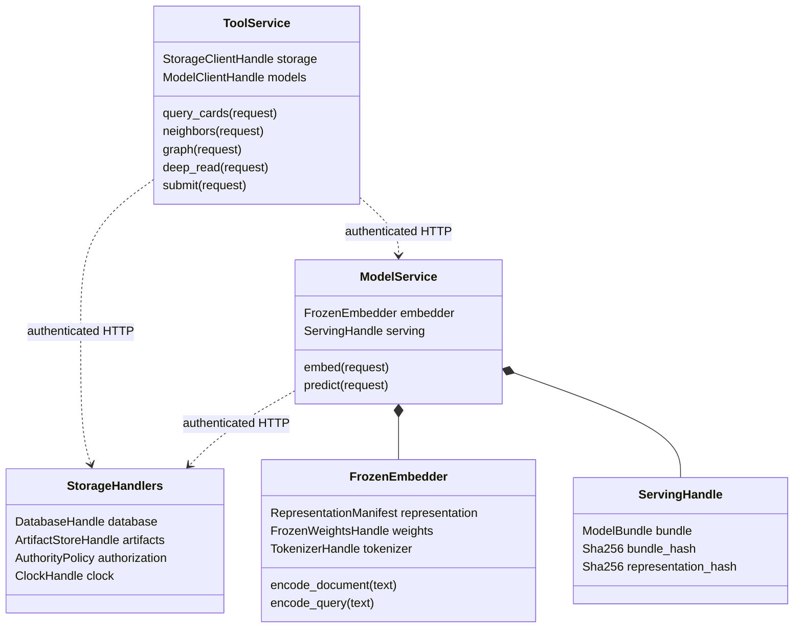

# Technical Design Description

How the software is built to meet each requirement, item by item, with the code and tests that carry it.

## Document map

- [Functions, class members and ownership](#implementation-interface-map)
- [Requirement-by-requirement implementation and verification](#requirement-designs)

- [Shared implementation rules](#shared-contracts)
- [Contract notation and ownership](#contract-conventions)
- [Storage contracts](#storage-contracts)
- [Agent and presentation contracts](#agent-contracts)
- [Learning and assessment contracts](#learning-contracts)
- [Service APIs](#service-api)
- [Operations contracts](#operations-contracts)

<a id="implementation-interface-map"></a>
## Implementation interface map

This section fixes callable boundaries and object members; the requirement-specific items explain their algorithms and prohibited alternatives. Types in the record catalog are immutable value objects with exactly the enumerated fields, no hidden wire members and no implicit coercion. API handlers are async; pure numerical functions are synchronous. Dependency handles are process-local and never serialized into a contract.

### Interface notation and ownership

`Result<T> = Ok{value:T} | Err{error:STORAGE.Error}` is an internal discriminated result, not a second HTTP envelope. Adapters translate it once into the specified Reply or ToolResult. `Vector768`, `Vector1536`, and `VectorN` mean finite in-memory numeric arrays with the dimensions and dtypes given in the learning contracts; `VectorN` preserves its owning TrainingArrays row order. A tensor reference is resolved and checksum-checked before a numerical call. Immutable source records remain separate from decoded arrays.

Every route table enumerates its handler member alongside its exact request and response contract. A row defines `async member(request: RequestColumn, *, context: RequestContext | AnonymousContext) -> ResponseColumn`; path/query fields are included in RequestColumn, multipart payloads are bounded byte streams, and a no-body request has no JSON body argument. Success status, wrapping and errors follow that table's transport rules, not a generic inferred JSON response. Methods with inline request records use that literal closed record as their argument type. Route names are adapter members, not new public endpoints.

```text
AnonymousContext = {request_id: RecordId}
RequestContext = {
  request_id: RecordId,
  principal_id: RecordId,
  role: STORAGE.Role,
  scope: ServiceScope | RunScope,
  idempotency_key: RecordId | null
}
ServiceScope = {kind: "service"}
RunScope = {kind: "run", run_id: RunId, snapshot_id: SnapshotId}
```

AnonymousContext is accepted only by the explicitly anonymous login/session-establishment routes. All other routes reject it. RequestContext is created only by authentication middleware. ServiceScope still requires per-route authorization and artifact visibility checks; it grants no blanket access. A run capability derives run/snapshot scope from the admitted capability, never caller-supplied context. Mutating command routes require a nonnull idempotency key. Private web adapters derive role rating_app and authenticated rater identity from the session; they do not trust a form field for identity. Secrets, certificates and capability tokens are excluded from this object and from artifacts.

Each named value-record implementation exposes `from_json(raw: bytes) -> Result<Self>` and `to_canonical_json() -> bytes`. The first rejects malformed, unknown or missing fields and enforces the listed local invariants; cross-record existence/authorization checks remain with the service owner. The second emits the single canonical serialization defined below. Members are the exact fields listed in the owning schema, with RecordMeta included only where the schema declares it. Union wrappers dispatch on their documented discriminator; they cannot construct an unspecified variant. Binary tensor payloads use their declared binary encoding rather than JSON.

### Service members and dependencies

| Class / module | Constructor members, read-only after construction | Callable members |
| --- | --- | --- |
| `StorageHandlers` | `database: DatabaseHandle`, `artifacts: ArtifactStoreHandle`, `authorization: AuthorityPolicy`, `clock: ClockHandle` | Every named member in the storage route table; all durable writes execute here |
| `ServiceHandlers` | `storage: StorageClientHandle`, `models: ModelClientHandle`, `authorization: AuthorityPolicy`, `clock: ClockHandle` | Members in the non-storage API tables; service-specific instances receive only dependencies needed by their routes |
| `OperationsHandlers` | `storage: StorageClientHandle`, `authorization: AuthorityPolicy`, `clock: ClockHandle` | Members in the operations route table; storage-hosted operations execute through StorageHandlers' transaction owner |
| `ToolService` | `storage: StorageClientHandle`, `models: ModelClientHandle`, `clock: ClockHandle` | `query_cards`, `neighbors`, `graph`, `deep_read`, `submit`; each accepts its named ToolRequest and returns its matching ToolResult |
| `ModelService` | `embedder: FrozenEmbedder`, `storage: StorageClientHandle`, `serving: ServingHandle` | `embed(request: EmbedRequest) -> Result<EmbedResult>`; `predict(request: PredictRequest) -> Result<PredictResult>` |
| `FrozenEmbedder` | `representation: RepresentationManifest`, `weights: FrozenWeightsHandle`, `tokenizer: TokenizerHandle` | `encode_document(text: NonEmptyString) -> Result<Vector768>`; `encode_query(text: NonEmptyString) -> Result<Vector768>`; distinct pinned prefix policies |
| `ServingHandle` | `bundle: ModelBundle`, `bundle_hash: Sha256`, `representation_hash: Sha256` | Immutable per-request binding; activation replaces the storage pointer, never these members in place |
| `LedgerRepository` | `transaction: TransactionHandle` | Append only inside the caller's storage transaction; no autonomous nested commit |
| `JobRepository` | `database: DatabaseHandle`, `clock: ClockHandle` | Claim/renew/checkpoint/complete signatures are exactly the storage job-route records; lease fences checked in the write transaction |

Handles above are implementation dependencies, not new persisted types: DatabaseHandle is the storage-only connection pool; TransactionHandle is one live database transaction; ArtifactStoreHandle is the storage-only artifact root/stream interface; StorageClientHandle and ModelClientHandle are authenticated HTTP clients restricted by role; ClockHandle supplies UTC and monotonic reads; FrozenWeightsHandle and TokenizerHandle are verified loaded local model objects. These handles never cross service boundaries. No non-storage class receives DatabaseHandle, TransactionHandle or writable ArtifactStoreHandle.



### Core function signatures

These are module-level domain functions; HTTP handlers supply authenticated context and persistence. Errors return Result, preserving the typed failure reason rather than replacing missing data with zero. Inputs named fit/development/calibration/evaluation must have those exact disjoint partition identities. State changes go through the storage API or an already-open storage transaction.

| Function | Exact input and output | Implementation constraint |
| --- | --- | --- |
| `outcomes.resolve.resolve_target` | `(target: TargetDefinition, paper: PaperVersionRecord, observation: CitationObservation, as_of: UtcInstant) -> Result<AutomaticLabel>` | Shared conservative interval, identity and pagination resolver; unavailable/unknown is represented in AutomaticLabel |
| `learning.features.assemble_features` | `(overview: EmbeddingRecord, passages: list<EmbeddingRecord>, source_passages: list<PassageRecord>, representation: RepresentationManifest) -> Result<CombinedFeatureRecord>` | Resolve verified tensors through a read-only artifact client; preserve exact passage ordering and overlap weights |
| `learning.fit.fit_head` | `(target: TargetDefinition, fit: TrainingArrays, development: TrainingArrays) -> Result<LinearHead>` | Five fixed regularization candidates; no calibration or evaluation rows inspected |
| `learning.calibration.fit_calibrator` | `(head: LinearHead, calibration: TrainingArrays) -> Result<SigmoidCalibrator>` | Nonnegative slope; fixed objective, initialization and convergence criteria |
| `learning.bundles.validate_bundle` | `(bundle: ModelBundle, registry: TargetRegistry, representation: RepresentationManifest) -> Result<ModelBundle>` | Return the same validated value; do not repair mismatches |
| `models.predict.predict_targets` | `(request: HeadInferenceRequest) -> Result<PredictionArtifact>` | Scoped read-only artifact resolution; internal logits remain outside public projection |
| `retrieval.passages.build_passages` | `(extraction: ExtractionRecord, representation: RepresentationManifest) -> Result<list<PassageRecord>>` | Section-aware ordered source spans and exact overlap policy |
| `retrieval.passages.search_passages` | `(request: ToolRequest<QueryCardsArgs>) -> Result<QueryCardsData>` | Search-mode arguments only; existing snapshot and retrieval budgets apply |
| `reader.extract.extract_latex` | `(paper_version_id: PaperVersionId, source_hash: Sha256, extractor_manifest_hash: Sha256, latex_source: string, created_at: UtcInstant) -> Result<ExtractionRecord>` | Non-executing source parsing only; never invokes a TeX compiler |
| `reader.extract.extract_pdf` | `(paper_version_id: PaperVersionId, source_hash: Sha256, extractor_manifest_hash: Sha256, pages: list<PdfPage>, created_at: UtcInstant) -> Result<ExtractionRecord>` | Structures an already-obtained PDF text layer; an image-only page is recorded unreadable, never run through OCR |
| `reader.chunk.chunk_passages` | `(extraction: ExtractionRecord, canonical_text: string, extraction_hash: Sha256, tokenizer: SectionTokenizer) -> Result<list<PassageRecord>>` | Private helper behind `retrieval.passages.build_passages`; the caller supplies the pinned tokenizer |
| `reader.cards.assemble_card` | `(input: CardBuildInput) -> Result<PaperCardBody>` | Read only declared committed inputs; return snapshot-free body, then storage publishes it |
| `assessments.input.build_assessment_input` | `(paper: PaperVersionRecord, extraction: ExtractionRecord, rubric: JevRubric, provider: JevProviderIdentity) -> Result<JevAssessmentInput>` | Original-paper content only; no citation outcomes or attention metadata |
| `environment.sealing.validate_probability` | `(probability: Probability) -> Result<Probability>` | Reject nonfinite/out-of-range/coerced values before submission transaction |
| `storage.submissions.commit_submission` | `(request: ToolRequest<SubmitArgs>, context: RequestContext) -> Result<SubmitData>` | Storage-only transaction validates all answers and nominations, then commits atomically |

Functions requiring artifact resolution receive a module service's StorageClientHandle dependency; pure fitting receives already materialized arrays matching TrainingArrays. Artifact publication is explicit after successful computation, not a hidden side effect of a pure numerical function. Existing requirement trace comments enumerate additional internal owners and their verification cases; their private helpers may be decomposed without changing these public/domain contracts.

## Document control

| Field               | Value                                                                                                                                |
| ------------------- | ------------------------------------------------------------------------------------------------------------------------------------ |
| Product             | research-agent.                                                                                                                |
| Target version      | First application release.                                                                                                           |
| Scope               | The design of what [SDD.md](SDD.md) requires, and nothing it does not.                                                               |
| Authority           | This document decides how the software is built. Where code and this document disagree, one is wrong; say which, with evidence.      |
| Companion documents | [SDD.md](SDD.md) states what the software must do. [SPEC-AMENDMENTS.md](SPEC-AMENDMENTS.md) records each change to either.           |
| Change control      | A pull request cites an accepted decision under `docs/decisions/`, edits the exact lines, and appends a row to the amendment ledger. |

## Normative language

- "must" states a requirement.
- "must not" states a prohibition.
- No other word makes a requirement. A proposal that is not decided is a GitHub issue and does not appear here.

## Conventions

- Each item is a `#### TDD-<section>.<n> Title` heading.
- A trace comment follows it: `<!-- id: TDD-x.y.z | implements: XX-nn | code: path#Symbol | tests: path or none | status: ... -->`.
- Items are numbered in reading order. A cited item is never renumbered; new items are appended.
- Status is one of `implemented`, `pending:#issue` (decided, not yet implemented) or `deviation:#issue` (the code does not yet meet it).
- The document states design only. Implementation progress, plans, ordering and evidence live in GitHub issues, `docs/implementation/` and `docs/evidence/`; the trace status is the only implementation state recorded here.

Example, not part of the specification:

```text
#### TDD-1.1.1 Reject a request without a credential

<!-- id: TDD-1.1.1 | implements: XX-01 | code: src/http/auth.ts#requireCredential | tests: tests/http/auth.test.ts | status: pending:#12 -->

The request handler calls `requireCredential` before routing. It returns the rejection response and logs the request id once.
```

The shared implementation boundary is [Shared implementation rules](#shared-contracts): identity, storage ownership, typed APIs, permissions, transaction order and lifecycle. The [detailed contract catalog](#contract-conventions) supplies exact schemas, service request/response shapes, storage constraints, algorithms and failure cases. The items below specialize those contracts. Implementation state is carried by each trace comment's status, not by prose.

<a id="requirement-designs"></a>
## 1. Historical learning and evidence

### 1.1 Corpus, labels and qualified prediction heads

These items define the learning subsystem. Python module names establish a concrete package boundary; runtime, storage ownership and check commands are fixed in Appendix A — Launch profile; implementation builds lock and test the dependency/image manifests.

#### TDD-1.1.1 Versioned automatic target registry

<!-- id: TDD-1.1.1 | implements: EN-12 | code: src/research_agent/outcomes/targets.py#registry | tests: tests/outcomes/test_targets.py | status: pending:#66 -->

Store the three automatic-citations-v1 records in fixed order with source, predicates, thresholds, elapsed-day windows, grace, capture allowance, identity/taxonomy rules and definition hash. Questions embed that immutable identity. Resolver inputs are preserved citation observations, never current counters, human semantic verdicts or Jev answers. Reject id/version reuse with changed bytes. Test the exact 5-family, two-window and 2-subfield predicates.

#### TDD-1.1.2 Event and collection clocks

<!-- id: TDD-1.1.2 | implements: EN-13 | code: src/research_agent/outcomes/windows.py#OutcomeWindow | tests: tests/outcomes/test_windows.py | status: pending:#66 -->

Represent instants in UTC and provider dates as full half-open day intervals. Compute the 365-day event end and 90-day maturity allowance; enforce a capture starting at or after maturity and completing by maturity plus 24 hours. Record the 24-hour forecast seal deadline independently. Determine definite/possible inclusion at t0, day 180, 270 and 365, and preexisting-predicate exclusion per target. Pass time explicitly into the resolver. A late historical acquisition is marked reconstructed, never backdated.

#### TDD-1.1.3 Three independent bibliometric outcomes

<!-- id: TDD-1.1.3 | implements: EN-15 | code: src/research_agent/outcomes/resolve.py#Resolver.resolve_target | tests: tests/outcomes/test_resolution.py | status: pending:#66 -->

Return three true/false/unknown records with witnesses or completion proof, bounds and reason. Count canonical citing families once; self-author citations remain included. Reach ignores taxonomy, late activity requires distinct dated families in both windows, breadth counts distinct non-target primary subfields. Test zero/all/overlapping positives, duplicate versions and missing target subfield masking breadth alone. Report correlation without assuming independent outcomes.

#### TDD-1.1.4 Coverage denominators

<!-- id: TDD-1.1.4 | implements: EN-39 | code: src/research_agent/learning/coverage.py#summarize_support | tests: tests/learning/test_coverage.py | status: pending:#65 -->

Left join source observations, original-text features and automatic labels to the original selection manifest. Preserve failed requests and monthly/weekly shortfalls. Report source matching, capture completion, date/taxonomy availability, feature coverage and per-target unknown reasons by publication period and source-subfield, with missing-subfield as its own group. A release cannot start its denominator from successful rows or hide target-text exclusions.

#### TDD-1.1.5 Deterministic source corrections

<!-- id: TDD-1.1.5 | implements: IN-12 | code: src/research_agent/outcomes/corrections.py#CorrectionService | tests: tests/outcomes/test_corrections.py | status: pending:#64 -->

Accept replacement preserved source evidence or an identified resolver defect. Recompute under the specified protocol, append label versions and dependency lineage, and retain sealed forecasts. No reviewer assignment or adjudication service exists for launch prediction-head labels. Rating and Jev schemas have no label-write authority. Test source correction propagation and refusal of a preference-only correction.

#### TDD-1.1.6 Resumable corpus stages

<!-- id: TDD-1.1.6 | implements: PL-11 | code: src/research_agent/learning/jobs.py#CorpusPipeline | tests: tests/learning/test_resume.py | status: pending:#64 -->

Checkpoint acquisition, extraction, identity reconciliation, automatic resolution, encoding and release assembly independently. Keys combine stage version, ordered input hashes and configuration hash. Verify temporary artifacts before committing the manifest. Interrupted label work reuses original papers, raw citation responses and embeddings. A failed target cannot expose a partial release or trigger unchanged paid acquisition.

#### TDD-1.1.7 Manifest dependency barrier

<!-- id: TDD-1.1.7 | implements: PL-17 | code: src/research_agent/artifacts/manifests.py#ManifestResolver | tests: tests/artifacts/test_manifests.py | status: pending:#64 -->

A dependent job accepts a release id, resolves its immutable manifest, verifies terminal success and all referenced artifact hashes, then records that exact dependency. Raw directory contents are not an accepted input interface. Inference holds the previously activated manifest independently of running jobs. Exercise interruption after individual file writes but before manifest commit to prove partial output stays invisible.

#### TDD-1.1.8 Masked three-head fitting

<!-- id: TDD-1.1.8 | implements: FT-08 | code: src/research_agent/learning/fit.py#fit_head | tests: tests/learning/test_fit.py, tests/learning/test_heads.py | status: implemented -->

Accept X float32 [N,2d], Y boolean [N,3], M boolean [N,3], row ids and ordered manifests. Fit each logistic model on its own known rows with the exact objective and numeric settings in Appendix B — Learning protocol. Use float64 optimization, unpenalized intercept and plain numeric artifacts. Reject nonfinite inputs, mismatched target order, single-class support and incompatible representation ids. Numerical-gradient and mask-invariance tests exercise the real optimizer; no encoder weights change.

#### TDD-1.1.9 Representation-only feature assembly

<!-- id: TDD-1.1.9 | implements: FT-09 | code: src/research_agent/learning/features.py#assemble_features | tests: tests/learning/test_features.py | status: pending:#70 -->

Resolve stored vectors through the representation manifest and require equal dimension, preprocessing id and weights/tokenizer hashes. Construct X with 2d columns by concatenating the overview and overlap-weighted unit-normalized passage pool divided by sqrt(2), as fixed in Appendix C — Retrieval protocol. Join labels separately by canonical paper id; do not concatenate metadata into X. Reject partial original full-text coverage and keep retrieval availability separate. Return X, named Y and M arrays with explicit row ids. Feature assembly has no API for Jev probabilities, later evidence text or platform counts. Use a preserved vector fixture and mutate every forbidden metadata field to verify the fitted input bytes remain identical.

#### TDD-1.1.10 Weekly training manifest

<!-- id: TDD-1.1.10 | implements: FT-10 | code: src/research_agent/learning/refresh.py#build_refresh | tests: tests/learning/test_refresh.py | status: pending:#64 -->

Freeze a committed evidence watermark and label-version map at the job start. Select only mature labels whose available_at is at or before the freeze. Resolve immutable historical and live examples into the existing partition policy. Hash the resulting dataset and fitting configuration; unchanged identity yields unchanged-data without fitting. Corrections after the watermark wait for a later run. Emit explicit per-target completion, insufficiency and failure records.

#### TDD-1.1.11 Separate sigmoid calibration

<!-- id: TDD-1.1.11 | implements: FT-11 | code: src/research_agent/learning/calibration.py#fit_calibrator | tests: tests/learning/test_calibration.py | status: pending:#67 -->

Fit nonnegative slope a and intercept b on calibration logits using the exact penalized objective in the learning protocol, independently of the prediction-head optimizer. Verify family/week partition disjointness before accessing labels. Store a,b and the calibration manifest in the bundle. Evaluate raw and calibrated outputs on the locked partition without updating either. A calibration set containing a fitting-family id fails before optimization; nonconvergence is a failed candidate, not an identity calibrator.

#### TDD-1.1.12 Original input provenance

<!-- id: TDD-1.1.12 | implements: FT-17 | code: src/research_agent/learning/representation.py#EmbeddingManifest | tests: tests/learning/test_representation.py | status: pending:#68 -->

Persist original paper version, normalized title/abstract input bytes, full-text extraction identity, ordered passage spans and weights, combined-feature hash, source availability and computed_at separately. Apply Appendix C — Retrieval protocol for passage pooling and complete-original-text eligibility. Normalize UTF-8 text to NFC and LF, tokenize with the pinned tokenizer and refuse empty or oversized inputs rather than truncating. Normalize dense output to unit L2 length and reject zero/nonfinite vectors. A current computation date is valid for historical deployment training; live snapshots additionally require the vector artifact to have been committed before sealing.

#### TDD-1.1.13 Historical release assembly

<!-- id: TDD-1.1.13 | implements: FT-18 | code: src/research_agent/learning/corpus.py#select_pilot | tests: tests/learning/test_corpus.py | status: pending:#65 -->

Freeze the 100-paper pilot separately from the 2000-candidate modeling selection using the protocol month/week hash rules over canonical unversioned arXiv ids; cross-listed cs.AI/cs.LG families are eligible. Preserve all selected ids and shortfalls. If allowed, expand to 5000 before inspecting locked evaluation, retaining partition memberships. Join original features and automatic labels without conditioning inclusion on success. Group families and publication weeks, freeze temporal partitions and record reconstructed acquisition. Verify hashes and gates before publishing.

#### TDD-1.1.14 Shared automatic observation protocol

<!-- id: TDD-1.1.14 | implements: FT-19 | code: src/research_agent/outcomes/protocol.py#ObservationProtocol | tests: tests/outcomes/test_protocol.py | status: pending:#64 -->

Use one immutable protocol object for historical and prospective resolution: source adapter, family aliases, provider-date intervals, target predicates, taxonomy snapshot rules and capture deadline. Preserve raw response hashes, capture start/end and maturity separately. Provider publication date is not citation-passage event time. The same stored observation gives the same labels in both execution paths; acquisition kind changes reporting eligibility, not predicate semantics.

#### TDD-1.1.15 Qualified target extension boundary

<!-- id: TDD-1.1.15 | implements: FT-20 | code: src/research_agent/outcomes/targets.py#validate_extension | tests: tests/outcomes/test_extensions.py | status: pending:#64 -->

Permit exactly the three launch target definitions. An extension requires an accepted definition and qualification manifest, new registry/bundle identity and compatible paper-card schema. No semantic-review queue or Jev annotation job is needed. Verify old snapshots retain prior target order, unknown targets are rejected and failed extensions leave existing outputs usable. A changed multiple-comparison plan precedes evaluating added prediction heads.

#### TDD-1.1.16 Bounded automatic resolver

<!-- id: TDD-1.1.16 | implements: FT-21 | code: src/research_agent/outcomes/resolve.py#Resolver.resolve_target | tests: tests/outcomes/test_resolution.py | status: pending:#66 -->

Run a pure function over mature preserved observations. Build lower/upper counts for dates, family uncertainty and primary-subfield availability under Appendix B — Learning protocol. Positive definite witnesses suffice; false requires complete capture and an upper bound below the predicate; otherwise return unknown. Incomplete pagination gives unbounded upper counts. Test ambiguous boundary dates, repeated records, conflicting family metadata, unknown target subfield and initial request failure. No downstream full text is read.

#### TDD-1.1.17 Source and model qualification gates

<!-- id: TDD-1.1.17 | implements: FT-22 | code: src/research_agent/learning/qualification.py#qualify_corpus | tests: tests/learning/test_qualification.py | status: pending:#64 -->

Evaluate 100-paper acquisition feasibility and modeling coverage/class-count gates separately, using intended selection denominators and original-feature eligibility. Then evaluate per-head calibration and locked Brier improvement with the specified three-comparison correction. Preserve exclusions, costs, sparse slice failures and correlated outcomes. Missing semantic annotations are not a failure because they are not required. A failed target cannot gain a qualified status from the success of another.

#### TDD-1.1.18 Bundle compatibility gate

<!-- id: TDD-1.1.18 | implements: FT-23 | code: src/research_agent/learning/bundles.py#validate_bundle | tests: tests/learning/test_bundles.py | status: pending:#64 -->

A bundle is a content-addressed manifest containing target definitions, representation identity, numeric prediction-head/calibrator artifacts and evaluation reports. Validate hashes, expected dimensions, finite coefficients, calibration status and target version before publishing it. Each target entry is qualified with an artifact or unavailable with a reason. Retained older artifacts are accepted only when their representation and target identity match the new manifest; they are explicit members, not mutable pointers.

#### TDD-1.1.19 Per-head and three-head readiness

<!-- id: TDD-1.1.19 | implements: FT-24 | code: src/research_agent/learning/readiness.py#forecast_readiness | tests: tests/learning/test_readiness.py | status: pending:#64 -->

Expose engineering-ready, per-target-qualified, all-three-qualified and mature-prospective-evaluation separately. Empty registry permits source collection and paper cards. Two qualified prediction heads expose two probabilities plus an unavailable third, but cannot satisfy all-three readiness. Keep original-paper Jev and platform gates independent. Artifact existence or successful process exit cannot stand in for model qualification.

#### TDD-1.1.20 Correction dependency graph

<!-- id: TDD-1.1.20 | implements: FT-25 | code: src/research_agent/artifacts/lineage.py#apply_correction | tests: tests/artifacts/test_corrections.py | status: pending:#64 -->

Append corrections referencing superseded source, label or representation ids and enumerate dependent corpus, bundle and report manifests. Mark affected evaluation stale and enqueue replacement qualification. Preserve prior bytes and sealed predictions. Critical invalidation withdraws the affected target atomically until requalified. New representations create a separate namespace; no human review artifact is required.

#### TDD-1.1.21 Atomic serving pointer

<!-- id: TDD-1.1.21 | implements: PL-14 | code: src/research_agent/models/registry.py#activate_bundle | tests: tests/models/test_activation.py | status: pending:#64 -->

Commit verified bundle bytes before one transactional compare-and-swap of the active bundle id. Inference acquires one manifest at request start and holds it until completion. Old manifests remain addressable for sealed snapshots. Test concurrent inference across promotion and crashes before and after pointer commit; each response resolves to one fully verified manifest. Use the storage-owned PostgreSQL transaction and immutable artifact commit protocol in Appendix A — Launch profile.

#### TDD-1.1.22 Three named prediction-head outputs

<!-- id: TDD-1.1.22 | implements: RD-08 | code: src/research_agent/models/predict.py#predict_targets | tests: tests/models/test_predictions.py | status: pending:#64 -->

Accept original paper/version id and pinned bundle id. Construct the matching [2d] vector and evaluate each qualified prediction-head/calibrator in registry order. Return the three records specified in Appendix B — Learning protocol, with probability or null, status/reason, exact question/target version and shared bundle provenance. Distinguish retrospective estimates from prospective-eligible forecasts. Reject dimension mismatches before multiplication. No raw vector or aggregate quality score enters the paper card; unavailable prediction heads never suppress readable text.

Persist PredictionArtifact with each raw pre-calibration linear logit, calibrated probability, target/bundle/representation ids, input hash and computed_at/available_at. A paper card references the artifact but displays only the public probability/provenance contract. The baseline service receives only a typed time-safe scalar projection; no historical recomputation or scorer access to vectors. Test raw-logit and probability lineage and denial of raw values in agent/rater projections.

#### TDD-1.1.23 Prospective prediction-head evaluation

<!-- id: TDD-1.1.23 | implements: IN-38 | code: src/research_agent/measurement/heads.py#evaluate_predictions | tests: tests/measurement/test_head_evaluation.py | status: pending:#64 -->

Join persisted predictions and their bundle memberships to automatically resolved label versions. Exclude recomputed predictions, fitting/tuning/calibration families and preexisting or ambiguous pre-seal events. Report each target separately: Brier loss, paired baseline skill, average precision, reliability bins and missingness. Group intervals by publication week with families inseparable. Retrospective graph reconstruction and public-model contamination limitations remain distinct from valid prospective records.

#### TDD-1.1.24 Weekly stage state machine

<!-- id: TDD-1.1.24 | implements: FT-16 | code: src/research_agent/orchestration/weekly.py#run_week | tests: tests/orchestration/test_weekly.py | status: pending:#64 -->

Use a persisted weekly id and freeze watermark to make each stage idempotent. Complete freeze, fitting, calibration, scoring, the selection-disabled record and report in order. FT-14 prevents launch parent draws and performance replacements. Treat model candidate rejection and insufficient data as terminal stage outcomes that allow reporting with the incumbent; treat corrupt source or ledger integrity as dependency failure. Resume from the last committed stage, not by rerunning submitted forecasts. Test a fit crash and a broken chain as different paths.

#### TDD-1.1.25 preserve source-linked passage embeddings alongside paper overview embeddings

<!-- id: TDD-1.1.25 | implements: RD-25 | code: src/research_agent/retrieval/passages.py#build_passages | tests: tests/retrieval/test_passages.py | status: implemented -->

Apply the representations, coverage and chunking rules in Appendix C — Retrieval protocol. Keep versioned source spans, section paths, extraction coverage and compatible model identities; do not silently truncate or replace the passage index with only a pooled vector. Preserve passage vectors alongside the separate FT-09 pool. A real extracted document is chunked across a long section and a short appendix; every included token is covered, overlap is bounded, and source spans reconstruct the passages. Storage ownership and immutable manifests follow Appendix A — Launch profile.

#### TDD-1.1.26 Passage search must obey the run snapshot and bounded deterministic ranking

<!-- id: TDD-1.1.26 | implements: RD-26 | code: src/research_agent/retrieval/passages.py#search_passages | tests: tests/retrieval/test_passages.py | status: pending:#70 -->

Apply the query, cosine ranking, family/version selection, tie order, non-overlap and result limits in Appendix C — Retrieval protocol through the existing tool. An exact cosine reference comparison catches ranking drift, duplicated overlapping hits and a revised paper inserted after the snapshot. Planned owner only; no implementation exists. Storage ownership and immutable manifests follow Appendix A — Launch profile.

#### TDD-1.1.27 Paper-card responses must expose full-paper evidence as source-linked query attachments

<!-- id: TDD-1.1.27 | implements: RD-27 | code: src/research_agent/retrieval/passages.py#attach_evidence | tests: tests/retrieval/test_passages.py | status: pending:#116 -->

Keep the base paper card immutable and attach exact matching text, score, source location, query identity and coverage using Appendix C — Retrieval protocol. Deep reading resolves the surrounding source; no raw vectors or quality probabilities are inferred. Two queries produce distinct evidence attachments while preserving the same base-card hash; each attachment reproduces its cited source bytes. Planned owner only; no implementation exists. Storage ownership and immutable manifests follow Appendix A — Launch profile.

#### TDD-1.1.28 Passage-index publication must preserve cache identity and historical snapshots

<!-- id: TDD-1.1.28 | implements: RD-28 | code: src/research_agent/retrieval/passages.py#publish_index | tests: tests/retrieval/test_passages.py | status: pending:#112 -->

Apply the cache and atomic publication rules in Appendix C — Retrieval protocol. Reuse unchanged passage artifacts and keep prior snapshot memberships accessible. Qualify study use through the recorded comparison under SR-17 and SR-18. Interrupt an index build, resume it, and verify unchanged vectors are reused and an older run still reads only its original index. Planned owner only; no implementation exists. Storage ownership and immutable manifests follow Appendix A — Launch profile.

## 2. Platform and durable state

### 2.1 Contracts

The following Python owners use storage-owned durable state and versioned HTTP contracts. Shared implementation rules owns the shared identifiers, HTTP errors and storage boundaries. Deployment acceptance tests exercise disposable real containers and PostgreSQL; default unit checks do not claim that deployed boundaries have passed.

#### TDD-2.1.1 Executable component inventory

<!-- id: TDD-2.1.1 | implements: SR-01 | code: src/research_agent/platform/inventory.py#ComponentInventory | tests: tests/platform/test_inventory.py | status: pending:#5 -->

Load a strict, versioned inventory whose rows contain component_id, role, layer, image_digest, interface_ids and mode membership. Batch rows instead carry input/output layer ids. Assign runtime/observation, environment, agent workers, reader and shared models to the ordered five layers. At readiness, compare Compose project labels and container inspection results with the inventory, ignoring unrelated host projects. Missing, duplicate or extra project components block that mode. Persist the inventory hash through storage. A real Compose acceptance test introduces an undeclared project service and verifies refusal; a schema test rejects both zero and two service-layer assignments.

#### TDD-2.1.2 Externally captured conduct trace

<!-- id: TDD-2.1.2 | implements: SR-02 | code: src/research_agent/tools/trace.py#TraceWriter | tests: tests/tools/test_trace_capture.py | status: pending:#5 -->

The shared tool service allocates a monotonic per-run call sequence through storage before executing each request. Trace entries contain run_id, call_id, request_hash, schema decision, start/end timestamps, response_hash, retrieved artifact ids and budget deltas; refused calls are entries too. Append a terminal response or error event rather than editing the request event. Sealing requires successful complete receipts for cited retrievals and no unresolved earlier tool call. The current submit request is exempt from that prior-receipt test: its terminal receipt commits atomically with forecasts, nominations and terminal run state. A pending earlier call still blocks sealing. Agent-written summaries have no authority over trace fields. Exercise the actual HTTP tool path with an invented read in agent text and confirm conduct inspection reports only the separately captured retrieval events.

#### TDD-2.1.3 Model-free production scoring boundary

<!-- id: TDD-2.1.3 | implements: SR-03 | code: src/research_agent/scoring/service.py#ScoringService | tests: tests/scoring/test_model_free.py | status: pending:#56 -->

Give the scorer storage read access to sealed forecasts, resolver records and preregistration, plus narrowly authorized append access for computed score records. Its dependency graph contains pure numeric functions, not model clients; its container egress lists storage only. Evaluation outputs include function version and ordered ledger input hashes. Unresolved and void records produce exclusion reasons rather than guessed labels. ForeSci artifacts occupy a development namespace denied to the production score input schema. Run an integration fixture with model endpoints unreachable, verify exact numeric parity, then attempt a model connection from the real scorer network namespace and verify denial.

#### TDD-2.1.4 Separate proposal and authority types

<!-- id: TDD-2.1.4 | implements: SR-04 | code: src/research_agent/contracts/authority.py#AuthorityPolicy | tests: tests/contracts/test_authority.py | status: pending:#56 -->

Define distinct versioned Proposal, SourceObservation, Resolution, Score and ExclusionRecord schemas. Storage accepts each authoritative record only from its named resolver/scorer/operator role and checks source lineage, never an agent-supplied role field. Model outputs can populate proposal or assessment artifacts but cannot satisfy authoritative resolution inputs. OpenAlex taxonomy is preserved as a source observation with proxy provenance, not as a model adjudication. Selection/mutation routes are disabled. Tests submit a valid-looking resolution with an agent token, and route a Jev answer into a resolver: both fail before append. Deterministic resolution and exclusion-action tests run with all model networks disabled.

#### TDD-2.1.5 Strict untrusted request admission

<!-- id: TDD-2.1.5 | implements: SR-05 | code: src/research_agent/tools/admission.py#admit_request | tests: tests/tools/test_admission.py | status: pending:#56 -->

Resolve the run from the authenticated short-lived capability rather than trusting request run_id. Require the strict tool envelope and exact allowed schema version; compare run_id, snapshot_id, tool name, active state and remaining budget against the stored run specification. Reject unknown keys, coercions and protected-field writes as one request, recording refusal externally. Any invalid submit attempt is refused atomically: append a rejection audit with the request hash and field errors, seal no forecasts, and allow correction within the remaining run budget and deadline. Exercise a cross-run token, a disallowed tool and a payload with an extra configuration field; verify no ledger proposal or configuration mutation occurs.

#### TDD-2.1.6 Restrict consumers of agent records

<!-- id: TDD-2.1.6 | implements: SR-06 | code: src/research_agent/storage/authorization.py#AgentOutputPolicy | tests: tests/storage/test_agent_output_policy.py | status: pending:#56 -->

Assign agent output artifacts a restricted record kind. Storage permits the sealing/resolution/scoring path and authorized human presentation projections to read them; reader, ingest, model fitting and other workers cannot retrieve their hashes or payloads through generic artifact endpoints. Orchestration reads lifecycle status and budget metadata, not agent prose. A digest projection is produced within the human-output path and preserves provenance. Enforce authorization both on manifest lookup and byte streaming so knowledge of a hash grants no access. Integration tests request the same artifact as each service identity and verify the denied callers receive no body or cross-run metadata.

#### TDD-2.1.7 Render recorded fields without rewriting

<!-- id: TDD-2.1.7 | implements: SR-26 | code: src/research_agent/web/rendering.py#RecordedFieldRenderer | tests: tests/web/test_recorded_rendering.py | status: pending:#56 -->

Construct presentation DTOs from allowed ledger fields and fixed UI labels, then use Jinja autoescaping without Markdown execution or generated prose. Store field source pointers in the internal projection so displayed text can be checked against its ledger source after HTML escaping is reversed. The app has no model client or model-network route. Rationale text, title and unavailable states remain verbatim recorded values, subject to the rater-specific disclosure projection. Tests use hostile HTML and Unicode text to verify safe rendering without semantic rewriting, and reject a projection field whose value is not the referenced record value.

#### TDD-2.1.8 Bind forecast evidence to retrieved artifacts

<!-- id: TDD-2.1.8 | implements: SR-07 | code: src/research_agent/environment/sealing.py#validate_evidence | tests: tests/environment/test_sealing_evidence.py | status: pending:#77 -->

Build a retrieved-id set from completed successful tool trace responses for the authenticated run and pinned snapshot; an id being present in the snapshot is insufficient. Require one to five evidence ids per forecast, reject duplicates under the submission schema, and resolve each to its exact snapshot artifact locator. A failed trace read aborts acceptance rather than trusting incomplete data. Any absent or unrequested evidence id rejects the complete submit attempt, recording safe field errors and its request hash without sealing siblings. Test an actually retrieved span, an unrequested snapshot span and another run's span; a corrected attempt can succeed only within the original budget and deadline.

#### TDD-2.1.9 Bind statements to immutable question definitions

<!-- id: TDD-2.1.9 | implements: SR-08 | code: src/research_agent/environment/sealing.py#bind_question | tests: tests/environment/test_question_binding.py | status: pending:#77 -->

A forecast names question_id; the sealer resolves its target definition and resolver through the run's immutable batch manifest rather than interpreting agent free text or accepting agent-supplied authority fields. Accepted ledger records store the derived question hash, target definition hash and resolver identity. Launch questions are exactly the three admitted citation predicates; nominations remain separate and cannot create questions. An unissued, duplicate or missing required answer rejects the complete attempt and records field errors. Tests submit another shard's question and an extra resolver override, verify zero sealed siblings, and then submit a valid correction within the remaining run allowance.

#### TDD-2.1.10 Derive immutable question horizons

<!-- id: TDD-2.1.10 | implements: SR-09 | code: src/research_agent/environment/sealing.py#validate_horizon | tests: tests/environment/test_horizon_binding.py | status: pending:#77 -->

Resolve horizon metadata from each issued question's immutable definition: verified first-public origin, the 365-day event end and separate 90-day maturity allowance. The agent does not supply or choose a horizon; strict submit parsing rejects a horizon override as an extra field. Accepted ledger forecasts persist the derived interval and definition hash alongside their question id. An unresolved or inconsistent question manifest prevents acceptance of the entire attempt rather than inventing timing. Tests reject a 455-day question event window and an agent horizon override, and verify a valid accepted forecast stores the exact question-derived 365-day interval.

#### TDD-2.1.11 Preserve finite submitted probabilities

<!-- id: TDD-2.1.11 | implements: SR-10 | code: src/research_agent/environment/sealing.py#validate_probability | tests: tests/environment/test_probability_binding.py | status: pending:#77 -->

Require a JSON numeric probability that is finite and within the closed interval [0,1], retaining its canonical numeric value in accepted ledger records. Booleans, numeric strings, omission, nonfinite extensions and out-of-range values reject the complete submit attempt before any forecast is sealed. Record its request hash and safe field errors; never clip, fill a prediction-head estimate or create a partial accepted submission. Tests cover both endpoints, a round-trip-precision interior value and invalid sibling values, proving zero forecast writes on rejection and no budget reset or deadline extension when correction is attempted.

#### TDD-2.1.12 Atomic complete submission acceptance

<!-- id: TDD-2.1.12 | implements: SR-11 | code: src/research_agent/storage/submissions.py#commit_submission | tests: tests/storage/test_submission_atomicity.py | status: pending:#77 -->

Validate the complete submission before acceptance. On any schema or semantic error, append a submission_rejected audit containing run_id, attempt request hash and bounded field errors, and create no forecast or nomination rows. Rejection consumes the tool call and returns remaining budgets; a correction uses a fresh attempt identity within the same run and deadline. A valid complete attempt atomically commits receipt, all forecasts and nominations under one transaction; identical accepted retries return the receipt without duplicate effects. If the run ends or expires without acceptance, record terminal run void rather than partial forecasts. Test invalid-sibling rollback, successful correction, expiry refusal and crash-safe idempotent acceptance.

#### TDD-2.1.13 Bound rationale and gate its disclosure

<!-- id: TDD-2.1.13 | implements: SR-24 | code: src/research_agent/contracts/submission.py#ForecastRationale | tests: tests/contracts/test_rationale.py | status: pending:#56 -->

Make rationale a required Unicode string with length at most 2000 code points in the strict submission schema; apply canonical NFC serialization and never silently truncate the recorded field. Evidence ids are separately bounded to five. Schema failure rejects the entire call before any forecast append. The canonical stored rationale is outside the resolver statement and score DTO. The rating projection includes it only when storage proves that this authenticated rater has rated this digest entry. Tests cover missing/overlong rationale, concurrent rating by the other rater, and equal numeric scores for records differing only in rationale.

#### TDD-2.1.14 Worker capabilities and two-destination isolation

<!-- id: TDD-2.1.14 | implements: SR-12 | code: src/research_agent/platform/isolation.py#WorkerIsolation | tests: tests/platform/test_worker_isolation.py | status: pending:#57 -->

Provision each worker with a run-scoped tool capability and model-proxy credential only. Attach it to dedicated tool and inference-proxy network paths; do not attach the application service network, data volumes, Docker socket or host network. Host firewall rules allow the shared tool service and the pinned proxy endpoints and deny other destinations, including direct model-service addresses and link-local host metadata. Apply and verify rules before launching the worker process. Container acceptance tests attempt storage HTTP, PostgreSQL, model-service HTTP, arbitrary internet and host gateway access, while permitted tools and inference calls remain reachable.

#### TDD-2.1.15 Explicit external egress roles

<!-- id: TDD-2.1.15 | implements: SR-13 | code: src/research_agent/platform/network.py#EgressManifest | tests: tests/platform/test_external_egress.py | status: pending:#56 -->

Represent deployment-bound endpoints as scheme, hostname, port, resolved addresses and TLS identity in an immutable egress manifest. Route ingest external requests through its source allowlist, workers through the inference proxy, and storage through the backup/anchor receiver. Resolve allowed names outside untrusted workers; block DNS rebinding to private or metadata destinations except explicitly bound private receiver routes. Rating HTTP listens only on its configured private interface. Start is refused when rules cannot be installed. Test with controlled allowed and denied servers from each actual container, including that storage cannot reach an ingest source and the rating app cannot call the internet.

#### TDD-2.1.16 Append-only transactional ledger

<!-- id: TDD-2.1.16 | implements: SR-14 | code: src/research_agent/storage/ledger.py#LedgerRepository | tests: tests/storage/test_ledger.py | status: pending:#72 -->

Use ledger_records(sequence bigint primary key, record_id uuid unique, kind, schema_version, canonical_payload bytea, previous_hash, record_hash, created_at). Storage appends under a serializable transaction with a locked chain-head row; serialization conflicts retry the same idempotent operation. Its application database role has SELECT/INSERT but no UPDATE/DELETE on ledger_records, with migrations using a separate operator role. No public mutation endpoint exists. Hash checks use canonical stored bytes. Tests use real PostgreSQL to attempt UPDATE/DELETE through both API and application role, and concurrent appends to verify one gap-free predecessor chain and no partial writes.

#### TDD-2.1.17 Snapshot-derived immutable run stamp

<!-- id: TDD-2.1.17 | implements: SR-15 | code: src/research_agent/orchestration/stamps.py#build_run_stamp | tests: tests/orchestration/test_run_stamp.py | status: pending:#64 -->

Before issuing worker credentials, resolve the run specification and paper-card manifest through storage, collect all producing bundle ids, and freeze image digests, configuration hash, seed, agent deployment manifest, snapshot hash and execution mode. Read producing-model identities from the snapshot's artifact DAG, never the active model pointer. Represent absent deferred encoder and unavailable prediction heads explicitly. Store the stamp before the first provider call and include its hash in trace entries. An unresolved required artifact blocks start. Test queued snapshot A after active bundle B promotion and verify every producing-model reference remains A.

#### TDD-2.1.18 Externally immutable chain-head receipts

<!-- id: TDD-2.1.18 | implements: SR-16 | code: src/research_agent/storage/anchors.py#AnchorClient | tests: tests/storage/test_anchor_receipts.py | status: pending:#56 -->

Storage tracks last_receipted_sequence and last_receipted_at and schedules anchoring after 100 new records or 15 minutes. Send sequence, record hash, profile id and an idempotency key to the separate receiver; retain its authenticated receipt as an immutable artifact. Receiver authority permits append/read only and rejects replacement or decreasing sequence. A timeout does not advance the acknowledged watermark. Sealing checks whether unanchored prospective records exceed the 30-minute backlog bound and refuses new seals while preserving capture. Test receiver outage/recovery and a recomputed altered ledger copy against an independently retained receipt.

#### TDD-2.1.19 Content-addressed dependency provenance

<!-- id: TDD-2.1.19 | implements: SR-23 | code: src/research_agent/storage/artifacts.py#ArtifactManifest | tests: tests/storage/test_artifact_publication.py | status: pending:#72 -->

Every derived artifact commit carries schema_version, SHA-256 artifact_hash, ordered input_hashes, producer_version, config_hash, created_at and actual available_at, plus separate source clocks where applicable. Storage verifies byte hashes and existence/authorization of input manifests before publishing the manifest; caller-provided paths are never accepted. Blob bytes are streamed into a temporary file, fsynced and renamed before the transaction publishes references. Repeated identical content reuses its address, with distinct producing manifests when provenance differs. Tests mutate an input copy and detect the mismatch, omit one dependency and reject commit, and crash before the reference transaction without exposing a usable artifact.

#### TDD-2.1.20 Evidence-gated layer activation

<!-- id: TDD-2.1.20 | implements: SR-17 | code: src/research_agent/platform/readiness.py#LayerAdmission | tests: tests/platform/test_layer_admission.py | status: pending:#77 -->

Maintain an immutable admission record naming layer id, baseline configuration hash, candidate hash, registered primary metric, comparison report ids and activation scope. The gate verifies baseline/candidate comparability and temporal precedence from stored registration and execution provenance; it does not treat a green unit test as a measured baseline. Jev follows its explicit qualification plus preregistration exception, without waiting for future citation maturity. Future prediction heads and disabled evolution remain denied irrespective of a caller flag. Tests reject a missing baseline, wrong-metric report, post-hoc registration and unqualified Jev rubric, while accepting the named Jev exception with immature citation outcomes.

#### TDD-2.1.21 Immutable comparison registration

<!-- id: TDD-2.1.21 | implements: SR-18 | code: src/research_agent/evaluation/registrations.py#ComparisonRegistration | tests: tests/evaluation/test_registration_gate.py | status: pending:#77 -->

Define a strict registration with hypothesis, population and split hashes, primary metric, direction, pass/kill criteria, minimum effect, exclusions, sample size, failure handling and stop rule. Canonicalize and hash it before accepting the first comparison job. Storage enforces that each job references the immutable registration and records its start after registration availability. Changed analysis receives a new exploratory identity, never overwrites the original. Pre-runtime signed registration imports preserve original date, signature evidence and later import time separately. Tests reject registrations created after first execution, mismatched metric hashes and modification under an existing registration id.

#### TDD-2.1.22 Retained supersession lineage

<!-- id: TDD-2.1.22 | implements: SR-19 | code: src/research_agent/storage/versions.py#SupersessionRecord | tests: tests/storage/test_supersession.py | status: pending:#5 -->

Versioned configurations and decisions are immutable records; replacement appends a supersession edge old_hash -> new_hash with reason, decision id and effective_at. Resolve current choices through that edge while keeping old artifacts addressable for replay. For repository contracts, review tooling compares the changed choice registry with its base and requires either an unchanged entry or a retained old entry with a superseding decision link; ordinary prose edits are not guessed to be machine-detectable choices. Reject cycles and dangling replacements. Tests demonstrate that activating a new configuration preserves the old configuration's bytes and that deletion or unmarked id reuse fails.

#### TDD-2.1.23 Dated external verification registry

<!-- id: TDD-2.1.23 | implements: SR-20 | code: src/research_agent/contracts/verification.py#VerificationRecord | tests: tests/contracts/test_verification_registry.py | status: pending:#5 -->

Store one verification entry per borrowed component or relied-on result, keyed by artifact/source identity, with source URL, checked_at UTC, verifier reference, content hash when permitted and status verified/unverified. Model selection and citation manifests reference these entries; a publication date is not used as checked_at. Missing evidence makes the entry explicitly unverified and prevents a readiness claim that depends on it. Document validation resolves registered named components/results against this registry. Tests distinguish unknown verification from a dated check and reject a reference whose immutable component revision differs from the verified one.

#### TDD-2.1.24 Accuracy obligations as scheduled records

<!-- id: TDD-2.1.24 | implements: SR-27 | code: src/research_agent/evaluation/accuracy.py#AccuracyRegistry | tests: tests/evaluation/test_accuracy_registry.py | status: pending:#56 -->

For each active output-producing component register component_version, metric_definition_hash, reference_manifest, denominator policy, cadence, last_report and next_due_at. Populate acquisition, extraction, resolver, retrieval, prediction heads, Jev, agent calibration and integrity entries from the launch profile. Jobs freeze source and reference watermarks; unresolved outcomes produce explicit insufficient-reference reports rather than fabricated scores. Activation checks registry coverage against the component inventory. Tests add a component without a reference schedule and refuse activation; a resolved/unresolved fixture verifies only eligible known outcomes enter the metric while exclusions retain their original denominator.

#### TDD-2.1.25 Mode-specific complete-profile gate

<!-- id: TDD-2.1.25 | implements: SR-28 | code: src/research_agent/platform/profile.py#LaunchProfile | tests: tests/platform/test_profile_readiness.py | status: pending:#56 -->

Parse one closed, immutable launch profile into runtime, storage, model, source, budget, evaluation, privacy, recovery and disabled-capability groups. Separate deployment bindings and operator funding authorizations from chosen design ceilings. Readiness returns a typed list of unmet gates for collection, engineering or study; collection needs licensed source/storage bindings, engineering adds local model/replay integrity, and study additionally needs all qualification, backup and funded inference prerequisites. Every job/artifact records profile_hash and mode. Unknown override keys are rejected. Parameterized deletion tests remove each required group; integration tests prove collection can operate while study is refused for an unfunded endpoint.

#### TDD-2.1.26 Per-paper blinded human projections

<!-- id: TDD-2.1.26 | implements: SR-21 | code: src/research_agent/web/projections.py#BlindedPaperView | tests: tests/web/test_genome_blinding.py | status: pending:#45 -->

Build a positive-list rater DTO that contains no genome, run, slot or lineage fields. Keep provenance joins inside storage and use paper-specific opaque detail labels generated once for that view from secure randomness, rejecting any reused label across papers in the presented digest. The private mapping supports later analysis but is inaccessible through rater endpoints. Selection ordering is shuffled from the persisted seed before projection. Render two papers from one known configuration and inspect HTML, JSON, links and attributes for forbidden identifiers; verify labels differ and the analyst-side provenance join remains correct.

#### TDD-2.1.27 Uniform origin-blinded digest entry

<!-- id: TDD-2.1.27 | implements: SR-22 | code: src/research_agent/web/projections.py#OriginBlindEntry | tests: tests/web/test_origin_blinding.py | status: pending:#45 -->

Use the same bibliographic pre-rating DTO for nominations, random controls and service picks; origin and selection reason remain storage-only analysis fields. Serialize absent optional content consistently so different array shapes or hidden attributes cannot encode origin. Shuffle after the full merged selection using the recorded digest seed; do not reserve position ranges for controls. Post-rating details still exclude permanent provenance fields. Tests build identical-paper fixtures under each origin and compare their rater-visible pre-rating serialization, then inspect several recorded-seed orders for fixed origin blocks rather than demanding statistically impossible perfect anonymity.

#### TDD-2.1.28 Server-side per-rater disclosure

<!-- id: TDD-2.1.28 | implements: SR-25 | code: src/research_agent/web/projections.py#RatingDisclosure | tests: tests/web/test_rating_disclosure.py | status: pending:#54 -->

Within one storage-backed projection request, read the authenticated rater's accepted rating for (digest_id,paper_id,rater_id). Before it exists, omit probabilities, rationales, popularity counts, Jev fields and origin from the server response entirely; CSS hiding is insufficient. After rating, allow the first four groups while continuing permanent genome/control/service-origin blinding. Use private no-store responses, rater-scoped cache keys or no projection cache, and CSRF-protected writes. Tests rate as A and read as B, inspect raw HTML/network payloads before rating, and verify that A's post-rating response exposes assessments without origin or genome ids.

#### TDD-2.1.29 One role per container

<!-- id: TDD-2.1.29 | implements: PL-01 | code: src/research_agent/platform/compose.py#ComposeInventory | tests: tests/platform/test_component_containers.py | status: pending:#56 -->

Compose assigns a service role and image entrypoint per storage, ingest, reader, models, tools, scorer, orchestrator, app and PostgreSQL container, plus isolated run/batch instances. Share only verified image layers; give each process a private writable temporary filesystem and role-scoped runtime secrets. No shared virtualenv is writable, no container runs multiple application role entrypoints, and ordinary service containers cannot start peers. Reconcile project inventory against actual container labels/process metadata. A disposable-host acceptance check introduces a second role in one container or a shared writable environment and verifies readiness refusal.

#### TDD-2.1.30 Versioned authenticated service contracts

<!-- id: TDD-2.1.30 | implements: PL-02 | code: src/research_agent/contracts/http.py#ServiceContract | tests: tests/contracts/test_service_contracts.py | status: pending:#5 -->

Expose versioned /v1 HTTP/JSON endpoints with strict request/response schemas and role-scoped service authentication. The interface registry lists caller, callee, method, route, schema and authorization scope. Storage is the only PostgreSQL client and artifact volume writer; other services stream authorized bytes by hash rather than filesystem path. Require schema_version and physical units on numeric boundary fields, propagate request ids, and return stable error codes without credentials. Tests use real service HTTP against declared routes and verify wrong-role and unknown-route refusal; container tests verify another role's file paths and database port are unreachable.

#### TDD-2.1.31 Declarative mode startup

<!-- id: TDD-2.1.31 | implements: PL-03 | code: src/research_agent/platform/startup.py#start_mode | tests: tests/platform/test_startup_modes.py | status: pending:#56 -->

The operator entrypoint validates the selected profile and deployment bindings, runs floor/network checks, then starts the selected Compose profile and waits for required health states. Inventory matching is scoped to this Compose project, including declared support database/proxy containers; unrelated host containers are not deleted. The operator-owned host launcher accepts only predeclared immutable worker specifications from authenticated orchestration; workers and ordinary services receive no Docker socket. Record external endpoint identities without provisioning them. A readiness failure leaves cycle scheduling disabled and reports the failed gate, while successful collection mode never implies study readiness. Disposable-host tests start each mode from the declaration, omit a required service, and verify that no ingest/daily cycle is released for the incomplete selected mode.

#### TDD-2.1.32 Applied cgroup resource ceilings

<!-- id: TDD-2.1.32 | implements: PL-04 | code: src/research_agent/platform/resources.py#ResourcePolicy | tests: tests/platform/test_resource_limits.py | status: pending:#56 -->

Generate CPU quota and memory.max settings from the launch role table, declare zero accelerator device mounts for local roles, and inspect applied cgroup values after container creation. Limit two workers and one heavy batch through transactional storage leases. Orchestration measures foreground resident memory outside the batch container, requests checkpoint-and-pause above 48 GiB and resumes below 40 GiB; hard memory limits remain the fallback if a job ignores the request. Tests compare declared versus actual limits and run a memory/CPU stress batch beside a health-probed service to verify containment rather than merely checking Compose text.

#### TDD-2.1.33 Health state machine

<!-- id: TDD-2.1.33 | implements: PL-05 | code: src/research_agent/platform/health.py#HealthMonitor | tests: tests/platform/test_health_monitor.py | status: pending:#5 -->

Each service exposes /health/live and /health/ready; readiness checks its critical event loop and required local dependencies rather than only process existence. The supervisor polls every 30 seconds, distinguishes initial waiting from a previously healthy service, and marks failed after three consecutive failed polls. Initial model load has a 15-minute bound. Recovery attempts follow 10/30/90-second delays and then latch an operator-repair state. Store transitions through storage when available and retain host supervisor diagnostics during storage failure. Test a running process with a stalled worker loop and a deliberately slow initial load to distinguish failed from waiting.

#### TDD-2.1.34 Reproducible build and run identities

<!-- id: TDD-2.1.34 | implements: PL-06 | code: src/research_agent/platform/builds.py#BuildManifest | tests: tests/platform/test_build_manifest.py | status: pending:#5 -->

The build manifest includes source tree hash, Python/tool versions, uv lock hash, base-image digest, package hashes and selected model/runtime identities. Fail unresolved tags, unconstrained dependencies or missing lock artifacts before producing a releasable image. Embed product version and manifest hash as OCI labels; record the running image digest separately because a human tag is mutable. Run stamps inspect actual selected containers rather than trusting build configuration. Tests reject a floating base image and altered lock hash, then start containers and verify their observed image digests and labels appear in the run stamp.

#### TDD-2.1.35 Runtime-only scoped secret files

<!-- id: TDD-2.1.35 | implements: PL-07 | code: src/research_agent/platform/secrets.py#SecretBindings | tests: tests/platform/test_secret_injection.py | status: pending:#5 -->

Deployment bindings name secret references, not values. Mount each needed credential read-only into its single consumer at startup using runtime secret files; never pass it in build arguments, image environment layers or logged command lines. Validate presence and permissions before readiness, and configure error serialization to report only the reference id. Scan image layers, history, build context and rendered Compose using synthetic test credentials that exercise the exact injection path. The scanner fails on any occurrence while logs are inspected for redaction. Actual production secret values are never copied into test fixtures or committed build inputs.

#### TDD-2.1.36 Stateless shared tools with external authority

<!-- id: TDD-2.1.36 | implements: PL-20 | code: src/research_agent/tools/service.py#ToolService | tests: tests/tools/test_cross_run_isolation.py | status: pending:#57 -->

One shared tools service resolves each authenticated run specification and snapshot from storage. It keeps no mutable conversation state; durable call budgets, retrieved ids and trace events belong to storage with atomic reservation before work. Cache only immutable content keyed by snapshot_hash, representation_hash, tool version and normalized arguments, and reapply authorization before returning cached bytes. Submission uses the same service but is forwarded to the storage-owned commit boundary through the sealer. Concurrent integration tests seed distinguishable run-specific arguments and verify no response, error or budget count leaks into the other run.

#### TDD-2.1.37 Snapshot-keyed indexes without latest fallback

<!-- id: TDD-2.1.37 | implements: PL-21 | code: src/research_agent/tools/snapshots.py#SnapshotIndex | tests: tests/tools/test_snapshot_pinning.py | status: pending:#57 -->

Resolve the snapshot by exact content hash before any index lookup. Cache index entries under (snapshot_hash, representation_id, index_schema_version), verifying the stored membership manifest and artifact hashes. A missing/corrupt old index is rebuilt only from that same snapshot or returns unavailable; it never redirects to the latest snapshot. Acquire an immutable index handle for the request lifetime so cache eviction cannot change its membership midway. Test snapshots A and B with one added highly similar paper and query A after B loads; both direct paper cards and neighbor/passage paths must exclude B-only content.

#### TDD-2.1.38 Single shared model-serving owner

<!-- id: TDD-2.1.38 | implements: PL-08 | code: src/research_agent/models/service.py#ModelService | tests: tests/models/test_single_serving_owner.py | status: pending:#64 -->

The shared model service owns the single serving instance of the frozen embedding model and qualified numeric prediction-head bundles. Reader and tools call typed embedding/prediction endpoints; workers have no route or token. Requests name representation/bundle identity and return producing identity with output. Batch jobs may fit numeric prediction heads but request encoding from the same service rather than loading another serving embedding model. A missing model process or incompatible manifest yields unavailable, not local fallback. Compose inspection plus request tracing in a multi-worker acceptance test verifies one serving process and that all returned model artifacts originated from it.

#### TDD-2.1.39 Weight-free worker images and mounts

<!-- id: TDD-2.1.39 | implements: PL-09 | code: src/research_agent/platform/workers.py#WorkerImagePolicy | tests: tests/platform/test_weight_free_workers.py | status: pending:#57 -->

Build a small worker image containing the model HTTP client, strict tool loop and contract code only. Exclude training/inference packages, model cache paths and artifact/model volumes from its image/mount allowlist. Set no writable Hugging Face cache mount and prohibit internet model-download destinations through host isolation. Admission verifies image manifest and attached volumes, not only a filename pattern. Tests inspect the built image and attempt actual opens on model paths and network fetches inside a worker; permitted model endpoint calls still succeed and return no application storage authority.

#### TDD-2.1.40 Operator preflight floor attestation

<!-- id: TDD-2.1.40 | implements: PL-10 | code: src/research_agent/platform/preflight.py#HostFloorReport | tests: tests/platform/test_host_floor.py | status: pending:#77 -->

Before Compose starts application services, the operator CLI measures logical CPUs, physical RAM, persistent filesystem capacity/free bytes and accelerator inventory through OS interfaces. Compare with 16 threads, 64 GiB, 1 TiB SSD and 500 GiB initial free space, with zero required local GPUs. Generate a dated, hashed preflight report outside application state, retain it as operator startup evidence, then import through storage after successful start; this exception creates no alternate application writer. Unknown storage medium/capacity is not a pass. A disposable-host test raises one floor above the measured value and verifies no application container is started.

#### TDD-2.1.41 Independent foreground and batch scheduling

<!-- id: TDD-2.1.41 | implements: PL-12 | code: src/research_agent/orchestration/scheduler.py#WorkScheduler | tests: tests/orchestration/test_foreground_progress.py | status: pending:#57 -->

Storage job records distinguish foreground capture/batch issuance/run/resolution work from checkpointable heavy jobs. The orchestrator reserves their separate concurrency lanes and never places a daily dependency edge on an in-progress fitting release. Foreground requests pin the accepted bundle and committed snapshots at admission. Resource pause signals and hard ceilings preserve the daily lane without promising unmeasured throughput. Run a long real numeric batch task while exercising ingest, snapshot, sealed submission and resolution on a disposable deployment; assert each starts before batch completion and records its actual completion or explicit deadline failure.

#### TDD-2.1.42 Stable serving handle until promotion

<!-- id: TDD-2.1.42 | implements: PL-13 | code: src/research_agent/models/registry.py#ServingHandle | tests: tests/models/test_stable_serving.py | status: pending:#57 -->

Represent the accepted bundle as a storage-owned immutable release id and generation. Model service obtains a validated handle at startup and holds it for every admitted request; fitting writes candidate manifests under distinct ids and cannot mutate the handle. Promotion first validates and loads candidate numeric parameters without changing the serving handle, then performs the storage compare-and-swap of accepted generation and an atomic handle swap. Requests admitted during handoff either retain their complete old manifest or acquire the complete new one. Existing snapshot artifacts retain their old producing ids. If the currently accepted bundle cannot be loaded, readiness fails rather than adopting a candidate. Tests interleave requests, successful candidate creation and failed fitting and verify outputs retain the accepted identity until explicit promotion.

#### TDD-2.1.43 Checkpointed leased batch recovery

<!-- id: TDD-2.1.43 | implements: PL-15 | code: src/research_agent/contracts/jobs.py#JobCheckpoint | tests: tests/storage/test_jobs.py | status: pending:#72 -->

A checkpoint manifest contains job identity, stage, ordered input hashes, configuration hash, completed work keys, continuation cursor and output artifact hashes. Workers persist it only through storage's artifact/lease endpoints. Resume claims a new lease generation and verifies the complete checkpoint DAG before continuing; stale owners cannot commit after lease expiry. Reuse completed acquisition/encoding units by content key and charge reservations only for genuinely new external attempts. Tests kill a real batch process after committed progress, restart it and inspect call counters for non-repetition; a corrupted checkpoint fails instead of restarting silently.

#### TDD-2.1.44 Durable job lifecycle and clocks

<!-- id: TDD-2.1.44 | implements: PL-16 | code: src/research_agent/storage/jobs.py#JobRepository | tests: tests/storage/test_jobs.py | status: pending:#72 -->

Store jobs with queue state, active lease generation, first_started_at, terminal_at, accumulated active_duration_ns, latest checkpoint and transition events. Public batch state maps queued before execution, running during a live lease, interrupted on expired/lost execution, finished only after committed manifest, and failed on terminal error; skipped is explicitly a non-run result. Attempts have separate start/end clocks. Use monotonic deltas for active duration and UTC instants for audit; never subtract clocks across processes. No worker starts before a durable running transition. Tests terminate a lease owner, recover it, and verify no finished state exists until outputs commit.

#### TDD-2.1.45 Storage-owned persistence and verified restore

<!-- id: TDD-2.1.45 | implements: PL-18 | code: src/research_agent/storage/persistence.py#PersistentStores | tests: tests/storage/test_container_replacement.py | status: pending:#56 -->

Mount PostgreSQL data and content-addressed artifact volumes only into their owning database/storage containers; all application root filesystems are read-only except disposable scratch. Storage verifies volume identity, permissions and free space before readiness. Publish artifact references only after durable file commit and reject missing hashes on reads. Nightly backup captures a consistent database snapshot plus all referenced blobs, recording the snapshot watermark and anchor receipts; isolated restore verifies both references and chain before declaring success. Acceptance tests recreate all application containers against preserved volumes and compare ledger, manifests, checkpoints and artifacts byte-for-byte.

#### TDD-2.1.46 Host-enforced service reach graph

<!-- id: TDD-2.1.46 | implements: PL-19 | code: src/research_agent/platform/network.py#ReachabilityPolicy | tests: tests/platform/test_reachability_matrix.py | status: pending:#56 -->

Compile the interface and egress registries into isolated Compose networks plus host firewall rules, with ingress/egress default deny. Separate worker, storage/database, service and private-app paths; same-network membership alone is not authorization. Deny host-gateway, metadata, unapproved IPv6 and direct DNS bypasses. Install rules before workload processes and compare observed rules with the manifest on readiness. Execute a container-level matrix test for every allowed and representative denied role pair using real listeners; verify a compromised process cannot grant itself reach by editing its own environment or HTTP client.

#### TDD-2.1.47 Private authenticated two-rater application

<!-- id: TDD-2.1.47 | implements: PL-22 | code: src/research_agent/web/auth.py#RaterSession | tests: tests/web/test_private_rater_access.py | status: pending:#56 -->

Bind server-rendered FastAPI/Jinja HTTPS behind the declared private listener with no public port binding. Provision exactly two pseudonymous rater principals through the operator path; store salted credential hashes through storage. Issue opaque 24-hour sessions with Secure, HttpOnly, SameSite=Strict cookies and require CSRF tokens on ratings/acknowledgments. Storage checks session principal and rater-specific projection scope; browser-supplied ids never select another identity. Tests exercise unauthenticated requests, expired sessions, forged CSRF and wrong-rater access; a separate real-network acceptance probe verifies private access works while public-interface access fails.


## 3. Forecast batches and agent execution

### 3.1 Contracts

Python owners below use the shared schemas, service roles and HTTP conventions in Shared implementation rules. Storage alone performs database and artifact writes. Domain services submit authorized versioned commands. Workers send harness-only transcript/accounting events through the tool service using their scoped run capability; its restricted storage writer forwards those events. These internal HTTP routes are not extra model-visible tools, and workers receive no storage certificate, database connection or writable artifact mount. Replays use recorded model replies and never imply deterministic fresh generation.

#### TDD-3.1.1 Atomic daily corpus admission

<!-- id: TDD-3.1.1 | implements: EN-01 | code: src/research_agent/ingest/daily.py#eligible_families | tests: tests/ingest/test_daily.py | status: pending:#5 -->

Parse arXiv records into family_id, version_id, categories, first_public_at, captured_at and source_hash; strip version suffix only through the canonical identity adapter. A fetch manifest lists every page and completion token. Stage records through storage, then commit corpus membership only after complete pagination and validation. Include a family when its category set intersects {cs.AI, cs.LG}; cross-listing does not duplicate it. Keep older referenced works in graph-reference identity records, not corpus membership. Verify a real storage transaction with an interrupted second page leaves membership unchanged, an irrelevant category is excluded and duplicate category hits create one family.

#### TDD-3.1.2 Prospective eligibility at seal and resolution

<!-- id: TDD-3.1.2 | implements: EN-02 | code: src/research_agent/forecasts/eligibility.py#check_prospective | tests: tests/forecasts/test_eligibility.py | status: pending:#64 -->

Evaluate the frozen target definition and preserved observation intervals against the actual storage seal timestamp. Output eligible, preexisting_event, timing_ambiguous or missed_deadline with witness hashes; do not equate capture time with event date. Resolution rechecks preexisting-event eligibility from later-captured dated evidence, appending an exclusion disposition without modifying the original forecast. Historical_reconstructed observations cannot enter prospective resolution. Test an after-seal capture whose definite witnesses predate sealing, an interval straddling seal time and three targets with different eligibility on the same paper.

#### TDD-3.1.3 Separate prediction and reading version pins

<!-- id: TDD-3.1.3 | implements: EN-35 | code: src/research_agent/snapshots/documents.py#DocumentPins | tests: tests/snapshots/test_document_pins.py | status: pending:#64 -->

Snapshot paper entries hold family_id, original_version_id, original_feature_hash or unavailable reason, readable_version_id, extraction_hash and card_hash. Resolve each artifact's available_at through storage before sealing; original feature lineage must terminate at the first public version. Read tools use readable_version_id while prediction-head inference uses original_feature_hash. Test original text unavailable with a readable revision, and a post-seal revision carrying new results: the first retains reading access with absent prediction heads, the second cannot alter any historical bytes.

#### TDD-3.1.4 Provider signal capture boundary

<!-- id: TDD-3.1.4 | implements: EN-36 | code: src/research_agent/snapshots/signals.py#select_provider_signal | tests: tests/snapshots/test_signals.py | status: pending:#57 -->

Select only committed source captures whose capture completion and ledger sequence precede the snapshot seal and whose artifact is in its manifest. A signal record carries provider_id, capture_id, payload_hash, value or unavailable reason and observation time; provider event dates never substitute for capture eligibility. Storage rejects a manifest referencing an uncommitted or future capture. Tests provide an old-dated response first captured after sealing and verify no value, then replay a later snapshot and verify the new value appears there alone.

#### TDD-3.1.5 Extraction coverage with independent audit state

<!-- id: TDD-3.1.5 | implements: EN-37 | code: src/research_agent/ingest/coverage.py#build_daily_coverage | tests: tests/ingest/test_coverage.py | status: pending:#77 -->

Use the complete daily admitted-family manifest as denominator and left join source, text, figure and bibliography extraction statuses. Compute four integer numerators and denominators before division, retaining missing/error distinctions. Attach the immutable fixed source-audit report and its sampled family ids, verdicts and actual audit date; do not describe an unaudited day's rows as hand verified. A missing audit produces not_yet_audited alongside valid automatic daily counts; missing automatic measurement records a gap. Test all combinations of missing artifacts against known counts, zero-paper days and a withheld audit report that does not suppress daily counts.

#### TDD-3.1.6 Same-day discovery capture

<!-- id: TDD-3.1.6 | implements: EN-38 | code: src/research_agent/ingest/discovery.py#capture_daily_picks | tests: tests/ingest/test_discovery.py | status: pending:#56 -->

The sole launch adapter is licensed Hugging Face Daily Papers. Preserve service day, actual capture timestamp, provider order, canonical family ids, source response hash, verification record and at most 50 picks. Commit successful same-day captures through storage; a response arriving on a later UTC day records uncovered for the requested day and cannot populate its pick list. Disabled/unlicensed service returns unavailable and performs no request. Test day rollover at UTC midnight, duplicate family ids, fifty-entry cap and disabled adapter with a network-deny test.

#### TDD-3.1.7 Transactional forecast sealing

<!-- id: TDD-3.1.7 | implements: EN-03 | code: src/research_agent/storage/forecasts.py#seal_forecasts | tests: tests/storage/test_forecasts.py | status: pending:#57 -->

Storage accepts a typed sealing command from authorized submission or rater/baseline owners, never an agent database connection. It validates question identity, finite probability in [0,1], submitter identity, snapshot evidence and deadlines, allocates the actual seal timestamp and appends one forecast ledger event per answer in the submission transaction. Seal receipt contains forecast ids, sequences and hashes. Idempotent request identity returns the same receipt. Concurrent identical requests create one set; an injected append failure rolls back every forecast and leaves no scorable partial submission.

#### TDD-3.1.8 Append-only settlement state

<!-- id: TDD-3.1.8 | implements: EN-04 | code: src/research_agent/storage/resolutions.py#append_resolution | tests: tests/storage/test_resolutions.py | status: pending:#57 -->

Accept forecast_id, frozen resolver identity, target identity, observation hash, tri-state result, evidence and resolution_version. Validate the referenced forecast is sealed and the outcome capture is eligible before appending a resolution event. Corrections append superseding resolution lineage rather than update original events; an as-of projection selects the declared active version. Retry the same request by canonical hash. Test true, false and unresolvable settlements, failed append leaving unsettled state, and byte-identical original forecast after correction.

#### TDD-3.1.9 Serializable hash-chain append

<!-- id: TDD-3.1.9 | implements: EN-05 | code: src/research_agent/storage/ledger.py#LedgerRepository | tests: tests/storage/test_ledger.py | status: pending:#72 -->

Storage alone locks the ledger head inside a PostgreSQL serializable transaction. Allocate sequence=head+1 and previous_hash=head.hash; compute SHA-256 over the canonical event envelope excluding its own hash, including schema_version, sequence, previous_hash, kind, payload and timestamp. Genesis uses an explicit all-zero SHA-256 predecessor. Insert event and advance the head atomically; stale expected-head requests conflict and internal transaction retry cannot duplicate an idempotency key. Verify the actual PostgreSQL path under concurrent append, rollback and tampering; audit identifies the first corrupted sequence.

#### TDD-3.1.10 Typed ledger envelopes

<!-- id: TDD-3.1.10 | implements: EN-06 | code: src/research_agent/storage/commands.py#DomainEvents | tests: tests/storage/test_jobs.py | status: pending:#72 -->

Define a versioned strict envelope with sequence positive integer, previous_hash and hash lowercase SHA-256 hex, kind registered discriminant, payload a matching strict schema and UTC timestamp. Fields added by storage remain required on persisted/readback records; clients supply only the permitted append-command subset. Unknown event kind, omitted stored field, nonfinite number or naive timestamp is invalid before insertion. Validation of an exported ledger checks hashes and schema independently so a self-consistent but malformed record is still refused.

#### TDD-3.1.11 Sanitized source capture provenance

<!-- id: TDD-3.1.11 | implements: EN-07 | code: src/research_agent/ingest/capture.py#preserve_response | tests: tests/ingest/test_capture.py | status: pending:#56 -->

Before requesting storage persistence, calculate transport SHA-256, apply the license/privacy field allowlist, strip authorization and credential material, then calculate stored-payload SHA-256. A capture event names both hashes when different, sanitizer version, source request parameters excluding secrets, HTTP status, actual capture interval and artifact retention class. Commit artifact and capture event before any consumer sees it. Failure leaves the response unusable; no consumer receives an in-memory bypass. Test secret-bearing response headers/body, permitted byte-preserving input, artifact tampering and failure between artifact upload and manifest commit.

#### TDD-3.1.12 Resolver build identity in settlement

<!-- id: TDD-3.1.12 | implements: EN-08 | code: src/research_agent/storage/resolutions.py#validate_resolver_identity | tests: tests/storage/test_resolver_identity.py | status: pending:#57 -->

Resolution commands carry resolver_id, source/build digest, definition hash and observation-protocol version. Storage compares the complete tuple against the sealed question before append; a semantic version string without its immutable digest is insufficient. Persist those fields in the resolution payload so replay never resolves a mutable latest alias. Test omitted identity, changed build under the same name and a complete valid tuple; rejection leaves the forecast unsettled.

#### TDD-3.1.13 Daily batch and canonical shard creation

<!-- id: TDD-3.1.13 | implements: EN-09 | code: src/research_agent/ingest/daily.py#run_once | tests: tests/integration/corpus/test_daily_ingest.py | status: pending:#56 -->

After a completed daily ingest, use its immutable membership manifest to select first-public eligible families without sorting on predicted success. Sort by first_public_at then family_id, take the profile's immediate-processing ceiling and partition into consecutive groups of at most 20. Record excluded late arrivals and overflow explicitly. Build question ids from family and qualified target-definition hashes; each shard and the four configuration slots reference one parent snapshot. Storage enforces unique UTC processing day and idempotent build identity. Test 0, 1, 20, 21 and 1001 papers, duplicate scheduler calls and exact four-way shard coverage.

#### TDD-3.1.14 Atomic batch seal and dispatch barrier

<!-- id: TDD-3.1.14 | implements: EN-10 | code: src/research_agent/storage/batches.py#seal_batch | tests: tests/storage/test_batches.py | status: pending:#57 -->

A batch manifest contains UTC day, ordered family/shard/question ids, target/resolver identities, snapshot hash, mode and configuration hashes. Storage verifies all referenced artifacts and future event horizons, writes the canonical batch hash and seal event in one transaction and returns a receipt. Only a committed receipt authorizes slot creation. A mutation creates a different manifest rejected against the existing day; no in-place question editing. Test crash before seal commit, question-byte alteration and dispatch racing seal completion.

#### TDD-3.1.15 Pinned resolver routing

<!-- id: TDD-3.1.15 | implements: EN-11 | code: src/research_agent/outcomes/dispatch.py#resolve_pinned_question | tests: tests/outcomes/test_dispatch.py | status: pending:#57 -->

Dispatch loads the immutable resolver artifact named by the question rather than the currently active target registry. Verify artifact hash and supported protocol, then invoke the pure resolver on the preserved observation. An absent build returns resolver_unavailable, schedules an operational finding and leaves settlement pending; it never redirects to a newer build. Test a newer registry alongside an old sealed question and a missing historical resolver image.

#### TDD-3.1.16 Evidence-bearing tri-state results

<!-- id: TDD-3.1.16 | implements: EN-14 | code: src/research_agent/outcomes/results.py#ResolutionResult | tests: tests/outcomes/test_results.py | status: pending:#57 -->

The resolver return type is status true/false/unresolvable, definition_hash, observation_hash, witness_ids, completion_proof_hash when needed, lower/upper bounds and reason. Map automatic label unknown to unresolvable without inventing a false event. At least one evidence artifact or explicit missing-evidence diagnostic must identify the input condition. Validate referenced ids in the observation manifest. Test each target's positive witnesses, negative complete upper bound and missing/ambiguous source; a bare boolean or unknown enum fails persistence.

#### TDD-3.1.17 No selection authority from metrics

<!-- id: TDD-3.1.17 | implements: EN-16 | code: src/research_agent/evolution/disabled.py#selection_disposition | tests: tests/evolution/test_disabled.py | status: pending:#56 -->

The launch policy object returns selection_disabled with the fixed configuration-manifest hash; it has no weighted aggregate fitness field. Reports can reference independent target loss records but no report endpoint can request replacement or a parent draw. Missing profile is fail-closed. Exercise drastically changed citation/Jev/preference inputs and verify identical population identity, zero launch requests and one audit disposition per weekly policy invocation.

#### TDD-3.1.18 Typed citation diagnostics

<!-- id: TDD-3.1.18 | implements: EN-17 | code: src/research_agent/papers/diagnostics.py#CitationDiagnostic | tests: tests/papers/test_diagnostics.py | status: pending:#64 -->

Graph diagnostics hold canonical family ids, graph manifest, capture time and count with explicit availability. Their artifact role is card_diagnostic, distinct from label_observation; storage manifest validators and resolver entrypoints reject the former where the latter is required. Resolve duplicate citation ids before computing descriptive totals. Test changing a current graph count after snapshot capture changes neither preserved labels nor fitting-release bytes.

#### TDD-3.1.19 Disabled citation intent diagnostic

<!-- id: TDD-3.1.19 | implements: EN-18 | code: src/research_agent/papers/diagnostics.py#disabled_diagnostic | tests: tests/papers/test_disabled_diagnostics.py | status: pending:#64 -->

The launch adapter registry has no enabled citation intent acquisition job. Its typed diagnostic view returns status unavailable and reason disabled_by_profile; it never substitutes zero. The reserved provenance shape names provider method, annotation availability and source evidence, but no network client or historical backfill is required. Diagnostic artifacts cannot be passed to automatic-label, fitting-target or selection APIs. Test this named field's disabled response and inject arbitrary diagnostic values into an otherwise identical paper-card fixture: label outputs, prediction-head feature bytes and population identity remain unchanged.

#### TDD-3.1.20 Disabled repository forks diagnostic

<!-- id: TDD-3.1.20 | implements: EN-19 | code: src/research_agent/papers/diagnostics.py#disabled_diagnostic | tests: tests/papers/test_disabled_diagnostics.py | status: pending:#64 -->

The launch adapter registry has no enabled repository forks acquisition job. Its typed diagnostic view returns status unavailable and reason disabled_by_profile; it never substitutes zero. The reserved provenance shape names repository attribution, observed fork count and capture time, but no network client or historical backfill is required. Diagnostic artifacts cannot be passed to automatic-label, fitting-target or selection APIs. Test this named field's disabled response and inject arbitrary diagnostic values into an otherwise identical paper-card fixture: label outputs, prediction-head feature bytes and population identity remain unchanged.

#### TDD-3.1.21 Disabled linked artifact diagnostic

<!-- id: TDD-3.1.21 | implements: EN-20 | code: src/research_agent/papers/diagnostics.py#disabled_diagnostic | tests: tests/papers/test_disabled_diagnostics.py | status: pending:#64 -->

The launch adapter registry has no enabled linked artifact acquisition job. Its typed diagnostic view returns status unavailable and reason disabled_by_profile; it never substitutes zero. The reserved provenance shape names paper-declared link, artifact identity and source text locator, but no network client or historical backfill is required. Diagnostic artifacts cannot be passed to automatic-label, fitting-target or selection APIs. Test this named field's disabled response and inject arbitrary diagnostic values into an otherwise identical paper-card fixture: label outputs, prediction-head feature bytes and population identity remain unchanged.

#### TDD-3.1.22 Disabled artifact upvotes diagnostic

<!-- id: TDD-3.1.22 | implements: EN-21 | code: src/research_agent/papers/diagnostics.py#disabled_diagnostic | tests: tests/papers/test_disabled_diagnostics.py | status: pending:#64 -->

The launch adapter registry has no enabled artifact upvotes acquisition job. Its typed diagnostic view returns status unavailable and reason disabled_by_profile; it never substitutes zero. The reserved provenance shape names source page identity, observed count and capture time, but no network client or historical backfill is required. Diagnostic artifacts cannot be passed to automatic-label, fitting-target or selection APIs. Test this named field's disabled response and inject arbitrary diagnostic values into an otherwise identical paper-card fixture: label outputs, prediction-head feature bytes and population identity remain unchanged.

#### TDD-3.1.23 Disabled repository stars diagnostic

<!-- id: TDD-3.1.23 | implements: EN-22 | code: src/research_agent/papers/diagnostics.py#disabled_diagnostic | tests: tests/papers/test_disabled_diagnostics.py | status: pending:#64 -->

The launch adapter registry has no enabled repository stars acquisition job. Its typed diagnostic view returns status unavailable and reason disabled_by_profile; it never substitutes zero. The reserved provenance shape names repository attribution, count or event series and capture time, but no network client or historical backfill is required. Diagnostic artifacts cannot be passed to automatic-label, fitting-target or selection APIs. Test this named field's disabled response and inject arbitrary diagnostic values into an otherwise identical paper-card fixture: label outputs, prediction-head feature bytes and population identity remain unchanged.

#### TDD-3.1.24 Disabled discussion mentions diagnostic

<!-- id: TDD-3.1.24 | implements: EN-23 | code: src/research_agent/papers/diagnostics.py#disabled_diagnostic | tests: tests/papers/test_disabled_diagnostics.py | status: pending:#64 -->

The launch adapter registry has no enabled discussion mentions acquisition job. Its typed diagnostic view returns status unavailable and reason disabled_by_profile; it never substitutes zero. The reserved provenance shape names matched item ids, dates and paper-link attribution, but no network client or historical backfill is required. Diagnostic artifacts cannot be passed to automatic-label, fitting-target or selection APIs. Test this named field's disabled response and inject arbitrary diagnostic values into an otherwise identical paper-card fixture: label outputs, prediction-head feature bytes and population identity remain unchanged.

#### TDD-3.1.25 Reject trend-to-paper forecasts

<!-- id: TDD-3.1.25 | implements: EN-24 | code: src/research_agent/forecasts/admission.py#validate_target | tests: tests/forecasts/test_admission.py | status: pending:#56 -->

The launch allowlist consists only of the three immutable automatic-citations-v1 target hashes. A trend-to-paper forecast returns unadmitted_type through the typed refusal path before any outcome acquisition or sealing; free-text mention in rationale remains unscored text. Record the attempted type and request hash without creating a forecast. Test otherwise well-formed input naming this type, including an attempted alias of an admitted resolver, and verify no resolution job or ledger forecast is created.

#### TDD-3.1.26 Reject co-citation forecasts

<!-- id: TDD-3.1.26 | implements: EN-25 | code: src/research_agent/forecasts/admission.py#validate_target | tests: tests/forecasts/test_admission.py | status: pending:#56 -->

The launch allowlist consists only of the three immutable automatic-citations-v1 target hashes. A co-citation forecast returns unadmitted_type through the typed refusal path before any outcome acquisition or sealing; free-text mention in rationale remains unscored text. Record the attempted type and request hash without creating a forecast. Test otherwise well-formed input naming this type, including an attempted alias of an admitted resolver, and verify no resolution job or ledger forecast is created.

#### TDD-3.1.27 Reject query-growth forecasts

<!-- id: TDD-3.1.27 | implements: EN-26 | code: src/research_agent/forecasts/admission.py#validate_target | tests: tests/forecasts/test_admission.py | status: pending:#56 -->

The launch allowlist consists only of the three immutable automatic-citations-v1 target hashes. A query-growth forecast returns unadmitted_type through the typed refusal path before any outcome acquisition or sealing; free-text mention in rationale remains unscored text. Record the attempted type and request hash without creating a forecast. Test otherwise well-formed input naming this type, including an attempted alias of an admitted resolver, and verify no resolution job or ledger forecast is created.

#### TDD-3.1.28 Reject citation-rate-growth forecasts

<!-- id: TDD-3.1.28 | implements: EN-27 | code: src/research_agent/forecasts/admission.py#validate_target | tests: tests/forecasts/test_admission.py | status: pending:#56 -->

The launch allowlist consists only of the three immutable automatic-citations-v1 target hashes. A citation-rate-growth forecast returns unadmitted_type through the typed refusal path before any outcome acquisition or sealing; free-text mention in rationale remains unscored text. Record the attempted type and request hash without creating a forecast. Test otherwise well-formed input naming this type, including an attempted alias of an admitted resolver, and verify no resolution job or ledger forecast is created.

#### TDD-3.1.29 Launch volunteered-forecast boundary

<!-- id: TDD-3.1.29 | implements: EN-30 | code: src/research_agent/forecasts/admission.py#validate_issued_question | tests: tests/forecasts/test_issued_questions.py | status: pending:#77 -->

The atomic launch submit schema binds each forecast to an issued shard question. A forecast without that identity, an extra question id or a new paper/target combination returns unissued_question and cannot create a volunteered forecast. Preserve refusal diagnostics within the normal tool budget. The admitted three targets remain usable through issued questions; expanding the volunteer surface requires an accepted amendment and schema version. Test a familiar target paired with an unissued paper and verify no additional forecast row or resolver job.

#### TDD-3.1.30 Immutable launch target admission

<!-- id: TDD-3.1.30 | implements: EN-31 | code: src/research_agent/forecasts/admission.py#admit_registry | tests: tests/forecasts/test_registry_admission.py | status: pending:#77 -->

An operator-owned activation command verifies the exact three target-definition and resolver-build hashes, conformance report and deterministic repeat-test artifact before recording target admission. Agent tool credentials cannot call this endpoint. Test each resolver twice over the same preserved fixtures and compare canonical results, including unknown cases; the repeat check complements pure dependency and no-clock/no-network design rather than proving arbitrary code deterministic. Unknown target definitions remain unadmitted until a future amendment; a random-number resolver fixture is refused.

#### TDD-3.1.31 Atomic private digest publication

<!-- id: TDD-3.1.31 | implements: EN-32 | code: src/research_agent/digest/publish.py#publish_digest | tests: tests/digest/test_publish.py | status: pending:#56 -->

Storage persists a complete immutable digest manifest and its blinded view before atomically making it available to the two provisioned rater identities. The app reads by authenticated rater and digest id; public, agent and other-rater credential roles cannot access internal source maps. Rendering includes the automated-output label and version-pinned paper cards. Test no authentication, unauthorized identity, partial manifest commit and a successful two-rater read; no partially populated digest becomes visible.

#### TDD-3.1.32 Seeded controls from the residual pool

<!-- id: TDD-3.1.32 | implements: EN-33 | code: src/research_agent/digest/controls.py#sample_controls | tests: tests/digest/test_controls.py | status: pending:#64 -->

Form a canonical ordered pool of daily eligible families minus selected population entries, then sample min(3,N) without replacement using hash ranking over batch_hash, control_rubric_version and family_id. Treat SHA-256-derived ranks as the recorded pseudorandom draw, tie-breaking by family id; inclusion probability is min(3,N)/N for each eligible residual family, with no probability for N=0. Persist candidate-pool hash, selected ids, seed and shortfall. Test replay, empty pools, no duplication, score changes and explicit conditional inclusion probabilities.

#### TDD-3.1.33 Optional human question offer

<!-- id: TDD-3.1.33 | implements: EN-34 | code: src/research_agent/ratings/forecasts.py#offer_human_questions | tests: tests/ratings/test_human_forecasts.py | status: pending:#77 -->

At batch issue, hash-rank its qualified citation_reach_365d questions using batch_hash and question_id, offering the first min(3,N) identically to both raters. Persist offer ids/deadlines independently of digest publication. Before deadline, an authenticated answer uses the common forecast sealing validator with rater submitter type; after deadline it is refused without locking ratings or requiring completion. Preserve participation as offered/answered/expired, never a synthetic zero. Test late/no participation, fewer questions, identical offers and unauthenticated submissions.

#### TDD-3.1.34 Watermarked deterministic digest build

<!-- id: TDD-3.1.34 | implements: EN-40 | code: src/research_agent/digest/build.py#build_digest | tests: tests/digest/test_build.py | status: pending:#77 -->

Build only after daily slots are terminal or their deadlines have expired; storage freezes a digest input ledger watermark exactly once for that batch. From events at or below that watermark read accepted nomination lists, linked sealed forecasts, the eligible control pool and captured service picks. Apply the profile allocation, then hash-rank the union with the recorded shuffle seed for blind display order. Persist input hashes, watermark, seed, selected/omitted ids and digest hash in one publication transaction. Test identical watermark replay after new ratings, late service captures and late submission attempts; none alters the published digest.

#### TDD-3.1.35 Two-stage nomination allocation

<!-- id: TDD-3.1.35 | implements: EN-41 | code: src/research_agent/digest/nominations.py#allocate_population_entries | tests: tests/digest/test_nominations.py | status: pending:#64 -->

For each configuration, visit its shards in canonical order repeatedly, consuming the next not-yet-seen nomination from each list until exhausted; skip void/quarantined submissions. Sort the four configuration ids and rotate by UTC day ordinal modulo four, then round-robin next unseen families until seven entries or exhaustion. Record winning nomination provenance and all supporting rationales without sorting on any probability. Test overlapping lists, empty shards, rotations across four days, 20-paper shard boundaries and wholesale probability changes with fixed nomination bytes.

#### TDD-3.1.36 Bounded service entry allocation

<!-- id: TDD-3.1.36 | implements: EN-42 | code: src/research_agent/digest/services.py#allocate_service_entries | tests: tests/digest/test_service_entries.py | status: pending:#64 -->

Start after population and controls are fixed. Sort qualified captured service ids lexically, preserve each source order, skip any family already selected and round-robin until two new entries or exhaustion. A pick must have a corpus family and permitted same-day capture; unmatched references are recorded omitted, not added as a second corpus. Persist internal origin mapping while returning the same blinded paper-card schema to the app. Test 100 offered picks, control overlap, source outage and a final digest size never exceeding twelve.

#### TDD-3.1.37 Pinned inference client identity

<!-- id: TDD-3.1.37 | implements: AG-01 | code: src/research_agent/agents/client.py#PinnedModelClient | tests: tests/agents/test_model_client.py | status: pending:#56 -->

Load the qualified deployment manifest with weights revision, tokenizer/template/parser hashes, FP8 format, image processor and endpoint identity. Before a run, compare endpoint readback against that manifest and refuse drift or missing qualification. Use the profile's chat-completions path and sampling settings with request_seed derived exactly from run_id, turn_index and sampling-v1 under Shared implementation rules, recording actual server metadata. The client has no fallback URL/model. Test a replay server reporting a changed tokenizer or model alias fails before generation; separately run the budgeted real-tool/image/context qualification suite required by the profile.

#### TDD-3.1.38 Snapshot-bound multimodal deep reads

<!-- id: TDD-3.1.38 | implements: AG-02 | code: src/research_agent/tools/deep_read.py#deep_read | tests: tests/tools/test_deep_read.py | status: pending:#56 -->

Accept a snapshot-visible family id and mutually exclusive section id or one/two page numbers, with an optional next_span continuation locator. Validate the locator against the same immutable snapshot, version and requested section/pages; it cannot select another paper or skip into hidden bytes. Resolve the readable version and exact text/figure locators from the snapshot, obtain immutable artifact streams through storage and return at most 6000 model text tokens and two images. Tables remain extracted text when available; PDF fallback renders the pinned page at 150 dpi with longest edge at most 1600 pixels, without OCR. Response names partial coverage, offsets and next_span. Tests verify two figures and textual tables reach canonical model content blocks, newer revisions stay inaccessible, and unavailable images carry reasons rather than invented pixels.

#### TDD-3.1.39 Fixed configuration boundary

<!-- id: TDD-3.1.39 | implements: AG-03 | code: src/research_agent/agents/configuration.py#validate_fixed_population | tests: tests/agents/test_configuration.py | status: pending:#77 -->

The population manifest contains exactly four immutable reading configurations. Its common infrastructure hash covers model, tools, budgets, rubric, registry, scorer and snapshot policy; only the admitted prompt/policy emphasis varies. No evolution job mutates any object at launch. Validate a proposed activation manifest against common identities and reject per-member model, resolver or tool-behavior overrides. Test a valid four-emphasis population and each forbidden shared-component change.

#### TDD-3.1.40 Matched tasks across configurations

<!-- id: TDD-3.1.40 | implements: AG-04 | code: src/research_agent/orchestration/slots.py#create_slots | tests: tests/orchestration/test_slots.py | status: pending:#56 -->

For each shard, construct four population slot records referencing identical shard hash, snapshot hash, model deployment, loop image, budgets and tool-schema manifest. Configuration hash and seed are the deliberate differing fields. Persist the complete population slot set atomically through storage before scheduling, so partial creation cannot masquerade as a smaller population. Eligible preregistered Jev comparisons receive two separate arm-specific slots under Shared implementation rules; their nominations never enter population selection, and both consume the same global limits. Test shuffled configuration input yields canonical identities and all pairwise shared fields remain equal; reject one member using a newer snapshot.

#### TDD-3.1.41 Two-worker slot scheduler

<!-- id: TDD-3.1.41 | implements: AG-05 | code: src/research_agent/orchestration/scheduler.py#schedule_slots | tests: tests/orchestration/test_scheduler.py | status: pending:#56 -->

Read queued slots from storage in earliest paper seal-deadline then slot-id order. Acquire durable fenced leases and ask the operator-owned launcher for the predefined unprivileged worker specification, with at most two active workers. Never expose a Docker socket to workers. Each slot ends completed, void or missed_deadline; a restarted scheduler reconciles live workers against leases before launching anything. No retry slot is created after ambiguous model execution. Test two competing schedulers and a crash after launch acknowledgment using actual storage: no duplicate slot execution, third worker or silently dropped deadline.

#### TDD-3.1.42 Reject performance mutation

<!-- id: TDD-3.1.42 | implements: AG-06 | code: src/research_agent/evolution/disabled.py#reject_performance_mutation | tests: tests/evolution/test_disabled.py | status: pending:#56 -->

The launch mutation command returns disabled_by_profile with profile hash and records an audit disposition through storage. It does not allocate a model request, child configuration, candidate score or selection job. A missing profile is an error, never implicit permission. Test a syntactically valid high-performing configuration and mature loss records still leave population bytes and provider request count unchanged.

#### TDD-3.1.43 Scoring input separation

<!-- id: TDD-3.1.43 | implements: AG-07 | code: src/research_agent/scoring/inputs.py#ForecastScoringInput | tests: tests/scoring/test_input_boundary.py | status: pending:#57 -->

The scorer requests typed sealed forecast and resolution projections from storage; each row contains forecast identity, target version, numeric probability, result and exclusion/lineage identities. Agent notes, nominated rank, claimed score and all Jev answers are absent from that projection. Scorer credentials cannot alter population manifests. Test adding self-praise or a claimed perfect score to model output changes neither the scoring input hash nor per-target losses; unsealed prose produces no input row.

#### TDD-3.1.44 Configuration identifier admission scan

<!-- id: TDD-3.1.44 | implements: AG-31 | code: src/research_agent/agents/admission.py#reject_paper_identifiers | tests: tests/agents/test_identifier_admission.py | status: pending:#57 -->

Recursively scan every configuration string and object key after canonical Unicode normalization, including prompt, policies, schema descriptions and enum values. Match normalized known corpus identifiers and their recognized DOI/arXiv URL forms from a storage-supplied identity manifest; reject with field path and identifier class, not a hidden prompt rewrite. Repeat validation against the current identity manifest when activating a configuration. This is identifier exclusion, not a claim to detect every encoded scientific fact. Test nested schema labels, versioned arXiv URLs, DOI casing and a benign non-identifier substring.

#### TDD-3.1.45 Strict assistant-turn schema

<!-- id: TDD-3.1.45 | implements: AG-32 | code: src/research_agent/agents/turns.py#AssistantTurn | tests: tests/agents/test_turns.py | status: pending:#56 -->

The protected assistant content is a strict JSON object {note:string, intent:enum, extension:{}}. Native tool_calls remain the API's separate ordered field; forecast answers remain submit arguments. Pass the fixed response schema on every request, preserving the same core hash for all configurations. Validate content before executing any tool call; malformed content records invalid_model_turn and ends the run void without executing attached calls. The qualification suite must prove the selected parser can combine this content contract with native tools; unsupported simultaneous formatting blocks qualification rather than silently dropping the note schema.

#### TDD-3.1.46 Bounded action notes and intents

<!-- id: TDD-3.1.46 | implements: AG-33 | code: src/research_agent/agents/turns.py#validate_protected_core | tests: tests/agents/test_protected_core.py | status: pending:#56 -->

Require note length at most 1000 Unicode characters encoded as valid UTF-8 and intent in scan/compare/inspect/forecast/nominate/submit/stop; normalize only at admitted configuration/artifact boundaries, never rewrite recorded model bytes. The note is an observable action/evidence summary rather than requested private reasoning. Store it with the turn but exclude it from scorer projections and pre-rating views. Test over-limit multibyte notes, unknown intents, missing note, core-schema mutation and identical scores after changing valid notes.

#### TDD-3.1.47 Empty extension at launch

<!-- id: TDD-3.1.47 | implements: AG-34 | code: src/research_agent/agents/turns.py#validate_empty_extension | tests: tests/agents/test_empty_extension.py | status: pending:#77 -->

Admission and turn validation require extension to be an object with zero properties. Even a well-labeled, well-typed future extension returns disabled_by_profile; there is no mutation builder or generated UI caption service. The reserved future type limits remain documentation rather than executable authority to admit fields. The app renders stored protected note/intent with ordinary escaping and no model request. Test valid-looking extra fields, missing labels, an unsupported nested type and rendering with every model endpoint unavailable.

#### TDD-3.1.48 Canonical single-conversation worker

<!-- id: TDD-3.1.48 | implements: AG-08 | code: src/research_agent/agents/loop.py#run_conversation | tests: tests/agents/test_loop.py | status: pending:#56 -->

Worker states are created -> running -> submitted or void, with quarantine as an exclusion disposition. Load the immutable run specification, append the system and initial task messages, then repeat budget reservation, persist request, call the pinned client, persist response, validate turn, dispatch native tool calls in received order and append exact tool responses. Execute the first accepted submit then stop, ignoring no later call as an alternative submission. A plain model stop without accepted submit is void. No framework rewrite, secondary planner, memory call or context compression exists. Replay preserved model bytes through the real dispatcher to verify ordering and terminal transitions.

#### TDD-3.1.49 Five-tool dispatcher

<!-- id: TDD-3.1.49 | implements: AG-09 | code: src/research_agent/tools/dispatch.py#dispatch_tool | tests: tests/tools/test_dispatch.py | status: pending:#57 -->

The dispatcher table contains query_cards, neighbors, graph, deep_read and submit only. The worker presents the run's admitted subset; the shared tool service independently checks that subset from run_id, never trusts supplied names. Read handlers resolve only snapshot-bound artifacts. submit invokes the transactional storage command through the authorized service adapter. Unknown tool names return tool_not_allowed before execution and consume one call. Test shell/browser/HTTP/protected-write requests, tool aliases and a hidden sixth registration are all refused.

#### TDD-3.1.50 Run-bound snapshot authorization

<!-- id: TDD-3.1.50 | implements: AG-10 | code: src/research_agent/tools/snapshot.py#authorize_snapshot | tests: tests/tools/test_snapshot_authorization.py | status: pending:#57 -->

Every call carries schema_version, run_id, tool_call_id and snapshot_id. Tools resolve the immutable run capability and compare its snapshot hash to the request before lookup; clients cannot select a newer snapshot by changing the field. Snapshot membership controls paper cards, paper versions, vectors, edges, images and allowed outcome observations. Read endpoints have no write operation, and direct storage artifact fetches require equivalent role/snapshot authorization. Test concurrent old/new snapshots, guessed artifact hashes, a later source response and an attempted manifest write from a real worker container.

#### TDD-3.1.51 Strict tool argument unions

<!-- id: TDD-3.1.51 | implements: AG-11 | code: src/research_agent/contracts/tools.py#ToolRequest | tests: tests/tools/test_schemas.py | status: pending:#57 -->

The model supplies only tool domain arguments. The trusted harness adds schema_version, run_id, snapshot_id and endpoint-native tool_call_id from its immutable context to the internal HTTP envelope. Reject attempted authority overrides; validate envelope separately. Parse domain JSON without coercion into tagged strict schemas with unknown properties forbidden recursively. query_cards is either paper_ids[1..5 distinct] or text query with overview/passages mode, optional single-paper filter and limit 1..5; neighbors takes one paper and limit 1..5; graph takes direction references/citations and limit 1..20; deep_read selects section or 1..2 pages with an optional matching next_span continuation; submit uses the complete answer/nomination schema. Defaults are only those documented in the profile. Reject booleans where integers are expected, nonfinite probabilities, duplicate ids, both query variants and malformed UTF-8. Execute no handler on validation failure.

#### TDD-3.1.52 Monotone resource accounting

<!-- id: TDD-3.1.52 | implements: AG-12 | code: src/research_agent/agents/budgets.py#RunBudget | tests: tests/agents/test_budgets.py | status: pending:#56 -->

Persist initial limits and append monotonically increasing usage events through storage: model attempts, tool attempts including refusals, deep reads, images, generated tokens, measured/reserved spend and wall deadline. Before a model request reserve min(8192, remaining generation allowance) within 65536 total context tokens using the pinned text/image processor, and reject a zero allowance or nonfitting conversation. Enforce 16 model attempts, 40 tool attempts, 8 deep reads, 12 images, 16384 generated tokens and 20 minutes. A retry consumes another attempt and fits the same deadline; only explicit nonexecuted 429/503 may retry once after five seconds. Unknown completion voids. Test exact boundary, concurrent tool attempts, failed reservations and timeout without hidden retries.

#### TDD-3.1.53 Independent scorer deployment

<!-- id: TDD-3.1.53 | implements: AG-13 | code: src/research_agent/scoring/service.py#ScoringService | tests: tests/scoring/test_isolation.py | status: pending:#5 -->

Run scorer as its declared container with a storage read projection and authorized score-append route. It exposes no listener to the worker network and imports no worker conversation state. A scoring batch is identified by ledger watermark, target registry and scoring build hash; it executes with workers absent. Integration tests use Compose network policies to refuse worker access and compute identical score artifacts before/after all workers stop, using actual preserved forecast/resolution records.

#### TDD-3.1.54 Tool allowlist intersection at admission

<!-- id: TDD-3.1.54 | implements: AG-14 | code: src/research_agent/agents/configuration.py#validate_tools | tests: tests/agents/test_tool_allowlist.py | status: pending:#57 -->

Validate the configuration's unique ordered tool names against the fixed five, then persist the exact allowed list into the run specification. Reject the entire configuration on an unknown name instead of silently intersecting away an error. Launch's four configured members all use the same full set, while the admission validator supports a strictly smaller set for conformance. Test four known tools produce only four advertised/authorized handlers and a sixth tool prevents slot creation.

#### TDD-3.1.55 Void terminal state without submission

<!-- id: TDD-3.1.55 | implements: AG-15 | code: src/research_agent/storage/runs.py#finish_without_submit | tests: tests/storage/test_run_terminal.py | status: pending:#57 -->

Storage performs a compare-and-set from running to void only if no accepted submission exists, recording reason, last usage event and complete run stamp. Successful submission and void transition serialize on the same run row so a timeout race cannot create both outcomes. Scoring projections exclude void runs but coverage denominators retain their slots. Test model stop with prose probabilities, failed submits, budget expiry and a racing accepted submit; exactly one terminal state survives and no plain text becomes a forecast.

#### TDD-3.1.56 Minimal initial task payload

<!-- id: TDD-3.1.56 | implements: AG-25 | code: src/research_agent/agents/messages.py#build_initial_message | tests: tests/agents/test_initial_message.py | status: pending:#57 -->

Serialize only shard paper/question ids and immutable question definitions, budget limits and snapshot description into the initial user/task message. System configuration remains the separate immutable instruction message. Do not include abstracts, paper cards, precomputed prediction-head/Jev values, neighbor lists or outcomes. Every later paper card message references a successful run-bound tool_call_id. Test message shape and content against a fixture whose abstract contains a unique marker; the marker appears only after an explicit query_cards lookup.

#### TDD-3.1.57 Atomic complete submit transaction

<!-- id: TDD-3.1.57 | implements: AG-26 | code: src/research_agent/storage/submissions.py#accept_submission | tests: tests/storage/test_submissions.py | status: pending:#64 -->

Submit body contains submission_id, answers[{question_id,probability,rationale,evidence_ids}], nominations[{paper_id,rationale}] plus strict tool envelope. Require answer ids equal the issued question set exactly, probabilities finite in [0,1], rationales at most 2000 characters, one to five evidence ids each and every evidence id previously delivered to this run from its snapshot. Require 0..7 unique nomination ids from this shard. Any structural or semantic error rejects the whole attempt and records submission_rejected with the request hash and per-question error codes; no partial forecast set is sealed, and a corrected attempt remains allowed within budget. In one storage transaction lock run state, validate all deadlines, append every forecast and nomination event, store canonical request hash/receipt and mark submitted. Same (run_id,submission_id) and bytes return the original receipt even after deadline; changed bytes conflict. Test one invalid answer rolls back all, empty-question engineering nominations work, duplicate nominations and simultaneous different submissions yield only one accepted result.

#### TDD-3.1.58 Post-call budget envelope

<!-- id: TDD-3.1.58 | implements: AG-27 | code: src/research_agent/agents/budgets.py#attach_remaining | tests: tests/agents/test_budget_envelope.py | status: pending:#57 -->

Every ok/unavailable/error tool result carries remaining values for each initial budget, computed after charging that attempt, plus current context size and wall milliseconds remaining. Read usage from the committed usage event, not caller-supplied counters. Remaining consumable allowances use declared units and never increase within a run; context usage is reported separately and can grow; idempotent transport replay returns the original call receipt and does not charge twice. If accounting cannot be committed, withhold the response and terminate void. Test rejected calls and unavailable images include complete budgets, and a storage outage cannot produce an unaccounted response.

#### TDD-3.1.59 No context compaction

<!-- id: TDD-3.1.59 | implements: AG-28 | code: src/research_agent/agents/messages.py#prepare_request | tests: tests/agents/test_context_integrity.py | status: pending:#45 -->

Store canonical conversation messages as append-only ordered artifacts, including native tool-call ids and image identities. prepare_request materializes the entire prior sequence byte-equivalently under the pinned transport serializer; only a new message is appended. Count all tokens including reserved output and image processing before sending. If the next request exceeds context, append budget_exhausted and stop without another provider call. Test a boundary fixture whose oldest evidence would disappear under truncation and compare each successive request prefix exactly.

#### TDD-3.1.60 Hashed eight-part configuration

<!-- id: TDD-3.1.60 | implements: AG-16 | code: src/research_agent/agents/configuration.py#AgentConfiguration | tests: tests/agents/test_configuration_schema.py | status: pending:#77 -->

The strict configuration record contains prompt, scan_policy, read_policy, probability_assignment_rule, tools, budgets, sampling and output_schema. Enforce policy text at most 4000 characters each, assembled system prompt at most 16000 and sampling count exactly one at launch. Hash canonical bytes of all eight parts and their schema version; no mutable description sits outside the identity used by runs. The one submitted probability is the one validated sample, not an average invented from prose. Test every missing part, a one-byte policy change and sampling count three rejection.

#### TDD-3.1.61 Immutable run specification and seed

<!-- id: TDD-3.1.61 | implements: AG-17 | code: src/research_agent/orchestration/specifications.py#build_run_specification | tests: tests/orchestration/test_specification.py | status: pending:#56 -->

Construct the slot tuple (daily_batch_id,shard_id,configuration_id,arm,attempt=0), configuration_hash, snapshot_hash, budgets, tool allowlist and seed before dispatch. Store run_id as the shared UUIDv4 identity; derive specification_seed as the first unsigned 64 bits of SHA-256 over canonical slot identity plus profile hash; derive request_seed as the first unsigned 32 bits over run_id, turn_index and sampling-v1 exactly as Shared implementation rules defines. Include mode, model/service manifests and earliest question seal deadline in the immutable specification hash. A questionless engineering slot uses batch seal plus 24 hours as its scheduling deadline and still obeys the 20-minute run cap; it produces no prospective forecasts. Storage rejects reuse of a slot with changed specification. Test missing seed, modified budgets and restart reuse of the same persisted specification.

#### TDD-3.1.62 Durable ordered model transcript

<!-- id: TDD-3.1.62 | implements: AG-29 | code: src/research_agent/agents/transcript.py#record_exchange | tests: tests/agents/test_transcript.py | status: pending:#45 -->

Before network send, stream sanitized canonical request bytes to storage and append a request event with run_id and strictly increasing exchange ordinal. After receipt, persist permitted response bytes and a response event linked to that request before any tool execution. Record explicit failed/ambiguous completion when no response exists; do not invent a paired response. Native call arguments remain exact strings for replay, with parsed validation kept separately. Test storage failure before send prevents network access; failure after response prevents dispatch; altered transcript bytes fail the recorded hash.

#### TDD-3.1.63 Image-delivery manifest

<!-- id: TDD-3.1.63 | implements: AG-30 | code: src/research_agent/agents/transcript.py#record_images | tests: tests/agents/test_image_manifest.py | status: pending:#45 -->

Before attaching image blocks, commit their ordered delivery manifest: run_id, tool_call_id, snapshot_id, family/version ids, figure/page locator, rendered artifact hash, source hash, pixel dimensions and processor identity. Returned content includes exactly that committed sequence. Withhold any image whose manifest commit fails and record unavailable; text tables do not increment image counters. Test two figures retain order, failed recording withholds pixels and replay identifies the exact rendered source version.

#### TDD-3.1.64 Weekly unchanged population checkpoint

<!-- id: TDD-3.1.64 | implements: AG-18 | code: src/research_agent/orchestration/selection.py#record_selection_stage | tests: tests/evolution/test_weekly_noop.py | status: pending:#64 -->

The weekly pipeline writes an idempotent selection_disabled event keyed by (cycle_id, select, profile_hash) through the same owner as TDD-4.1.76, then carries that same population into its checkpoint. Do not create candidate rankings, parent probabilities or fitness artifacts. Missing input ledger/profile yields failed-no-replacement with the previous population still active. Test successive weeks with changing mature forecast scores and interrupted checkpoint append; the active configuration hashes never change.

#### TDD-3.1.65 Disabled parent selection

<!-- id: TDD-3.1.65 | implements: AG-19 | code: src/research_agent/evolution/disabled.py#reject_parent_selection | tests: tests/evolution/test_disabled.py | status: pending:#56 -->

A launch request for parent selection is handled by the common disabled-capability guard before any search, model inference, similarity computation, schema generation or durable candidate creation. Return disabled_by_profile with the active profile hash and append the request disposition through storage. There is no dormant implementation to provision. Test otherwise valid input with a missing profile and an active launch profile: neither authorizes the operation, creates a child nor changes an existing configuration.

#### TDD-3.1.66 Disabled mutation proposals

<!-- id: TDD-3.1.66 | implements: AG-20 | code: src/research_agent/evolution/disabled.py#reject_mutation | tests: tests/evolution/test_disabled.py | status: pending:#56 -->

A launch request for mutation proposals is handled by the common disabled-capability guard before any search, model inference, similarity computation, schema generation or durable candidate creation. Return disabled_by_profile with the active profile hash and append the request disposition through storage. There is no dormant implementation to provision. Test otherwise valid input with a missing profile and an active launch profile: neither authorizes the operation, creates a child nor changes an existing configuration.

#### TDD-3.1.67 Disabled mutation similarity admission

<!-- id: TDD-3.1.67 | implements: AG-21 | code: src/research_agent/evolution/disabled.py#reject_similarity_admission | tests: tests/evolution/test_disabled.py | status: pending:#56 -->

A launch request for mutation similarity admission is handled by the common disabled-capability guard before any search, model inference, similarity computation, schema generation or durable candidate creation. Return disabled_by_profile with the active profile hash and append the request disposition through storage. There is no dormant implementation to provision. Test otherwise valid input with a missing profile and an active launch profile: neither authorizes the operation, creates a child nor changes an existing configuration.

#### TDD-3.1.68 Disabled schema evolution

<!-- id: TDD-3.1.68 | implements: AG-35 | code: src/research_agent/evolution/disabled.py#reject_schema_evolution | tests: tests/evolution/test_disabled.py | status: pending:#56 -->

A launch request for schema evolution is handled by the common disabled-capability guard before any search, model inference, similarity computation, schema generation or durable candidate creation. Return disabled_by_profile with the active profile hash and append the request disposition through storage. There is no dormant implementation to provision. Test otherwise valid input with a missing profile and an active launch profile: neither authorizes the operation, creates a child nor changes an existing configuration.

#### TDD-3.1.69 Graduated integrity exclusions

<!-- id: TDD-3.1.69 | implements: AG-22 | code: src/research_agent/storage/exclusions.py#apply_exclusion | tests: tests/storage/test_exclusions.py | status: pending:#56 -->

Storage enforces transitions active -> run_quarantined -> configuration_quarantined -> authority_revoked, with scope-specific events retaining references to the triggering runs. A verified boundary/protected-write violation quarantines its run; three integrity run quarantines for the same immutable configuration in rolling seven days quarantine that configuration. Ordinary argument errors do not count. Authority revocation requires confirmed repeated protected write after quarantine and an operator disposition; no audit deletion occurs. A new tested configuration plus recorded disposition is required for release. Test skip-step refusal, concurrent third violations, seven-day boundary and unchanged historical forecast bytes.

#### TDD-3.1.70 Exclusion and ledger atomicity

<!-- id: TDD-3.1.70 | implements: AG-23 | code: src/research_agent/storage/exclusions.py#append_exclusion_transition | tests: tests/storage/test_exclusion_ledger.py | status: pending:#57 -->

In the same serializable storage transaction compare the expected exclusion state, append an event naming action, scope id, prior/new state, evidence hashes and operator/system authority, then update the materialized authorization projection. If append fails no effective transition occurs. An idempotency key prevents repeated delivery duplicating the step. Test failure after provisional projection update rolls back both state and event, and reconstruct all authorization state from the ledger in order.

#### TDD-3.1.71 Prompt independence from exclusions

<!-- id: TDD-3.1.71 | implements: AG-24 | code: src/research_agent/agents/messages.py#assemble_system_prompt | tests: tests/agents/test_prompt_independence.py | status: pending:#57 -->

The prompt builder accepts only the immutable configuration and common prompt-schema manifest; scheduling checks exclusion state outside that API. It never reads exclusion events, score reports or future outcome projections. Validate admitted prompt text contains no exclusion-action terminology required forbidden by the SDD, rejecting rather than editing it. Test byte-identical assembly for the same configuration before and after run/configuration quarantine, while scheduler authority independently blocks the latter.


## 4. Reader models and measurement

### 4.1 Contracts

All persistence uses the versioned storage HTTP API and error/identity contracts in Shared implementation rules. These modules own computations and projections, not additional durable stores. Existing learning, correction, calibration and passage-retrieval owners remain authoritative.

#### TDD-4.1.1 Pure ledger scoring

<!-- id: TDD-4.1.1 | implements: IN-01 | code: src/research_agent/scoring/scores.py#score_ledger | tests: tests/scoring/test_scores.py | status: implemented -->

Read a complete versioned ScoreInput through the storage API: ordered forecast ids, probabilities, target versions and selected resolution versions. Compute binary Brier losses in float64 in canonical id order; persist result with input hash and scorer version. Missing or invalid records fail the job without a score. Run the real function twice under different clocks and with networking denied and compare canonical output bytes.

#### TDD-4.1.2 Content-free scoring interface

<!-- id: TDD-4.1.2 | implements: IN-02 | code: src/research_agent/scoring/schemas.py#ScoreInput | tests: tests/scoring/test_schemas.py | status: implemented -->

ScoreInput forbids extra keys and admits paper family identifiers but no text, paper cards, images or model outputs. The scorer role can read ledger scoring projections only; storage rejects its artifact-content requests. Exercise the deployed authorization rules against paper endpoints and score the same permitted projection with paper artifacts absent; losses must remain identical.

#### TDD-4.1.3 Unresolved outcome masking

<!-- id: TDD-4.1.3 | implements: IN-03 | code: src/research_agent/scoring/support.py#resolved_support | tests: tests/scoring/test_support.py | status: pending:#64 -->

Select only explicit true/false resolution versions linked to the exact question target; unknown and absent resolutions increment coverage counters and never enter loss. Validate maturity and question clocks before selection, failing malformed temporal records. Append both immature and overdue unknown forecasts to a fixture and prove the resolved losses stay unchanged while the coverage denominator grows.

#### TDD-4.1.4 Selection disagreement diagnostic

<!-- id: TDD-4.1.4 | implements: IN-04 | code: src/research_agent/scoring/attention.py#pick_nonoverlap | tests: tests/scoring/test_attention.py | status: pending:#64 -->

Deduplicate submitted nomination family ids per configuration/batch and match permitted service-capture ids on that batch. Return 1-len(intersection)/len(nominations), source id and both set hashes. Empty nomination sets or missing source captures return null with reason, never one. Test identical, disjoint, partially intersecting and duplicated sets; verify this diagnostic has no fitness output field.

#### TDD-4.1.5 Probability concentration monitor

<!-- id: TDD-4.1.5 | implements: IN-05 | code: src/research_agent/scoring/calibration.py#concentration_flag | tests: tests/scoring/test_calibration.py | status: pending:#56 -->

Partition by configuration and target definition; sort sealed forecasts by seal sequence and take the latest 200. Require 200 observations, otherwise report insufficient-support. Bin floor(10*p), mapping p=1 to bin9, and flag if one count is at least180. Persist counts, support hash and profile id. Test179/180 boundary, p=1 and multiple configurations; unresolved probabilities participate without being called miscalibration.

#### TDD-4.1.6 Reliability table and diagram

<!-- id: TDD-4.1.6 | implements: IN-06 | code: src/research_agent/scoring/calibration.py#reliability_table | tests: tests/scoring/test_calibration.py | status: pending:#57 -->

For each configuration/target use resolved probabilities in ten fixed bins [0,.1), ending [.9,1]. Store count, mean predicted probability, observed positive fraction and question ids; empty bins carry null means. Render the table with an ordinary plotting function, not a model. Hand-calculated unequal-size bins catch replacing bin means with centers or including unknown outcomes.

#### TDD-4.1.7 Logged author-count baseline

<!-- id: TDD-4.1.7 | implements: IN-07 | code: src/research_agent/scoring/baselines.py#popularity_baseline_answers | tests: tests/scoring/test_baselines.py | status: implemented -->

Build one fixed scalar covariate log1p(sum of prior citation counts over unique author ids)) only when all author counts have valid pre-seal captures. Train through the shared learning.logistic.fit_binary_logistic and calibrator owners on temporally partitioned logged covariates; do not reconstruct old author totals. Seal available probabilities through the common forecast endpoint with baseline identity and covariate hashes. Test missing author counts, repeated authors and a post-seal replacement; no unavailable row gets a fabricated answer.

#### TDD-4.1.8 Bundle base-rate forecast

<!-- id: TDD-4.1.8 | implements: IN-08 | code: src/research_agent/scoring/baselines.py#base_rate_baseline_answers | tests: tests/scoring/test_baselines.py | status: implemented -->

Read each qualified target bundle's immutable fitting positive and known counts; compute numerator/denominator and seal that value under a dedicated baseline submitter. Reject zero denominator, unqualified target and changed target definition. Add a later label and a different target's label to storage and prove an existing batch forecast and its denominator remain byte-identical.

#### TDD-4.1.9 Fixed paper-card regression baseline

<!-- id: TDD-4.1.9 | implements: IN-09 | code: src/research_agent/scoring/baselines.py#card_regression_baseline_answers | tests: tests/scoring/test_baselines.py | status: implemented -->

Use vector [target raw logit, original overview neighbor distance, head_available, distance_available]; missing numeric values use zero only internally with their masks, and no row with all signal masks false is answered. The fit wrapper validates its four-feature schema and delegates to the common numeric logistic/calibration owners in Shared implementation rules and uses only earlier persisted out-of-family prediction-head predictions, not in-sample fitted logits. Save covariate schema hash and training availability cutoff. Test changed Jev/metadata fields cannot change inputs; reject a training row whose producing bundle included its family.

#### TDD-4.1.10 Earlier-neighbor forecasts

<!-- id: TDD-4.1.10 | implements: IN-33 | code: src/research_agent/scoring/baselines.py#NeighborBaseline | tests: tests/scoring/test_baselines.py | status: pending:#56 -->

Consume the paper card's pinned earlier-neighbor ids and known labels for the identical target version with resolution availability strictly before seal. Return (positive_count+1)/(known_count+2), or unavailable for zero known. Store witness label versions in the sealed input manifest. Test two neighbors with future labels and later arrivals leave the result unchanged, and one positive produces2/3.

#### TDD-4.1.11 Sealed population mean

<!-- id: TDD-4.1.11 | implements: IN-34 | code: src/research_agent/scoring/baselines.py#MeanForecaster | tests: tests/scoring/test_baselines.py | status: pending:#57 -->

After valid configuration submissions close but before the question deadline, take at most one accepted probability per configuration/question and compute its arithmetic mean in sorted configuration-id order. Persist contributing forecast ids and seal under a non-population submitter. Late or absent means remain unavailable; do not average baselines or retries. Test a duplicate submit, missing configuration and deadline expiry; selection state cannot consume this submitter.

#### TDD-4.1.12 Baseline availability barrier

<!-- id: TDD-4.1.12 | implements: IN-35 | code: src/research_agent/scoring/baselines.py#validate_baseline_inputs | tests: tests/scoring/test_baselines.py | status: pending:#57 -->

Require each baseline input's captured_at and available_at strictly earlier than batch.sealed_at and validate snapshot membership, target version and training cutoff. Record excluded ids and reasons as a baseline attempt even when all inputs fail. Exercise exact-equality and later timestamps, missing dates and incompatible versions; the baseline cannot read a newer current-card pointer.

#### TDD-4.1.13 Authenticated rating events

<!-- id: TDD-4.1.13 | implements: IN-10 | code: src/research_agent/web/ratings.py#submit_rating | tests: tests/web/test_ratings.py | status: pending:#45 -->

POST the authenticated rater, digest entry id, enum like/dislike/skip and idempotency key through the storage API; server supplies event time. The current rating is the latest append-only rating event for that rater/entry, with prior events retained. Unrated is absence, not skip. Browser tests submit each enum, reject forged rater identity and simulate persistence failure; the UI cannot display saved until storage acknowledges.

#### TDD-4.1.14 Frozen evidence review sample

<!-- id: TDD-4.1.14 | implements: IN-11 | code: src/research_agent/measurement/reviews.py#sample_forecasts | tests: tests/measurement/test_reviews.py | status: pending:#56 -->

At each ISO-week close hash-rank sealed forecast ids with SHA256(profile_id, ISO_week, forecast_id), choose first five or all if fewer, and persist the selection before opening review. Verdicts use supported/unsupported/unassessable with reviewer id and evidence references; absent verdict remains unchecked. Tests verify seeded membership independent of input order and no replacement after an unanswered or unassessable review.

#### TDD-4.1.15 Resolver defect case lifecycle

<!-- id: TDD-4.1.15 | implements: IN-13 | code: src/research_agent/measurement/defects.py#DefectCase | tests: tests/measurement/test_defects.py | status: pending:#64 -->

Create immutable defect events through storage with case id, reporter, source hashes, target definition, resolver version and state open/investigating/confirmed/rejected. A confirmed disposition references reproducible evidence and delegates correction to outcomes.corrections.CorrectionService; it never edits a label directly. Test a preserved malformed-date case reaches correction and a preference-only complaint cannot obtain label-write authority.

#### TDD-4.1.16 Post-rating recorded detail view

<!-- id: TDD-4.1.16 | implements: IN-36 | code: src/research_agent/web/details.py#render_recorded_detail | tests: tests/web/test_details.py | status: pending:#57 -->

Check the requesting rater has a rating for the entry before fetching the redacted ledger projection. Render escaped stored rationale, named probabilities and evidence locators directly in Jinja; map configuration identities to per-entry opaque labels. Missing records yield explicit unavailable panels. Browser tests compare visible values with stored fixtures, deny unrated access and verify injected HTML and hidden configuration/control origins never reach the rendered page.

#### TDD-4.1.17 Question-aligned outcome detail

<!-- id: TDD-4.1.17 | implements: IN-37 | code: src/research_agent/web/details.py#join_outcome_details | tests: tests/web/test_details.py | status: pending:#57 -->

Join forecast, resolution and baseline answers by immutable question id and target definition, never paper id alone. Render true/false only for known resolution; null outcome means unresolved and read failure means unavailable. Keep missing baselines visible. A three-target fixture with one resolved and two unresolved questions catches cross-target joins and copied verdicts.

#### TDD-4.1.18 Forecast-level estimands

<!-- id: TDD-4.1.18 | implements: IN-14 | code: src/research_agent/measurement/comparisons.py#paired_forecast_rows | tests: tests/measurement/test_comparisons.py | status: pending:#57 -->

Construct one row per matched question/configuration pair and target with individual losses; preserve run, family and publication-week ids as clustering metadata. Estimate mean difference over forecast rows before any resampling, never equal-weight run means. Test an uneven run-size fixture where the pooled forecast difference disagrees with the average run difference; report all counts and omitted support.

#### TDD-4.1.19 Shared clustered bootstrap

<!-- id: TDD-4.1.19 | implements: IN-15 | code: src/research_agent/measurement/bootstrap.py#bootstrap_difference | tests: tests/measurement/test_bootstrap.py | status: pending:#56 -->

Accept paired value rows, immutable family/week cluster mapping, requested interval tails and seed. Draw 10000 publication-week samples with replacement using a versioned NumPy generator seeded20260920, carry every family and forecast in each selected week, recompute the forecast-level statistic and take percentile bounds. Preserve method/version and support hashes. Empty or nonfinite samples produce unavailable/no verdict. Test paired row permutation invariance, inseparable families and analytic constant-difference data; callers supply prediction-head/Jev multiplicity tails instead of reimplementing bootstrap.

#### TDD-4.1.20 Uncertainty disposition

<!-- id: TDD-4.1.20 | implements: IN-16 | code: src/research_agent/measurement/comparisons.py#interval_verdict | tests: tests/measurement/test_comparisons.py | status: pending:#64 -->

Require finite ordered bounds and the preregistered favorable direction. If low<=0<=high return inconclusive; otherwise indicate the favored direction, with separate minimum-effect pass field where registered. Missing bounds yield unavailable. There is no equivalence verdict without a separate registered margin. Test intervals touching zero, wide intervals around a large estimate and reversed bounds.

#### TDD-4.1.21 Preregistration admission

<!-- id: TDD-4.1.21 | implements: IN-17 | code: src/research_agent/evaluation/registrations.py#ComparisonRegistration | tests: tests/measurement/test_registrations.py | status: pending:#56 -->

Validate one primary metric, direction, population, sampling/splits, minimum effect, exclusions, failure handling, stop rule and canonical configuration hash before a comparison job obtains a lease. Resolve the immutable registered record through storage and delegate to the same registration validator as TDD-2.1.21 and verify evidenced registration precedes first comparison execution. Signed pre-runtime findings retain original provenance when imported. Tests reject two primaries, backdated unproven registration and attempts to alter a consumed registration.

#### TDD-4.1.22 Complete run accounting

<!-- id: TDD-4.1.22 | implements: IN-18 | code: src/research_agent/measurement/reports.py#run_accounting | tests: tests/measurement/test_reports.py | status: pending:#57 -->

Freeze issued run specifications and states at a ledger watermark, then left-join results by run id. Include scheduled, running, void, failed, quarantined and completed dispositions with missing-result reasons. Compare distinct run-id count to the frozen specifications before committing report artifacts. An integration fixture with unfinished and void runs catches reporting only successful submissions.

#### TDD-4.1.23 Defect audit denominators

<!-- id: TDD-4.1.23 | implements: IN-39 | code: src/research_agent/measurement/defects.py#defect_report | tests: tests/measurement/test_defects.py | status: pending:#64 -->

Group investigated cases by resolver version and report confirmed defects, investigated cases, open cases and null rate when investigated=0. Label the ratio as selected-audit evidence; uninvestigated cases cannot enter the denominator. Read rationale-support reviews from a different schema only for a separate section. Tests change all support-review verdicts without changing defect statistics.

#### TDD-4.1.24 Attention comparison provenance

<!-- id: TDD-4.1.24 | implements: IN-40 | code: src/research_agent/measurement/attention.py#service_comparison | tests: tests/measurement/test_attention.py | status: pending:#64 -->

Build a descriptive record with service id, capture interval, canonical family overlap and rating coverage. Permit a forecast metric attachment only from the shared scorer on matched sealed question ids. Missing source identity disables that comparison. Tests pass service picks without probabilities and require coverage output with no Brier loss or skill field.

#### TDD-4.1.25 Captured service lead times

<!-- id: TDD-4.1.25 | implements: IN-41 | code: src/research_agent/measurement/attention.py#forecast_lead_time | tests: tests/measurement/test_attention.py | status: pending:#56 -->

For each source-captured pick select the earliest valid sealed citation_reach_365d forecast with p>0.75 and seal time strictly earlier than capture, per configuration. Return (capture_at-sealed_at).total_seconds()/86400, question id, registered threshold and source-capture id; no crossing and unavailable history are distinct states. Tests cover p=.75, equality of timestamps and a later favorable forecast. Do not interpret capture time as the source's unknowable first recommendation time.

#### TDD-4.1.26 External emergency halt

<!-- id: TDD-4.1.26 | implements: IN-19 | code: src/research_agent/ops/control.py#halt_runs | tests: tests/ops/test_control.py | status: pending:#57 -->

An operator-invoked host utility outside Compose writes a durable admission-deny marker in the host control directory, revokes run network access, stops orchestrator admission and all labeled run containers, escalating termination to forced kill. Capture runtime container ids and actual completion; any survivor yields incomplete and nonzero exit. Queue its signed halt event for storage import when storage recovers. An isolated host acceptance test freezes application processes before invoking the utility and verifies no run can restart.

#### TDD-4.1.27 Accepted-state restoration

<!-- id: TDD-4.1.27 | implements: IN-20 | code: src/research_agent/ops/control.py#restore_accepted_state | tests: tests/ops/test_control.py | status: pending:#57 -->

While admission remains denied, verify the last accepted manifest and all population/model/bundle hashes; ask storage to atomically restore only active pointers in one compare-and-swap transaction. Preserve the complete ledger and append restoration lineage. Missing artifacts keep the system halted with no pointer changes. A recovery integration test alters active pointers, restores, and compares ledger prefix and restored hashes; restoring does not itself release the halt.

#### TDD-4.1.28 Private operational delivery

<!-- id: TDD-4.1.28 | implements: IN-21 | code: src/research_agent/ops/alerts.py#deliver_alert | tests: tests/ops/test_alerts.py | status: pending:#56 -->

Evaluate profile conditions into a stable condition/component/version key and persist raised_at plus pending delivery. Delivery means the authenticated private app's alert inbox has durably accepted the item, not that a user read it; app unavailability retains pending. Store delivered_at and same-UTC-day status, retry pending deliveries without duplicate rows. Test unavailable app crossing midnight remains late/not-delivered rather than falsifying timestamps.

#### TDD-4.1.29 Explicit acknowledgment state

<!-- id: TDD-4.1.29 | implements: IN-22 | code: src/research_agent/ops/alerts.py#acknowledge_alert | tests: tests/ops/test_alerts.py | status: pending:#57 -->

Create one outstanding unread projection when delivery commits. Only an authenticated acknowledgment event for the alert id closes it; HTTP GET/page rendering does not. Preserve acknowledgment author and time. Exercise browser refresh, failed acknowledgment and concurrent duplicate acknowledgment; one logical event closes unread, while inability to query acknowledgment fails toward unread.

#### TDD-4.1.30 Untrusted source envelope

<!-- id: TDD-4.1.30 | implements: IN-23 | code: src/research_agent/reader/security.py#SourceEvidence | tests: tests/reader/test_security.py | status: pending:#57 -->

Serialize paper text, locators and image references inside an explicit data-only tool-result envelope, never interpolate them into system/developer instructions or tool definitions. Escape rendered markup; tool authorization validates independent RunSpec identity and budgets after every reply. A hostile source fixture requesting changed tools or protected writes must be refused by actual dispatch validation regardless of model output; no claim that prompt wording alone prevents injection.

#### TDD-4.1.31 Immutable run configuration

<!-- id: TDD-4.1.31 | implements: IN-24 | code: src/research_agent/agents/configuration.py#verify_configuration_digest | tests: tests/agents/test_configuration.py | status: pending:#77 -->

Resolve prompt and RunSpec hashes before worker start, mount only immutable read-only copies, and give the worker no storage configuration-write permission. Recompute hashes on completion and quarantine a mismatch through the normal integrity path. Test attempted writes through both filesystem and every exposed storage/tool route; launch performs no mutation job and operator changes create new configuration versions.

#### TDD-4.1.32 Independent provenance walk

<!-- id: TDD-4.1.32 | implements: IN-42 | code: src/research_agent/measurement/audit.py#audit_provenance | tests: tests/measurement/test_audit.py | status: pending:#77 -->

Run a leased weekly audit outside serving processes. Hash-select up to50 stored score records, follow score-input manifests through resolutions and source/artifact hashes to the independently verified ledger anchor, and report each broken link without repair. Reuse recorded-response replay for latest plus seeded older batch. Test corrupting one leaf artifact and one predecessor hash in a copied store; findings identify affected roots and leave original records untouched.

#### TDD-4.1.33 License admission records

<!-- id: TDD-4.1.33 | implements: IN-25 | code: src/research_agent/compliance/licenses.py#authorize_use | tests: tests/compliance/test_licenses.py | status: pending:#5 -->

Resolve a dated license-review record keyed by source/model identity with permitted purposes, retention constraints, review evidence and expiration when applicable. Before fetch/load/retention, compare requested purpose against this allowlist; absent or incompatible review is a structured refusal. Test granted inference but denied weight redistribution, missing source record and changed model revision; deferred ModernBERT has no launch artifact dependency.

#### TDD-4.1.34 Permitted fetch destinations

<!-- id: TDD-4.1.34 | implements: IN-26 | code: src/research_agent/ingest/access.py#authorize_fetch | tests: tests/ingest/test_access.py | status: pending:#5 -->

Build outbound requests only from configured permitted source adapters and reviewed license records. Validate redirects against the same allowed source policy before following; paywall/auth challenges fail as unavailable without browser fallback, proxying or scraped mirrors. Tests serve a redirect from an allowed source to an unapproved/paywalled route and verify no second request occurs.

#### TDD-4.1.35 Sanitization and retention lineage

<!-- id: TDD-4.1.35 | implements: IN-27 | code: src/research_agent/compliance/retention.py#sanitize_payload | tests: tests/compliance/test_retention.py | status: pending:#56 -->

Apply explicit source payload schemas before persistence, removing auth headers, credentials and unrelated contacts while preserving licensed public scholarly author metadata. Record transport hash, sanitized payload hash and retention class. Deletion creates a tombstone and invalidates dependent replay qualifications through storage lineage, with secrets never in diagnostics. Tests verify sanitized bytes, log redaction and a required-deletion walk that preserves permitted audit ids without retaining prohibited content.

#### TDD-4.1.36 Automated-output framing

<!-- id: TDD-4.1.36 | implements: IN-28 | code: src/research_agent/web/rendering.py#validate_output_label | tests: tests/web/test_rendering.py | status: pending:#57 -->

All digest and report renderers consume one fixed automated-output notice and dated-probability formatter. Validate the notice is present before publication/storage; format predictions with target, seal time and finite probability, not an authored finding. Test missing-notice rejection at the publication boundary and escaped model text that attempts to override the notice.

#### TDD-4.1.37 Operational latency summaries

<!-- id: TDD-4.1.37 | implements: IN-29 | code: src/research_agent/measurement/timing.py#timing_report | tests: tests/measurement/test_timing.py | status: pending:#77 -->

Compute publication-to-ingest hours and ingest-to-card, queue wait, first-model-call-to-submit and batch-to-digest seconds from validated UTC pairs. Store count, missing/invalid count and float64 median/95th percentile using pinned NumPy linear quantiles. Never substitute monotonic clock values for UTC; absent endpoints are unavailable. Test known durations and mixed clock-domain rejection. Link service lead-time diagnostics separately; these latencies are not prediction timing accuracy against chance.

#### TDD-4.1.38 Agent calibration reporting

<!-- id: TDD-4.1.38 | implements: IN-30 | code: src/research_agent/measurement/reports.py#calibration_section | tests: tests/measurement/test_reports.py | status: pending:#57 -->

Attach each configuration/target's reliability_table artifact at the report watermark together with resolved and unresolved counts. No pooled diagram merges target definitions or substitutes prediction-head calibration for agent calibration. Empty support renders unavailable. A fixture of .9 forecasts with 50% positives must display mean .9 and observed .5 and remain separate from a well-calibrated prediction head.

#### TDD-4.1.39 Nominated-topic dispersion

<!-- id: TDD-4.1.39 | implements: IN-31 | code: src/research_agent/measurement/topics.py#topic_entropy | tests: tests/measurement/test_topics.py | status: pending:#56 -->

Deduplicate nominated family ids, obtain snapshot-valid primary subfields and compute -sum(p*log(p)) over known labels, using natural logs. Return distinct count, unknown fraction and same-day eligible-pool comparator with matching deduplication. No known labels produces null entropy, not zero. Test one-topic/equal-three-topic distributions and unknown-only data; no entropy enters selection.

#### TDD-4.1.40 Evidence-support review report

<!-- id: TDD-4.1.40 | implements: IN-32 | code: src/research_agent/measurement/reviews.py#support_report | tests: tests/measurement/test_reviews.py | status: pending:#57 -->

Join the frozen sample to adjudicated supported/unsupported/unassessable verdicts. Report unsupported/(supported+unsupported), that assessable count, unassessable and unchecked counts separately; empty assessable support is null. Do not infer whether evidence caused a model response. Test adding unchecked or unassessable reviews changes coverage but not the assessable failure ratio.

#### TDD-4.1.41 Immutable paper card assembly

<!-- id: TDD-4.1.41 | implements: RD-01 | code: src/research_agent/reader/cards.py#assemble_card | tests: tests/reader/test_cards.py | status: pending:#68 -->

Resolve paper/version, bundle, graph and assessment artifacts through an immutable input-assembly manifest at a declared cutoff. Commit the paper card before snapshot sealing references it and its exact inputs. Replay resolves the already pinned paper card directly; a crash before paper card commit cannot publish a snapshot. Produce a versioned paper card with core identity/title/abstract/source locator and typed per-signal available/unavailable values. Persist canonical paper card JSON and deterministic rendered text as artifacts, then compare-and-swap the current pointer through storage. Snapshot references never follow the current pointer. Test optional-service failure still commits readable core and a later promotion leaves old paper card bytes unchanged.

#### TDD-4.1.42 Per-field producing identity

<!-- id: TDD-4.1.42 | implements: RD-02 | code: src/research_agent/reader/cards.py#ModelSignal | tests: tests/reader/test_cards.py | status: pending:#68 -->

Represent every model-derived scalar as value, model_id, representation_or_bundle_id and provenance_ref; Jev adds identity_kind immutable_revision/mutable_alias. Validate each field independently before assembly and convert a missing producer into unavailable with reason. Render identity beside each scalar rather than only in a footer. Tests change one prediction-head identity and leave another unchanged, detecting stale stamps without suppressing the whole paper card.

#### TDD-4.1.43 Snapshot-valid accuracy stamps

<!-- id: TDD-4.1.43 | implements: RD-03 | code: src/research_agent/reader/cards.py#SignalQualification | tests: tests/reader/test_cards.py | status: pending:#68 -->

Resolve model-state date and metric/report references at paper card creation using only qualification evidence available by snapshot seal. Stamp prediction-head fit dates separately from embedding checkpoint identity/date; Jev uses computation time and alias semantics with no invented checkpoint date. Unavailable accuracy yields unavailable scalar under this contract. Tests attach a newer accuracy report to an old snapshot and require rejection, while unchanged archived evidence stays readable.

#### TDD-4.1.44 Deterministic bounded paper card text

<!-- id: TDD-4.1.44 | implements: RD-04 | code: src/research_agent/reader/rendering.py#render_card | tests: tests/reader/test_rendering.py | status: pending:#68 -->

Render a fixed ordered text schema: identity and abstract/source-span locator, coverage, three named prediction-head outputs, eight Jev fields, earlier neighbors and graph/count diagnostics. Each value includes required provenance and availability; enforce the3000 embedding-token cap using the pinned tokenizer and explicit source-span fallback for an overlong abstract rather than silent truncation. Store rendered bytes once; tool output returns those bytes plus separate query evidence. Golden content tests compare actual text and ensure no binary/pointer-only paper card is accepted.

#### TDD-4.1.45 Vector-free tool projection

<!-- id: TDD-4.1.45 | implements: RD-05 | code: src/research_agent/reader/projections.py#AgentCardProjection | tests: tests/reader/test_projections.py | status: pending:#57 -->

Construct public tool/card projections from an allowlist of scalar signals, identities, locators and text. Vector arrays, feature pools and model coefficients are absent from the projection schema; storage also refuses vector artifact reads under a run credential. Test all five tool responses using a distinctive vector fixture and reject an extra embedding field at serialization, rather than relying only on searching output strings.

#### TDD-4.1.46 Discovery provenance exclusion

<!-- id: TDD-4.1.46 | implements: RD-14 | code: src/research_agent/reader/projections.py#strip_discovery_origin | tests: tests/reader/test_projections.py | status: pending:#57 -->

Keep captured service picks in a storage namespace unavailable to reader/tool roles. Typed paper card construction admits no service rank, nomination flag or source-origin field. Test identical papers with different hidden service ranks produce identical paper cards and graph/tool projections; discovery ids cannot be retrieved through arbitrary artifact locators.

#### TDD-4.1.47 Exact earlier overview neighbors

<!-- id: TDD-4.1.47 | implements: RD-06 | code: src/research_agent/models/neighbors.py#earlier_neighbors | tests: tests/models/test_neighbors.py | status: pending:#56 -->

Load snapshot-eligible original overview vectors with matching representation id; filter verified first_public_at strictly before target and exclude its family. Normalize/validate finite vectors and accumulate float64 dot products over stored float32 coordinates; sort by descending cosine then canonical family id and take five. Return ids/similarities/model provenance, not vectors. Known-vector tests cover ties, wrong revision, uncertain times and duplicate versions.

#### TDD-4.1.48 Descriptive embedding distance

<!-- id: TDD-4.1.48 | implements: RD-07 | code: src/research_agent/models/neighbors.py#neighbor_distance | tests: tests/models/test_neighbors.py | status: pending:#56 -->

Consume the exact selected neighbor result, not a second candidate search, and compute mean(1-cosine) in deterministic neighbor order with float64 accumulation. Record neighbor count, selected ids and representation id. Empty support or invalid vectors produces unavailable. Test orthogonal and identical unit vectors and verify the displayed label contains no novelty/anomaly probability interpretation.

#### TDD-4.1.49 Snapshot graph counters

<!-- id: TDD-4.1.49 | implements: RD-10 | code: src/research_agent/reader/graph.py#graph_summary | tests: tests/reader/test_graph.py | status: pending:#56 -->

Read captured deduplicated family edges and bibliography match observations from storage. Return incoming unique families, outgoing unique families and matched bibliographic entries/total parsed entries with graph hash, capture times and unknown counts. Empty parsed bibliography makes match fraction null; a missing graph makes counts unavailable, not zero. A fixture with repeated DOI/preprint aliases and partial index coverage catches double counting and false completeness.

#### TDD-4.1.50 Earlier-neighbor outcome projection

<!-- id: TDD-4.1.50 | implements: RD-11 | code: src/research_agent/reader/graph.py#neighbor_outcomes | tests: tests/reader/test_graph.py | status: pending:#56 -->

For each selected neighbor retain only exact-target resolution versions available strictly before snapshot seal, and retain its entry even when no target has a known outcome. Include label id, state, available_at and source observation ref; enforce earlier corpus arrival in addition to the neighbor representation's first-public ordering. Tests distinguish publication from corpus-arrival times and exclude a label corrected after seal.

#### TDD-4.1.51 Snapshot bibliographic counts

<!-- id: TDD-4.1.51 | implements: RD-12 | code: src/research_agent/reader/counts.py#author_counts | tests: tests/reader/test_counts.py | status: pending:#77 -->

Read only explicitly captured public prior-author citation counts visible at snapshot, keyed by canonical author id with source/capture time. Missing author or ambiguous identity yields unavailable for that author. Render repository/Hugging Face/download counters as disabled-by-profile without fetching them. Test later author-count replacement cannot mutate a frozen paper card and source errors never become zero.

#### TDD-4.1.52 Reference centroid distance

<!-- id: TDD-4.1.52 | implements: RD-13 | code: src/research_agent/models/neighbors.py#reference_centroid_distance | tests: tests/models/test_neighbors.py | status: pending:#56 -->

Select deduplicated outgoing reference families with snapshot-visible original overview vectors in the same representation. Sum in canonical family order, divide by present count and normalize in float64; return 1-cosine(target,centroid), present/missing counts and provenance. No references or zero centroid gives unavailable. Test cancelling vectors, missing reference vectors and duplicate aliases.

#### TDD-4.1.53 Separated assessment paper-card section

<!-- id: TDD-4.1.53 | implements: RD-15 | code: src/research_agent/reader/assessments.py#assessment_section | tests: tests/reader/test_assessments.py | status: pending:#54 -->

Resolve only a committed assessment artifact compatible with the smoke report pinned by that snapshot; the current smoke report is checked only before publishing into future snapshots, never to rewrite historical replay. Emit eight named fields or per-field unavailable records in a distinct Jev section; do not derive aggregate rank or quality. Reader assemblers pass no assessment object to learning feature assembly, outcome resolution or baseline schemas. A contract test mutates every assessment field and compares forbidden downstream input hashes unchanged.

#### TDD-4.1.54 Versioned eight-question rubric

<!-- id: TDD-4.1.54 | implements: RD-16 | code: src/research_agent/assessments/rubric.py#Rubric | tests: tests/assessments/test_rubric.py | status: pending:#54 -->

Encode the exact SDD eight rows as immutable field ids, ordered categories, full criteria and development-only positive/boundary examples. Compute a canonical rubric hash and create one Choice per row regardless of contribution type. Reject unknown keys, extra questions, missing criteria and an altered body under a reused version. Fixture tests compare the full outbound schema with the approved rubric artifact and deny run-role mutation.

#### TDD-4.1.55 Whole extracted-text assessment input

<!-- id: TDD-4.1.55 | implements: RD-17 | code: src/research_agent/assessments/input.py#build_assessment_input | tests: tests/assessments/test_input.py | status: pending:#56 -->

Build state text from the saved version's body, appendices, captions and table text in document order with extraction coverage, using no popularity or other-paper context. Validate nonempty usable text, UTF8 byte length<=131072 and verified provider total request/token limits including rubric overhead. Over-limit state returns unavailable before any request; no truncation or summary. Test multibyte text at the byte boundary, missing sections and metadata contamination.

#### TDD-4.1.56 Strict categorical result state

<!-- id: TDD-4.1.56 | implements: RD-18 | code: src/research_agent/assessments/schemas.py#AssessmentResult | tests: tests/assessments/test_schemas.py | status: pending:#54 -->

Use a discriminated union: available carries category, ordered probability map and optional provider confidence; unavailable carries reason and no probabilities. Validate exactly eight rubric fields, all expected categories, finite nonnegative probabilities summing within 1e-6 of one, confidence in[0,1] when supplied and selected category membership. Retain low confidence and rubric categories such as insufficient-information as valid answers. Test NaN, missing categories, malformed sums and timeout without renormalization or fabricated answers.

#### TDD-4.1.57 Assessment attempt provenance

<!-- id: TDD-4.1.57 | implements: RD-19 | code: src/research_agent/ingest/jev.py#persist_attempt | tests: tests/ingest/test_jev.py | status: pending:#54 -->

Persist sanitized request/response artifacts, input/extraction hashes, rubric hash, configured and returned identity, identity pinning kind, request/completion times and smoke-report reference through storage before publishing an available result. Keep actual available_at distinct from provider computation time. Failed persistence leaves no reader-visible valid result. Test alias-only identity with no invented weights hash and a crash between response receipt and manifest commit.

#### TDD-4.1.58 Bounded ingest assessment adapter

<!-- id: TDD-4.1.58 | implements: RD-20 | code: src/research_agent/ingest/jev.py#JevWorker | tests: tests/ingest/test_jev.py | status: pending:#56 -->

Acquire a storage-backed lease on SHA256(input_hash,rubric_hash,provider_config_hash), reuse committed results and reserve worst-case funded cost before sending. Enforce two concurrent attempts,30s timeout,1000 daily attempts and all monetary limits; retry once after 2s only for explicit429/503 rejection. Ambiguous timeout retains billing reservation and unavailable status without automatic retry. Test a real local HTTP fault endpoint, concurrent same-key jobs and budget exhaustion; reader has no provider route.

#### TDD-4.1.59 Assessment version publication

<!-- id: TDD-4.1.59 | implements: RD-21 | code: src/research_agent/reader/assessments.py#publish_assessment_version | tests: tests/reader/test_assessments.py | status: pending:#56 -->

Commit new immutable result/card artifacts with actual availability and conditionally advance current-card pointer; old snapshot memberships stay pinned to prior artifact hashes. Retrieval must supply snapshot id, never choose latest assessment implicitly. Test recomputation against two snapshots and attempted referenced-blob overwrite, plus recorded-response replay that uses original assessment bytes.

#### TDD-4.1.60 Assessment smoke test

<!-- id: TDD-4.1.60 | implements: RD-22 | code: src/research_agent/measurement/jev.py#smoke_test_rubric | tests: tests/measurement/test_jev.py | status: pending:#97 -->

Materialize the fixed 20-paper, one-per-week hash sample with its shortfall before any request. Send each paper's complete eight-field request under the operating limits, persist every request and response, and record per field the valid-result count, category counts and unavailable reasons, with input coverage, latency and cost. Pass requires at least 18 valid results per field and a recorded owner review; the report claims no accuracy. Tests refuse activation when one field has 17 valid results, when the owner review is missing and when the active provider identity differs from the report's, and check that every available paper-card assessment carries the unqualified label.

#### TDD-4.1.61 Paired prospective assessment trial

<!-- id: TDD-4.1.61 | implements: RD-23 | code: src/research_agent/measurement/jev.py#JevBenefitStudy | tests: tests/measurement/test_jev.py | status: pending:#56 -->

Resolve a preregistered study id before issuing evidence-first paired runs, randomizing with/without exposure order from a recorded seed while holding snapshot/model/questions/budgets fixed. Allocate first 2000 eligible families across>=26 publication weeks; retain assigned treatment, actual exposure and failure states. Wait for 455-day mature resolutions and require>=70% matched support,>=.01 reach Brier gain and 95% lower bound>0 using shared bootstrap. Other targets remain secondary. Tests preserve failed delivery in assignment denominators and refuse a benefit verdict before maturity.

#### TDD-4.1.62 Assessment activation evidence

<!-- id: TDD-4.1.62 | implements: RD-24 | code: src/research_agent/assessments/readiness.py#check_assessment_readiness | tests: tests/assessments/test_readiness.py | status: pending:#56 -->

Validate referenced provider access/retention evidence, identity semantics, actual input limits, funded profile, immutable rubric, a passing smoke test with recorded owner review for the active rubric and provider identity, and prospective registration at a storage watermark. Return typed failed gates; immature prospective outcomes are not a gate. Transient unavailable attempts after activation do not revoke the smoke test automatically. Tests remove each evidence record individually and verify study activation fails while collection mode remains allowed.

#### TDD-4.1.63 No deferred encoder dependency

<!-- id: TDD-4.1.63 | implements: MD-01 | code: src/research_agent/models/policy.py#validate_launch_models | tests: tests/models/test_policy.py | status: pending:#64 -->

Validate active model manifests against launch roles: frozen embedding representation, numeric prediction-head bundle and configured agent endpoint only. Separate trainable-encoder artifacts/jobs are rejected disabled-by-profile; missing ModernBERT artifacts do not affect readiness. Test actual deployment configuration validation with no deferred weights and with an injected training dependency.

#### TDD-4.1.64 Training ancestry gate

<!-- id: TDD-4.1.64 | implements: MD-02 | code: src/research_agent/learning/policy.py#validate_training_origin | tests: tests/learning/test_policy.py | status: pending:#57 -->

Apply ancestry validation to any proposed neural-weight training job before job creation, then reject that job as disabled at launch. Require a published-weight artifact and verifiable parent chain if a future admitted type reaches validation; numeric logistic prediction heads use their explicit fitting exemption. Test absent ancestry cannot create a checkpoint and normal prediction-head fitting is not incorrectly rejected.

#### TDD-4.1.65 Pinned representation selection

<!-- id: TDD-4.1.65 | implements: MD-03 | code: src/research_agent/models/policy.py#validate_representation_adoption | tests: tests/models/test_policy.py | status: pending:#77 -->

Resolve the profile's exact representation revision and qualification manifest; no registry query for newest release participates in serving. A different revision requires a separately qualified namespace and explicit accepted activation manifest, not a date comparison. Test introducing a later available checkpoint leaves active representation and all snapshot vector ids unchanged.

#### TDD-4.1.66 ModernBERT admission refusal

<!-- id: TDD-4.1.66 | implements: MD-04 | code: src/research_agent/models/policy.py#reject_deferred_encoder | tests: tests/models/test_policy.py | status: pending:#64 -->

Return disabled-by-profile for requests naming the deferred ModernBERT service or training pipeline, with audit disposition and no weight download. This shares the launch-model policy rather than adding a dormant implementation. Test request rejection occurs before filesystem/network/model allocation and leaves the active frozen bundle intact.

#### TDD-4.1.67 Pinned embedding inference

<!-- id: TDD-4.1.67 | implements: MD-06 | code: src/research_agent/models/embedding.py#FrozenEmbedder | tests: tests/models/test_embedding.py | status: implemented -->

Verify modernbert-embed-base revision d556a88e332558790b210f7bdbe87da2fa94a8d8 and actual file hashes, load CPU float32 in evaluation/inference mode with gradients disabled, and mean-pool token states under the attention mask into 768 dimensions with L2 normalization. Documents use the exact `search_document: ` prefix; queries use `search_query: `. Delegate overview/passage feature assembly to existing learning.features owner. Tests use a small real-model qualification fixture to verify padding invariance, dimension, finite norm and 1536-feature output; default CI validates manifest/text contracts without downloading weights.

#### TDD-4.1.68 Fixed neighbor quality evaluation

<!-- id: TDD-4.1.68 | implements: MD-12 | code: src/research_agent/measurement/retrieval.py#reference_rank_evaluation | tests: tests/measurement/test_retrieval.py | status: pending:#56 -->

Use the profile's locked100-paper source-anchored sample and five seed-selected earlier random controls per paper, recording all eligible reference/control ids before model results. Require evidence each candidate existed in the relevant corpus by target arrival; missing history excludes it with reason. Compute reference-vs-control ranking and relevance@5 separately from passage recall, preserving representation id. Known-time vector fixtures catch later candidates and a model version accidentally sharing an old report.

#### TDD-4.1.69 Exact bibliography edges

<!-- id: TDD-4.1.69 | implements: MD-07 | code: src/research_agent/ingest/bibliography.py#parse_identified_references | tests: tests/ingest/test_bibliography.py | status: pending:#56 -->

Use a non-executing parser to extract DOI/arXiv identifiers and source character spans from bibliography blocks. Canonicalize identifiers through the shared identity service; exact resolved aliases produce family edges and ambiguous strings remain unmatched entries. Never invoke TeX compilation or fuzzy title matching. Test malicious TeX, duplicate preprint/journal identifiers and an ambiguous near-title match against preserved source fixtures.

#### TDD-4.1.70 Captured graph merge

<!-- id: TDD-4.1.70 | implements: MD-08 | code: src/research_agent/ingest/graph.py#merge_graph_observation | tests: tests/ingest/test_graph.py | status: pending:#56 -->

Merge exact source-parsed edges and captured OpenAlex relationships by ordered source/target family ids, retaining a list of evidence refs and availability timestamps. Publish a new immutable graph manifest through storage, never mutate older snapshot memberships. Keep this graph view separate from outcomes' observation/capture-completion protocol. Tests merge duplicate edges once and preserve missing-remote coverage rather than asserting an empty complete graph.

#### TDD-4.1.71 No OCR execution path

<!-- id: TDD-4.1.71 | implements: MD-10 | code: src/research_agent/reader/extraction.py#validate_extraction_policy | tests: tests/reader/test_extraction.py | status: pending:#57 -->

Allow only non-executing source parsing, PDF text-layer extraction and image rendering. Validate deployment model inventory and extractor configuration against this allowlist; no OCR packages/models or external OCR endpoints are permitted. An image-only PDF yields explicit missing text plus available page images. Test actual extraction on an image-only fixture and fail image/config validation when an OCR dependency is declared.

#### TDD-4.1.72 Bounded page and figure media

<!-- id: TDD-4.1.72 | implements: MD-11 | code: src/research_agent/reader/media.py#render_deep_read_media | tests: tests/reader/test_media.py | status: pending:#56 -->

Resolve immutable source/PDF hashes and requested section or one/two pages, extract source figures/table text when available and otherwise rasterize those pages at 150dpi bounded to1600px. Return locator, coverage, media hash and untrusted-data marker, with at most two images and 6000 agent-model text tokens; oversized text uses explicit immutable spans and next_span pagination under the profile. Run the renderer in a restricted subprocess with input/output/time limits and no network. Tests exercise a PDF-only fixture, invalid pages and malicious source instructions without changing tool authority.

#### TDD-4.1.73 Read-only embedding weights

<!-- id: TDD-4.1.73 | implements: FT-06 | code: src/research_agent/models/policy.py#verify_frozen_weights | tests: tests/models/test_policy.py | status: pending:#57 -->

Stream hash-verified embedding artifacts through storage into the model service private disposable cache, exposing inference without training authority and expose only inference interfaces; the prediction-head fitting process receives numeric features, never a writable neural module. Record before/after manifest hashes around weekly execution and fail qualification on mutation. An integration test executes actual prediction head fitting/refresh over saved features while checking model artifact hashes and denied write attempts.

#### TDD-4.1.74 Inference-only agent endpoint

<!-- id: TDD-4.1.74 | implements: FT-07 | code: src/research_agent/agents/model_client.py#InferenceOnlyClient | tests: tests/agents/test_model_client.py | status: pending:#77 -->

Expose only the pinned chat-completions request schema to run workers; deployment egress and credential scope provide no training/fine-tuning route. Batch job admission rejects any agent-weight-update job. Fixed configuration updates produce new immutable prompt identities outside runs and do not modify weights. Test prohibited endpoint/job admission and verify weekly execution produces no training request.

#### TDD-4.1.75 Per-target matched-support skill

<!-- id: TDD-4.1.75 | implements: FT-12 | code: src/research_agent/scoring/scores.py#target_skill | tests: tests/scoring/test_scores.py | status: implemented -->

Intersect resolved question ids for compared configurations and the sealed fitting-base-rate baseline separately for each target. Compute mean(p-y)^2 and 1-agent_loss/base_loss on that support; baseline_loss=0 yields null skill and empty support yields null loss. Store exact support ids and coverage exclusions; never produce a cross-target aggregate or fitness. Tests remove hard questions, add historical labels without sealed forecasts and check neither silently improves common-support scores.

#### TDD-4.1.76 Idempotent selection disposition

<!-- id: TDD-4.1.76 | implements: FT-13 | code: src/research_agent/orchestration/selection.py#record_selection_stage | tests: tests/orchestration/test_selection.py | status: pending:#64 -->

At the weekly select stage invoke the shared disabled-selection policy and submit one disposition keyed by cycle_id/stage/profile_hash through storage. A retry with identical body returns the committed result; changed population output under the same key is rejected. Inject interruption before and after commit and prove exactly one disposition and unchanged active population.

#### TDD-4.1.77 Disabled evolutionary selection

<!-- id: TDD-4.1.77 | implements: FT-14 | code: src/research_agent/orchestration/selection.py#disabled_selection | tests: tests/orchestration/test_selection.py | status: pending:#56 -->

Validate the immutable launch profile, return selection-disabled plus the current population hash, and invoke no parent draw, replacement or archive operation. Missing profile is a failed stage, never implicit enablement. Test arbitrarily large favorable forecast histories and an attempted enable flag both leave the population unchanged.

#### TDD-4.1.78 Disabled diversity archive

<!-- id: TDD-4.1.78 | implements: FT-15 | code: src/research_agent/orchestration/selection.py#reject_archive_operation | tests: tests/orchestration/test_selection.py | status: pending:#56 -->

Reject archive insert/select requests as disabled-by-profile before any model call or population mutation and record the rejected capability plus profile identity. Do not create an archive service or schema solely for dormant search. A contract test with otherwise valid inputs verifies refusal and absence of model/job/storage mutation beyond the audit event.


The disabled weekly selection stage has one implementation owner, orchestration/selection.py#record_selection_stage, and one idempotency key (cycle_id, select, profile_hash) across AG-18 and FT-13. Neither caller appends a second event. The IN-35 pre-batch input barrier applies to IN-07 to IN-09 and IN-33 only; IN-34's population-mean comparison is computed after member submissions and remains separately labeled.

<a id="shared-contracts"></a>
## Shared implementation rules

<a id="shared-contracts-shared-implementation-contracts"></a>

This section fixes common interfaces used by its requirement-specific items. SDD and its launch/learning/retrieval profiles define behavior. A disagreement is a defect to reconcile, not permission to choose a second implementation. All services use the same versioned Python contract package in `src/research_agent/contracts/`.

The normative [detailed contract catalog](#contract-conventions) defines complete records, field bounds, unions, endpoint payloads, relational constraints and algorithms. This document summarizes those shared boundaries; implementations use the catalog shapes rather than reconstructing records from prose.

<a id="shared-contracts-identity-time-and-serialization"></a>
### Identity, time and serialization

`ArtifactHash` is a lowercase 64-hex SHA-256 over actual bytes; JSON artifacts use one canonical serializer (`contracts/canonical.py`). Normalize Unicode strings to NFC, reject duplicate keys before and after normalization, sort object keys, preserve array order, emit UTF-8 without whitespace, and reject nonfinite floats. Python's round-trip numeric rendering is pinned by the runtime; fixture bytes include negative zero, Unicode and exponents. Never normalize raw provider/PDF/model bytes before hashing them. A stored payload sanitized for retention has a different identity from transport bytes, with a policy-id bridge.

`RecordId` and `RunId` are UUIDv4 identifiers from the standard library; randomness is not study sampling. `PaperFamilyId` is a storage-issued stable UUID with an immutable external-id mapping history; never merge uncertain bibliography titles. `PaperVersionId` identifies a family plus original external version and source hash. Immutable manifest ids are content hashes. A human-readable model/rubric alias is never an immutable identity. Target ids and their order are exactly those in Appendix B — Learning protocol.

Instants are UTC RFC3339 strings with microsecond precision and a Z suffix, stored as timestamptz. Source dates are intervals, not fabricated exact instants. Separate `source_event_interval`, `captured_at`, `available_at`, `created_at` and `imported_at`. Runtime durations use monotonic elapsed values; wall-time reports use recorded UTC pairs with explicit clock-domain checks. Nonnegative integer budget counters with positive configured limits and money in integer USD microdollars avoid float accounting. No schema coerces strings to numbers, booleans to counts or NaN to unavailable.

Each immutable manifest carries the catalog RecordMeta fields: `schema_version`, ordered `input_hashes`, `producer_version`, `config_hash`, `created_at`; additional typed provenance belongs to the specific manifest. Its content hash lives in an external ArtifactRef, never its own hashed preimage. Storage publishes a separate ArtifactPublicationReceipt with published_at and committed_ledger_sequence. Snapshot sealing checks the committed ledger watermark and source-time eligibility; producer timestamps cannot grant runtime visibility. `schema_version` is an explicit integer, initially 1. Unknown versions fail closed, never silently deserialize as the current version. Binary float32 vectors carry little-endian dtype, shape, representation id, feature/source hash and payload checksum; similarity accumulation is float64. Vector coordinates are not agent-visible.

<a id="shared-contracts-ownership-and-durable-state"></a>
### Ownership and durable state

Only storage connects to PostgreSQL and mounts the persistent artifact tree writable. Storage's public application API is `/v1`; model/reader/ingest/scorer workers compute and submit typed commands. Shared Python contracts are not a second storage client with SQL privileges. Worker's temporary scratch data is bounded and disposable; no recovery depends on it. The local model service streams verified weight/tokenizer artifacts through storage into a disposable private cache; the separately managed inference host uses its own operator-provisioned immutable model cache. Neither mounts another application component's writable volume. Agent workers mount no weights.

Storage table families and invariants:

| Owner tables | Key and constraint |
| --- | --- |
| `artifacts`, `artifact_edges`, `artifact_tombstones` | Hash primary key; finalized bytes immutable; edges reference committed inputs; tombstone disables retrieval without rewriting permitted ledger metadata |
| `paper_families`, `paper_versions`, `external_id_observations` | Stable family id; provider/version identities retained; uncertain merges produce findings, never title-based guesses |
| `jobs`, `job_attempts`, `job_checkpoints` | Job id plus monotonically increasing lease epoch; checkpoint references committed artifact hashes |
| `ledger_records`, `ledger_head`, `anchor_receipts` | Unique sequence and record id, previous-record hash, typed payload hash; append-only application privileges |
| `snapshots`, `snapshot_members` | Content-hashed manifest with exact versions/cards/graph/target/bundle ids; sealed membership never changes |
| `run_slots`, `runs`, `run_events`, `tool_receipts` | Unique batch/shard/configuration/arm/attempt slot; ordered run event sequence; immutable request/response hashes |
| `submissions`, `forecasts`, `nominations` | Unique run submission plus content hash; one accepted submit per run; one answer per issued question |
| `model_bundles`, `active_bundles`, `qualification_records` | Immutable bundle manifests; one compare-and-swap pointer per compatible registry/representation namespace |
| `digests`, `digest_entries`, `ratings`, `human_forecasts` | Unique batch digest watermark; unique paper per digest; rater events append rather than rewrite audit history |
| `spend_authorizations`, `spend_reservations`, `spend_charges` | Immutable authorization identity; transactional daily/monthly capacity checks; no negative or duplicate reconciliation |
| `alerts`, `audit_events`, `study_registrations` | Immutable event ids; authenticated acknowledgment separate from display; actual external/import times kept |

Migration owner `storage/migrations/` creates constraints and schema version. Startup refuses unsupported schema; no auto-destructive downgrade. A transaction that serializes ledger append locks the head row, allocates sequence, validates previous hash, appends typed record and updates the chain head atomically. Retry serialization conflicts only on the same idempotent command. Artifact write order is temp/write/checksum/fsync/atomic rename/fsync directory, then DB references. If a crash leaves a verified unreferenced blob, retry can reuse it by hash; no partial bytes are served. Garbage collection consults references, leases and retention, preserving required tombstones. The DB superuser is not an application principal; independent anchors expose later privileged rewrites.

<a id="shared-contracts-http-and-command-contracts"></a>
### HTTP and command contracts

Service-to-service TLS with operator-provisioned certificates authenticates a service role; endpoint permissions are server-side, independent of request fields. Agent access is only through tools using an opaque run-scoped capability, never a storage certificate. Storage checks the caller's role and artifact/snapshot scope on every route. Credentials are mounted at runtime and omitted from logs/artifacts.

Commands use `schema_version`, `command_id`, `request_id`, `payload` and an idempotency key. Store the canonical payload hash with the key. Identical retries return the original committed response; a changed payload receives 409 `idempotency_conflict`. Domain-specific unique constraints prevent two different command ids from duplicating an accepted submission or ledger event. A 202 response means queued, never committed. Committed responses identify affected records/artifact hashes and a ledger sequence when that command appends ledger records.

Responses use `{schema_version, request_id, status, data, error}`; status is ok/unavailable/error: ok carries data and null error; unavailable/error carries null data and a typed error object. Per-field unavailable states can occur inside otherwise successful paper card data. Unavailable never silently means zero. Errors have stable `code`, safe `message`, `retryable` and evidence ids when allowed. HTTP mappings: 400 malformed JSON/duplicate keys, 401 unauthenticated, 403 forbidden, 404 absent-or-not-visible artifact, 409 state/idempotency conflict, 422 invalid typed input, 429 bounded capacity rejection, 503 temporarily unavailable. Do not expose hidden artifact existence through distinct responses. Internal finite bounded retries do not override provider-specific no-ambiguous-retry policy.

Storage-owned routes (typed request/response models in `contracts/storage.py`):

| Route | Contract and caller |
| --- | --- |
| `POST /v1/artifacts` | Stream bytes with expected hash/type/provenance; stage/check/commit; authorized producer role only |
| `GET /v1/artifacts/{hash}` | Exact permitted bytes or tombstone/unavailable; scoped internal role; no agent direct access |
| `POST /v1/paper-observations` | Ingest adds preserved provider identity/version/source observations and effective availability |
| `POST /v1/jobs/claim`, `/v1/jobs/{id}/renew`, `/checkpoint`, `/complete` | Claim returns lease epoch; every update compares owner/epoch/expiry. A stale worker cannot commit |
| `POST /v1/snapshots/seal` | Orchestrator supplies committed membership and cutoff; storage checks provenance/time/compatibility and hashes exact membership |
| `GET /v1/snapshots/{id}/cards`, `/graph`, `/passages`, `/questions` | Tools/reader receive scoped immutable paper cards, graph, passages and question definitions; no unscoped search for an agent |
| `POST /v1/runs`, `/v1/runs/{id}/events` | Orchestrator creates declared slot; authenticated run/event writer appends ordered status and request/response records |
| `POST /v1/runs/{id}/submit` | Tool service passes validated payload; storage rechecks slot, deadline, snapshot, retrieved evidence, uniqueness and budgets in one transaction |
| `POST /v1/bundles/activate` | Models/orchestrator submits expected-old/new ids plus qualification identity; CAS rejects mismatch without partial pointer changes |
| `POST /v1/digests` | Orchestrator supplies batch id and terminal-slot watermark only; the storage-owned digest projector reads nominations and commits deterministic entries, avoiding orchestration access to agent prose |
| `POST /v1/ratings`, `/v1/human-forecasts`, `/v1/alerts/{id}/ack` | Rating backend supplies authenticated pseudonymous rater; server enforces visibility, consent/action, deadlines and blinding |
| `POST /v1/spend/reserve`, `/v1/spend/{id}/reconcile` | Authorized orchestrator/ingest; atomic caps and prior authorization; unresolved charge stays reserved |
| `POST /v1/studies/import`, `/v1/anchors/receipts` | Restricted operator/storage integrations import evidenced records with actual times and verified signatures |

All routes have explicit typed payloads in their owning TDD item; they cannot accept arbitrary SQL, paths, tool names or Python execution. HTTP path segments are opaque ids, never filesystem paths. Protect file lookup with hash validation and directory confinement. Default body caps derive from the called artifact/tool contract; transport cannot bypass a smaller domain cap.

<a id="shared-contracts-run-lifecycle-and-inter-service-boundaries"></a>
### Run lifecycle and inter-service boundaries

Scheduler creates all four population slots per shard before dispatch, and two separate with/without-Jev evidence-first comparison slots per eligible study shard. Slot identity includes arm so comparison runs cannot overwrite population runs. All six consume the same global concurrency/spend limits. Comparison runs do not nominate into the population digest and are not reused as population runs. A pair's assigned arm is fixed before requests; preserve missing/failed arm outcomes. Capacity qualification includes these additional calls, not just four population slots.

A run progresses queued -> running -> submitted, void or missed_deadline. Starting a run pins the run spec and immutable snapshot; a run finishing after its question seal deadline cannot obtain forecast credit. Reservations/deadline checks precede calls; consumed resources are committed even on provider errors. Tool receipts record requested ids, actual visible evidence ids, result bytes and counters. Storage validates submit against receipts, preventing invented evidence ids. Every validation failure rejects the complete attempt and records submission_rejected; no partial forecast subset is sealed. Horizon and resolver derive from the issued question, not agent fields. Human/baseline producers use authenticated view/input receipts with equivalent snapshot scope. A terminal run permits only exact receipt replay, not additional reading, changed submissions or budget reset.

The operator-owned host launcher starts only the declared worker image, fixed mounts, network policy and resource limits from an admitted run spec. It accepts an authenticated orchestrator request, not arbitrary container arguments. It is a constrained deployment adapter, not agent-accessible tooling; workers and web app have no Docker socket. A launcher failure produces a slot failure. Reconciliation after process restart reads durable slots before attempting any work; no automatic second sample is created for an ambiguous model completion.

Tools are `query_cards`, `neighbors`, `graph`, `deep_read`, `submit` only. Their exact argument schema lives in `contracts/tools.py`, generated from one shared schema owner for server validation and model declarations. No hidden extra tool fields are inferred from prose. Model transport turns include protected action summary/intent as structured fields and zero or more declared tool calls; summaries describe actions/evidence rather than private reasoning. The adapter validates the complete response envelope before executing calls sequentially in declared order. The first accepted submit ends execution; later calls in that response are not executed. A rejected submit returns structured errors and remaining budgets and permits correction on a later turn within the unchanged run limits. Budget/deadline validation repeats before each call, preventing a parallel-call array from overspending.

<a id="shared-contracts-bootstrap-qualification-and-operations-separation"></a>
### Bootstrap, qualification and operations separation

Collection mode runs storage/ingest only; engineering adds the local reader/models/tools plus deterministic recorded-response execution with explicit unqualified outputs; study mode requires the full activation manifest. Common readiness code evaluates evidence records, not `all=true` operator assertions. Actual host addresses, certificate references, permission evidence, backup receiver, quotes and funding are DeploymentBindings; secrets are external references. An incomplete binding cannot become an invented default.

An operator preflight writes a signed local report before the database starts; storage then imports its exact hash and original time. Offline comparisons likewise preserve signed registrations before comparison execution; import records `registered_at`, evidenced result time and `imported_at` separately. Import validates signatures against admitted operator keys and artifact hashes, records verification evidence and refuses registration after comparison execution begins. A signature alone does not prove historical timing: preserve independent timestamp evidence (for example a prior published commit or trusted timestamp receipt); unverifiable chronology cannot qualify activation. Runtime registrations use existing ledger order.

Work queues, permits, active pointers and audit commands are tested against real PostgreSQL and artifact storage; deterministic boundary fixtures test clocks, sources and model response parsing. Default CI never rents a GPU or invokes paid APIs. Real embedding/agent/Jev qualification is a separate explicit command that writes immutable measured evidence and refuses missing permission/funding. Preserved provider responses test adapters without claiming live provider capability. All output schemas expose unavailable reasons, eligible denominator and version so engineering results cannot be labeled prospective study evidence.

Implementation sequence: storage/identities -> source capture and replay -> labels and extraction/retrieval -> fitted prediction heads and Jev -> bounded runs/digest/ratings -> full evaluation and operations qualification. Build one end-to-end path before widening concurrency. Immutable artifact checkpoints are the unit of reuse; changes invalidate only dependent artifacts. No implementation lane starts against an unaccepted competing interface.

Harness-only run-event and budget-reservation endpoints on the tool service accept the same scoped run capability, validate ordered request/response ids and proxy durable writes to storage under the tool-service role. They are not model-visible tools. Thus request logging and reservations precede model execution without giving a worker direct storage access. A single budget owner in storage fences concurrent calls. The tools proxy cannot select arbitrary storage commands from a worker payload.

Sampling seeds: `specification_seed` is the first unsigned 64 bits of SHA-256 over canonical slot identity plus profile hash; `request_seed` is the first unsigned 32 bits of SHA-256 over run_id, turn_index and the literal sampling-v1 domain. Store both with each request and read them unchanged during replay. Study sampling/shuffling uses separate domain-separated seeds defined by each profile algorithm. These seeds do not promise deterministic model generation.

<a id="shared-contracts-restricted-projections-and-common-numerical-fitting"></a>
### Restricted projections and common numerical fitting

`GET /v1/scoring-inputs/{manifest_id}` exposes forecast ids/probabilities, target definitions, resolution states, eligible support and hashes only. The production scorer cannot retrieve general artifacts, paper content, paper cards, assessments or baseline covariates. A separate baseline-producer principal uses `GET /v1/baseline-inputs/{snapshot_id}` for only the permitted counts, raw prediction-head logits, scalar distances, masks and earlier known labels with lineage. Sharing a Python package does not share credentials or role permissions. Baseline computations run as admitted batch jobs; they do not introduce another service or neural-model copy. The deterministic scorer only consumes their sealed forecasts.

Private rating routes serve explicit projection models, never generic artifact JSON. Strip hidden producer/configuration/control-source identity recursively, including nested provenance and linked URLs. Per-entry labels do not carry across papers. Rater detail unlock depends on that rater's own stored rating; direct artifact/snapshot routes are forbidden. HTML escapes preserved source and rationale text. These controls hide assigned origin, not a guarantee that writing style cannot suggest it. Human evidence-view receipts have their own authenticated rater/snapshot scope.

PredictionArtifact preserves raw pre-calibration linear prediction-head score internally alongside calibrated probability; public paper cards carry the calibrated value and allowed provenance only. The common numeric owner `learning/logistic.py#fit_binary_logistic` accepts a finite 2-D matrix, binary labels, fixed regularization and convergence settings, and returns weights/intercept/diagnostics. `learning/fit.py#fit_head` first enforces the exact 1536-dimensional representation-only prediction-head contract and target mask. Baseline wrappers enforce their own fixed one- or four-feature schema before calling the same numeric owner and calibration routines. Generic numeric fitting never grants a caller permission to supply forbidden prediction-head features or change temporal partitions.

Model tool schemas expose domain arguments only. The trusted harness binds schema_version/run_id/snapshot_id and the actual native tool_call_id into the internal HTTP request from its immutable run context; model-supplied authority fields are invalid. Server-side envelope checks authenticate that binding before domain validation.

A run terminal state submitted maps to its scheduler slot state completed; void/missed_deadline remain explicit. The mapping commits with the same submission transaction and cannot be inferred from a worker process exit code alone.

<a id="contract-conventions"></a>
## Contract notation and ownership

<a id="contract-conventions-detailed-contract-catalog"></a>

The following sections are normative implementation detail for this TDD. SDD and its launch/learning/retrieval profiles own product behavior; the catalog owns exact version-1 field shapes and implementation constraints. A conflict is a defect to fix before code, not permission to choose whichever text is convenient.

<a id="contract-conventions-reading-the-schemas"></a>
### Reading the schemas

`Name = {field: Type}` defines a closed record. All displayed fields are required; `T | null` allows an explicit null and does not permit omission. Only fields expressly marked optional may be omitted, with their specified defaults applied at one documented boundary. `A | B` is a union selected by a literal discriminator where present. `list<T>[m..n]` and `List<T>[m..n]` bound array length; `list<T>` has no independent schema cap beyond the applicable message/artifact bound. Array items and keys are always typed. `Map<K,V>` is allowed only when both types and key restrictions are stated. No `Any`, opaque unvalidated object or arbitrary JSON is an application payload.

Code blocks use language-neutral type notation; the implementation translates these records into strict shared Python validators, JSON Schema for model declarations and versioned storage migrations. The notation is not executable Python. Implementers may not infer extra fields from examples or add `additionalProperties` permissiveness. The exact wire representation is ordinary UTF-8 JSON except for the explicitly binary artifact/vector/image endpoints. Server-generated fields stay server-controlled even when a command supplies them for an idempotency comparison.

<a id="contract-conventions-common-aliases"></a>
#### Common aliases

| Type | Wire definition |
| --- | --- |
| `RecordId`, `RunId`, `PaperFamilyId`, `PaperVersionId` | Lowercase canonical UUIDv4 string with RFC4122 variant; IDs identify persisted records, not filenames |
| `Sha256`, `ArtifactId`, `SnapshotId` | Exactly 64 lowercase hex characters; domain aliases retain distinct validation and authorization |
| `UtcInstant` | Valid `YYYY-MM-DDTHH:MM:SS.ffffffZ` UTC timestamp; reject offsets/local time and impossible dates |
| `UtcDate` | Valid `YYYY-MM-DD` calendar date in UTC |
| `YearMonth` | Valid `YYYY-MM` UTC billing month |
| `NonNegativeInt` | JSON integer from zero through signed int64 maximum; booleans are not integers |
| `PositiveInt` | NonNegativeInt greater than zero |
| `Finite` | Finite JSON number; no NaN or infinity and no numeric strings |
| `FiniteNonNegative` | Finite number >=0 |
| `Probability` | Finite number in [0,1] |
| `PositiveDecimal` | Decimal ASCII string matching `^[0-9]+(\.[0-9]+)?$`, strictly >0; parse to exact decimal, never binary money arithmetic |
| `NonEmptyString` | Nonempty UTF-8 NFC text without NUL; individual field bounds and endpoint caps still apply |
| `HttpsUrl` | Absolute HTTPS URI with hostname and optional port/path/query, no userinfo or fragment; permitted endpoint allowlist checked separately |
| `Money` | NonNegativeInt in USD microdollars; one USD = 1,000,000 |
| `ArtifactRef`, `RecordMeta` | Storage-owned exact records in Storage contracts; never embed a manifest's self-hash into its own preimage |

`Id`, `Hash`, `Utc`, `Count`, `Positive`, `Text`, `Mode` in Storage contracts are short aliases for RecordId, Sha256, UtcInstant, NonNegativeInt, PositiveInt, NFC text and ExecutionMode respectively. They are not alternative encodings. Hash-valued references and UUID-valued IDs are not interchangeable even though both serialize as strings.

A type alias does not establish existence: every reference is checked for committed presence, expected payload type/version, caller visibility and time eligibility. JSON shape validation alone does not establish those facts. Dates with uncertainty use the interval type owned by the source-data contract, not a fake precise timestamp.

`AGENTS.X` references the type X in Agent and presentation contracts. `SignatureEvidence` and `ArtifactPublicationReceipt` are storage-owned types.

<a id="contract-conventions-contract-owners"></a>
### Contract owners

| Catalog | What it fixes | Code owner |
| --- | --- | --- |
| [Storage contracts](#storage-contracts) | Shared records, every storage route, binary protocol, relational keys/indexes/constraints, transaction and recovery order, authorization | `contracts/storage.py`, `storage/`, `storage/migrations/` |
| [Agent and presentation contracts](#agent-contracts) | Configuration/run/snapshot/question schemas, model transport, five tools, budgets, submissions, digest/rating projections and lifecycle | `contracts/tools.py`, `contracts/runs.py`, `agents/`, `tools/`, `web/` |
| [Learning and assessment contracts](#learning-contracts) | Papers/sources/extraction/passages/vectors, labels/corpus/splits, fitting/bundles/predictions, paper-card/Jev/report contracts | `contracts/papers.py`, `contracts/passages.py`, `contracts/learning.py`, `learning/`, `models/`, `reader/`, `assessments/` |
| [Service APIs](#service-api) | Exact non-storage routes, transport limits, harness proxies, model/reader and private-web APIs | Service HTTP adapters |
| [Operations contracts](#operations-contracts) | Deployment/access/permission/funding, readiness, quotes/reservations, backup/anchor/health and activation operations | `contracts/operations.py`, `operations/`, storage command adapters |

The same type has one defining owner. Cross-domain routes reference it, not a second lookalike. Internal raw predictions, agent-visible paper cards and blinded rater projections are deliberately different types. A generic artifact endpoint never bypasses role restrictions. Operations roles are authenticated principals/capabilities of the existing components, not a demand for additional independently deployed services.

<a id="contract-conventions-required-implementation-artifacts-and-integration-sequence"></a>
### Required implementation artifacts and integration sequence

Each implementation slice produces the strict domain validators, corresponding migration/indexes where durable, authorized API handlers and meaningful tests for its cited TDD items. Generated model tool schemas come from the same validator definitions used by the tool service. Schemas use explicit versions; additive fields are still rejected until a versioned contract is admitted. Preserve old schema readers needed for immutable snapshots; never reinterpret old bytes with a new target or rubric.

1. Storage slice: canonical bytes/hash fixtures, real PostgreSQL schema, blob commit, command idempotency and lease fencing. Verify crash cases and replay before any model work.
2. Source slice: immutable identities/observations, extraction/span manifests, dated citation captures and pure unknown-aware resolvers. Source exceptions return typed unavailable records.
3. Model slice: one frozen embedding model, exact shape/normalization checks, common logistic/calibration numerical owner with separate prediction-head/baseline input wrappers, immutable bundle qualification and CAS.
4. Agent slice: snapshot membership, trusted harness envelope, model/domain validation, bounded tools, atomic complete submission and deterministic digest with private projection.
5. Evaluation/operations slice: registration and split locks, signed/imported evidence, score/baseline permission separation, mode activation, budget and restore acceptance.

Do not substitute fake behavior behind mocks for storage atomicity, lease fencing, network isolation, encrypted restore or live provider compatibility. Default checks can validate preserved fixtures and real local storage; paid/live qualification remains separately authorized. No passing document check establishes these implementation tests have run.

<a id="contract-conventions-contract-acceptance-checklist"></a>
### Contract acceptance checklist

For each route, identify method/path, caller role, exact request type, exact success and unavailable/error shapes, idempotency behavior and durable commit boundary. For each artifact, identify byte format, self-hash boundary, producer/version, input lineage, availability and retention. For each state transition, name the actor, guard, transaction, resulting event and recovery after interruption. For each scientific computation, preserve exact units, order, dimensions, windows, masks, split membership and failure criteria from the protocols.

Examples demonstrate the schema; they do not expand it. Positive examples must satisfy both shape and stated cross-field constraints. Negative examples name the rejection, and must not silently coerce, clip, guess, reseal or charge twice. Root catalog and linked type references are checked together during review; storage-to-reader-to-tool and snapshot-to-submission-to-digest boundaries are reviewed end to end, not only per file.

<a id="storage-contracts"></a>
## Storage contracts

<a id="storage-contracts-storage-wire-contracts-and-transactional-implementation"></a>

This section defines version 1 of `contracts/storage.py`; records are closed (additional properties forbidden), every displayed field is required, `T|null` explicitly permits null, `List<T>[a..b]` bounds length, and unions are discriminated by the literal `kind`. References to domain types below resolve to their canonical domain schema; they are not arbitrary JSON. No wire coercion is allowed. Root identifiers cannot be supplied by untrusted model output.

<a id="storage-contracts-primitive-and-shared-records"></a>
### Primitive and shared records

| Name | Exact shape |
| --- | --- |
| `Id` | canonical lowercase UUIDv4 string, variant RFC4122 |
| `Hash` | string matching `^[0-9a-f]{64}$` |
| `Utc` | valid UTC RFC3339 timestamp `YYYY-MM-DDTHH:MM:SS.ffffffZ` |
| `Count` | integer 0..9223372036854775807; bool rejected |
| `Positive` | integer 1..9223372036854775807 |
| `Probability` | finite number 0..1 |
| `Money` | Count, USD microdollars |
| `Text` | NFC string with no NUL; individual fields further bounded |
| `Role` | storage, ingest, reader, models, tools, scorer, orchestrator, rating_app, baseline_producer, operator, billing_reconciler, anchor_integration, backup_integration, restore_verifier, health_monitor |
| `Mode` | collection, engineering, study |
| `TargetId` | citation_reach_365d, late_citation_activity_365d, cross_subfield_reach_365d |
| `SourceInterval`, `ExternalIdentifier` | Canonical source-data records owned by Learning and assessment contracts; no alternative interval/identifier encoding |
| `ProducerVersion` | `{image_digest:Hash,source_commit: string matching ^[0-9a-f]{40}$,contract_version:1}` |
| `RecordMeta` | `{schema_version:1,input_hashes:List<Hash>[0..1000000],producer_version:ProducerVersion,config_hash:Hash,created_at:Utc}` |
| `ArtifactRef` | `{schema_version:1,artifact_hash:Hash}` |
| `PageRequest` | `{limit:integer[1..100],after_id:Id\|null}` |
| `CommitReceipt` | `{record_ids:List<Id>[0..1000000],artifact_hashes:List<Hash>[0..1000000],ledger_first:Positive\|null,ledger_last:Positive\|null,committed_at:Utc}`; ledger endpoints either both null or ordered |
| `Error` | `{code:ErrorCode,message:Text[1..512],retryable:boolean,evidence_ids:List<ArtifactId>[0..20]}` |
| `ErrorCode` | malformed_json, unauthenticated, forbidden, not_found, invalid_input, idempotency_conflict, state_conflict, lease_expired, stale_lease, incompatible_manifest, unavailable_input, deadline_exceeded, budget_exceeded, integrity_failure, capacity_exceeded, temporarily_unavailable, incompatible_snapshot, evidence_not_retrieved, incomplete_answers, upstream_rejected, upstream_ambiguous, unavailable_source, funding_disabled |

`Command<P>={schema_version:1,command_id:Id,request_id:Id,payload:P}` with mandatory HTTP `Idempotency-Key: <Id>`. `Reply<T>` is exactly either `{schema_version:1,request_id:Id,status:"ok",data:T,error:null}`, or `{schema_version:1,request_id:Id,status:"unavailable"|"error",data:null,error:Error}`. A successful replay retains the original body including original request_id; response header `X-Replayed: true` identifies replay. Request correlation for the new transport remains in access metadata. Requests have a 1 MiB JSON cap except snapshot/seal manifests, which are uploaded as artifacts rather than embedded. Validation errors disclose field paths and codes in safe message text, never original secrets or hidden values. No endpoint returns 202 unless its response type explicitly represents a durable queued job; every route below returns a committed result.

**Self-hash rule:** a manifest's stored canonical body contains RecordMeta and its typed domain fields, but no `artifact_hash`. Its hash is SHA256 of those complete bytes. `ArtifactRef`/API envelopes carry that hash externally. Existing shorthand saying a manifest “includes artifact_hash” means this envelope, not a circular field inside its own preimage. `input_hashes` is ordered and may not include the manifest's own hash. Binary payload metadata lives in a separate typed manifest referencing the raw payload hash.

<a id="storage-contracts-every-storage-route"></a>
### Every storage route

`ManifestRef = ArtifactRef` and `ManifestHeader = RecordMeta` are compatibility aliases only. `M<T>` below means a ArtifactRef whose bytes must decode as exactly T; storage validates its kind, version and dependencies before state change. The domain owners supply `SnapshotManifest`, `PaperCard`, `GraphData`, `PassageRecord`, `Question`, `Submission`, `RunSpec`, `ModelBundle`, `HeadQualificationReport`, `ScoringInput`, `BaselineInput`, `StudyRegistration` and `DigestManifest`; these are finite named schemas, not arbitrary mappings.

| Handler member | Route and success HTTP | Exact payload/request | Exact data |
| --- | --- | --- | --- |
| `StorageHandlers.post_artifacts` | POST /v1/artifacts (201 new/200 existing) | binary protocol below | `ArtifactReceipt` |
| `StorageHandlers.get_artifacts_hash` | GET /v1/artifacts/{hash} (200) | no body, hash path | raw exact bytes; binary protocol below |
| `StorageHandlers.post_paper_observations` | POST /v1/paper-observations (201) | `Command<PaperObservation>` | `{family_id:Id,version_id:Id,observation_id:Id,receipt:CommitReceipt}` |
| `StorageHandlers.post_jobs_claim` | POST /v1/jobs/claim (200) | `Command<{worker_id:Id,kinds:List<JobKind>[1..12]}>` | `{lease:JobLease\|null}`; null means no eligible work, not failure |
| `StorageHandlers.post_jobs_id_renew` | POST /v1/jobs/{id}/renew (200) | `Command<LeaseFence>` | `{expires_at:Utc,receipt:CommitReceipt}` |
| `StorageHandlers.post_jobs_id_checkpoint` | POST /v1/jobs/{id}/checkpoint (200) | `Command<{fence:LeaseFence,checkpoint:Hash}>` | `{checkpoint_id:Id,receipt:CommitReceipt}` |
| `StorageHandlers.post_jobs_id_complete` | POST /v1/jobs/{id}/complete (200) | `Command<{fence:LeaseFence,result:JobResult}>` | `{job_id:Id,state:"committed"\|"failed"\|"skipped",receipt:CommitReceipt}` |
| `StorageHandlers.post_snapshots_seal` | POST /v1/snapshots/seal (201) | `Command<{manifest:M<SnapshotManifest>}>` | `{snapshot_id:Hash,receipt:CommitReceipt}` |
| `StorageHandlers.get_snapshots_id_cards` | GET /v1/snapshots/{id}/cards (200) | query `paper_id` repeated 1..5 times; no other arguments | `{snapshot_id:Hash,cards:List<PaperCard>[1..5]}`; exact requested order |
| `StorageHandlers.get_snapshots_id_graph` | GET /v1/snapshots/{id}/graph (200) | query `paper_id:Id`; `direction:"references"\|"citations"`; `limit:1..20` | `GraphData` |
| `StorageHandlers.get_snapshots_id_passages` | GET /v1/snapshots/{id}/passages (200) | query `paper_id:Id`; `passage_id:ArtifactId` repeated 1..20 | `{snapshot_id:Hash,passages:List<PassageRecord>[1..20]}` |
| `StorageHandlers.get_snapshots_id_questions` | GET /v1/snapshots/{id}/questions (200) | query `paper_id:Id` repeated 1..20 | `{snapshot_id:Hash,questions:List<Question>[0..60]}` |
| `StorageHandlers.post_runs` | POST /v1/runs (201) | `Command<{spec:M<RunSpec>}>` | `{run_id:Id,slot_id:Sha256,state:"queued",receipt:CommitReceipt}` |
| `StorageHandlers.post_runs_id_events` | POST /v1/runs/{id}/events (201) | `Command<{expected_next_sequence:Positive,event:RunEvent}>` | `{event_id:Id,sequence:Positive,receipt:CommitReceipt}` |
| `StorageHandlers.post_runs_id_budget_reserve` | POST /v1/runs/{id}/budget/reserve (201) | `Command<RunBudgetReserveInput>` | `RunBudgetReservation` |
| `StorageHandlers.post_runs_id_budget_reconcile` | POST /v1/runs/{id}/budget/reconcile (200) | `Command<RunBudgetReconcileInput>` | `RunBudgetReservation` |
| `StorageHandlers.post_runs_id_submit` | POST /v1/runs/{id}/submit (201) | `Command<{submission:Submission}>` | `{submission_id:Id,run_id:Id,state:"submitted",receipt:CommitReceipt}` |
| `StorageHandlers.post_bundles_activate` | POST /v1/bundles/activate (200) | `Command<{namespace:Hash,expected_old:Hash\|null,new_bundle:M<ModelBundle>,qualification:M<HeadQualificationReport>}>` | `{namespace:Hash,active_bundle:Hash,receipt:CommitReceipt}` |
| `StorageHandlers.post_digests` | POST /v1/digests (201) | `Command<{batch_id:Sha256,terminal_watermark:Hash}>` | `{digest_id:Sha256,digest: M<DigestManifest>,receipt:CommitReceipt}` |
| `StorageHandlers.post_ratings` | POST /v1/ratings (201) | `Command<RatingInput>` | `{rating_event_id:Id,receipt:CommitReceipt}` |
| `StorageHandlers.post_human_forecasts` | POST /v1/human-forecasts (201) | `Command<HumanForecastInput>` | `{forecast_ids:List<Id>[1..60],receipt:CommitReceipt}` |
| `StorageHandlers.post_alerts_id_ack` | POST /v1/alerts/{id}/ack (201) | `Command<AlertAcknowledgment>` | `AlertAcknowledgment` |
| `StorageHandlers.post_spend_reserve` | POST /v1/spend/reserve (201) | `Command<SpendReservationRequest>` | `SpendReservation` |
| `StorageHandlers.post_spend_id_reconcile` | POST /v1/spend/{id}/reconcile (200) | `Command<SpendReconciliation>` | `SpendReservation` |
| `StorageHandlers.post_studies_import` | POST /v1/studies/import (201) | `Command<{registration:M<StudyRegistration>,signature:SignatureEvidence,chronology_evidence:List<Hash>[1..20]}>` | `{registration_id:Id,imported_at:Utc,receipt:CommitReceipt}` |
| `StorageHandlers.post_anchors_receipts` | POST /v1/anchors/receipts (201) | `Command<LedgerAnchorReceipt>` | `ArtifactRef` |
| `StorageHandlers.get_scoring_inputs_manifest_id` | GET /v1/scoring-inputs/{manifest_id} (200) | no body | `ScoringInput` |
| `StorageHandlers.post_scores` | POST /v1/scores (201) | `Command<{score:M<ScoreRecord>}>` | `{score_id:ArtifactId,receipt:CommitReceipt}` |
| `StorageHandlers.get_baseline_inputs_snapshot_id` | GET /v1/baseline-inputs/{snapshot_id} (200) | no body | `BaselineInput` |

The former `/snapshots/{id}/...` is only the four enumerated routes above. Search, neighbors and deep-read pagination are tool/reader computations over authorized snapshot artifacts, not an extra unscoped storage API. Snapshot route callers authenticate scope with `X-Run-Id: Id` when serving a run; storage independently binds it to the stored run/snapshot. A reader batch principal instead presents its fenced job id/epoch and is restricted to that job's declared inputs.

<a id="storage-contracts-binary-artifact-protocol"></a>
#### Binary artifact protocol

POST uses `Content-Type: multipart/form-data` with exactly two parts: `metadata` (`application/json`, at most 128 KiB, `ArtifactUpload`) and `payload` (`application/octet-stream`, bytes). Never embed base64 PDFs/weights/vectors in JSON. `ArtifactUpload={schema_version:1,command_id:Id,request_id:Id,expected_hash:Hash,byte_length:Count,media_type:"application/json"|"application/pdf"|"application/octet-stream"|"image/png"|"text/plain",kind:ArtifactKind,input_hashes:List<Hash>[0..1000],producer_version:ProducerVersion,config_hash:Hash,source_available_at:Utc|null,retention_policy_hash:Hash}`. `ArtifactKind` = source_response, source_document, extraction, vector_payload, model_weights, tokenizer, manifest, tool_request, tool_response, provider_response, study_evidence, signature_evidence. A model_weights binary can be up to 128 GiB, other binaries up to 1 GiB; actual admitted job/source cap may be lower. Reject declared or streamed overage; stream without buffering whole body. Storage assigns `created_at` after fsync; validates any source_available_at against authenticated capture evidence; actual runtime publication comes from ArtifactPublicationReceipt. Input hashes must all be committed/visible. ArtifactReceipt is `{artifact_hash:Hash,byte_length:Count,created_at:Utc,receipt:CommitReceipt}`. GET sets exact Content-Length, Content-Type and `ETag: "<hash>"`; no content transformations. Error replies are the JSON Reply error union. Missing, tombstoned and unauthorized hashes return indistinguishable 404 not_found to callers without tombstone-audit privilege.

<a id="storage-contracts-command-payload-records"></a>
#### Command payload records

`PaperObservation={source:ExternalIdentifier,external_version:Text[1..64],identifiers:List<ExternalIdentifier>[1..20],source_artifact:Hash,source_event_at:Utc|null,source_event_interval:SourceInterval|null,captured_at:Utc,available_at:Utc,transport_hash:Hash,stored_payload_hash:Hash,sanitization_policy_hash:Hash|null}`. Exactly one of source_event_at/source_event_interval is nonnull. ExternalIdentifier uses the canonical scheme/value fields, not provider/value. stored_payload_hash equals source_artifact; differing transport/stored hashes require sanitization policy. available_at>=captured_at and both<=command receipt time; uncertain historical event dates are allowed without backdating actual availability. Resolve known exact identifiers transactionally; contradictory existing family mappings produce a conflict finding and no merge. Original source version is immutable; revised bytes with same external version become a separate observation and conflict, not replacement.

`JobKind` = capture, extract, embed, label, fit, calibrate, predict, assess, qualify, baseline, score, audit. `LeaseFence={worker_id:Id,lease_epoch:Positive}`. `JobLease={job_id:Id,kind:JobKind,lease_epoch:Positive,expires_at:Utc,input_manifest:Hash,checkpoint:Hash|null}`. `JobResult` is `{kind:"committed",output_hashes:List<Hash>[1..1000]}` or `{kind:"failed",error:Error}` or `{kind:"skipped",reason:"unavailable_input"|"ineligible"|"disabled",evidence_hashes:List<Hash>[0..20]}`. Job insertion is a storage-internal consequence of a validated source/profile operation, not arbitrary enqueue exposed to agents.

`RunEvent` is one of `{kind:"started",worker_id:Id,launcher_receipt:Hash}`, `{kind:"model_request",turn_index:integer[0..15],request_hash:Hash,reservation_id:Id,request_seed:integer[0..4294967295]}`, `{kind:"model_response",turn_index:integer[0..15],request_hash:Hash,response_hash:Hash,elapsed_microseconds:Count}`, `{kind:"tool_receipt",tool_call_id:Text[1..128],tool_name:"query_cards"|"neighbors"|"graph"|"deep_read"|"submit",request_hash:Hash,response_hash:Hash,evidence_ids:List<ArtifactId>[0..1000],elapsed_microseconds:Count}`, `{kind:"submission_rejected",submission_hash:Hash,error:Error}`, `{kind:"terminal",state:"void"|"missed_deadline",reason:ErrorCode,evidence_hashes:List<Hash>[0..20]}`. Provider ambiguity becomes terminal void, not a second request sample. `submitted` can be generated only by successful submit transaction.

`RatingInput={rater_id:Id,digest_entry_id:Sha256,view_receipt_id:Id,rating:RatingValue,supersedes_event_id:Id|null}`. `RatingValue="like"|"dislike"|"skip"`; absence of a rating event is unrated and is not a fourth submitted value. Same-rater corrections append and reference the immediately prior event; no edits to old rows. `HumanForecastInput={rater_id:Id,snapshot_id:Hash,view_receipt_ids:List<Id>[1..100],answers:List<HumanAnswer>[1..60]}`; `HumanAnswer={question_id:Sha256,probability:Probability,rationale:Text[0..2000],evidence_ids:List<ArtifactId>[0..5]}`. Storage resolves target/horizon/deadline from question and checks each evidence view existed before submission; no human-provided resolution, target id or timestamp accepted.

`SpendReservationRequest`, `SpendReservation`, `SpendReconciliation`, `LedgerAnchorReceipt` and `AlertAcknowledgment` are defined only in Operations contracts. Their exact route payload/result types above match that owner. Billing reconciliation is restricted to operator/billing reconciler, not ingest; ingest only requests reservations and supplies billing evidence through its admitted operation record. UTC accounting fields are checked against storage-derived exposure periods; callers cannot move charges to an arbitrary less-used period.

`SignatureEvidence={key_id:Id,algorithm:"ed25519",signed_payload_hash:Hash,signature_base64:Text[88..88]}`; decode exactly 64 bytes and verify against admitted key registry. `LedgerAnchorReceipt` uses this signature wrapper under Operations contracts; signatures cover the canonical unsigned receipt body (request, received_at and receiver_id), excluding the signature field. Receipt verification checks the local sequence/hash and admitted receiver signing key; decreasing/conflicting receiver claims are rejected and alerted, identical replay is harmless.

<a id="storage-contracts-ledger-idempotency-and-transaction-algorithms"></a>
### Ledger, idempotency and transaction algorithms

`LedgerPreimage={schema_version:1,sequence:Positive,record_id:Id,previous_record_hash:Hash,event_kind:LedgerEventKind,payload_hash:Hash,created_at:Utc,command_id:Id}`. Genesis previous hash is 64 zeros. `record_hash=SHA256(canonical(LedgerPreimage))`; record_hash is stored alongside preimage, excluded from preimage. Event payload is independently content-addressed, with its own specific typed schema. `LedgerEventKind` = artifact_committed, paper_observed, job_transition, snapshot_sealed, run_created, run_event, submission_accepted, bundle_activated, digest_created, rating_recorded, human_forecast_sealed, alert_acknowledged, spend_reserved, spend_reconciled, study_imported, anchor_received, score_published, run_budget_reserved, run_budget_reconciled. Event references identify the command's domain record and committed artifacts, never an arbitrary object supplied by caller.

1. Authenticate role, parse/normalize exact schema, validate size, compute command content hash over canonical `{route_template,path_ids,payload}` (exclude request_id and command_id so a transport retry is semantically identical); begin SERIALIZABLE transaction.
2. Claim `(principal_id,idempotency_key)` unique row. Existing same content hash returns stored status/body; different content returns409. A unique `(principal_id,command_id)` also prevents one command identifier from changing payload under another key. Concurrent in-flight conflicts wait for the first transaction rather than running twice.
3. Lock relevant domain rows in order: spend authorization, UTC monthly bucket, UTC daily bucket, job/run/slot, ledger head. Validate fences, active state, deadline and scope using database time after lock. Check all artifact metadata/hash rows are committed and not tombstoned. Domain rules run before ledger insertion.
4. Perform domain change, append ledger payload artifacts already fsynced (or canonical small payload fsynced before acquiring head), lock single head and append consecutive records; persist exact successful response with idempotency row; commit. Rollback leaves no domain/ledger/idempotency success. Verified orphan bytes are harmless and reusable.
5. Serialization/deadlock retry at most three attempts with 10/30/90 ms backoff, preserving command content and no external call inside transaction. Exhaustion503 retryable. Lost connection after COMMIT is resolved by replay, never guessing failure.

Lease claim uses `FOR UPDATE SKIP LOCKED`, earliest scheduled_at then job_id, permitted kinds only. Claim increments lease_epoch, creates job_attempt, expires_at=DBnow+120s. Expired running attempts become expired audit rows before reassignment. Renewal every30s requires state running, matchingworker/epoch, DBnow<expires_at; returns DBnow+120s. Checkpoint/complete repeat fence predicate in same write transaction; an uploaded artifact from an old worker may remain an orphan but cannot become job output. A process restart discovers durable lease/slot state, never resets counters or sample number.

Submit locks run then slot, rejects terminal/expired/budget-exceeded state, exact question-id set mismatch, duplicate targets/questions, foreign snapshot or unseen evidence. Store submission and every forecast/nomination, append sealed event, mark run submitted and slot completed atomically. Immutable question content supplies deadlines/resolver/target. Request or retry arriving after deadline may return an already committed response, but cannot create a new submission. Rejection is a separately committed typed run event; retryable correction does not replace the rejected event. CAS activation locks namespace pointer, requires current==expected_old and qualification with matching exact bundle/representation/target registry and passes; initial null CAS races produce one winner.

Digest transaction validates every slot in the supplied watermark is terminal and membership exactly matches batch population slots. Its manifest hashes sorted `(slot_id,state,submission_hash|null)`; comparison slots excluded. It projects round-robin nominations and controls from frozen inputs, checks family uniqueness and cap, inserts unique batch digest plus entries, and appends ledger event. Replays return the existing result; a different watermark cannot rewrite it.

Spend reservation locks authorization/month/day in fixed order and checks combined/subcategory monetary caps and rental seconds using settled charges plus outstanding reservations. UTC bucket comes from storage time; operations spanning midnight preserve original allocation and reserve future covered buckets before incurring cost. Reconcile charges once by unique reservation id, releases only proven unused remainder, appends outcome atomically. An unresolved reservation retains full capacity consumption. Authorization cannot be manufactured by reserve; operator-signed funding/binding admission is required.

<a id="storage-contracts-relational-layout-and-constraints"></a>
### Relational layout and constraints

All ids use PostgreSQL uuid, hashes bytea with octet_length=32, counters bigint CHECK>=0, timestamps timestamptz NOT NULL, money bigint CHECK>=0. Enumerations are text CHECK IN fixed schema values. Columns nullable only when explicitly marked `?`. Every hash FK references artifacts unless specified as an external transport/checksum identity. Manifest JSON bytes remain authoritative; indexed relational projections are built in the same transaction and verified against manifest hash on replay. No table stores unconstrained mutable JSON as the sole domain owner.

| Table | Columns beyond common typed identity | Keys/indexes/checks |
| --- | --- | --- |
| artifacts | hash PK, byte_length, media_type, kind, created_at, available_at, retention_policy_hash, producer_manifest_hash | hash unique; bytes path derived only from hash; ready rows only after fsync |
| artifact_edges | output_hash,input_hash,ordinal | PK(output_hash,ordinal); both FK; CHECK output!=input; index input_hash |
| artifact_tombstones | id PK,artifact_hash,reason,policy_hash,created_at | UNIQUE artifact_hash; original metadata retained |
| paper_families | id PK,created_at | no title unique constraint |
| paper_versions | id PK,family_id,provider,external_version,source_hash,observed_at | UNIQUE(family_id,provider,external_version,source_hash); index(family_id,observed_at) |
| external_id_observations | id PK,family_id,provider,value,version_id,observation_hash,captured_at,available_at | immutable observations; lookup(provider,value); authoritative binding separate unique(provider,value) mapping inserted only after exact-ID validation |
| jobs | id PK,kind,state,input_manifest_hash,scheduled_at,lease_epoch,worker_id?,expires_at?,checkpoint_hash? | index(state,scheduled_at,id); running iff worker/expires nonnull |
| job_attempts | id PK,job_id,lease_epoch,worker_id,started_at,ended_at?,status | UNIQUE(job_id,lease_epoch) |
| job_checkpoints | id PK,job_id,lease_epoch,artifact_hash,created_at | index(job_id,lease_epoch,created_at) |
| ledger_records | sequence PK,record_id UNIQUE,previous_record_hash,record_hash UNIQUE,event_kind,payload_hash,created_at,command_id | append-only; predecessor validated under head lock |
| ledger_head | singleton boolean PK CHECK true,sequence,record_hash | exactly one row bootstrap sequence0/zero hash |
| anchor_receipts | id PK,receiver_id,sequence,record_hash,received_at,signature_hash | UNIQUE(receiver_id,sequence); sequence references ledger_records |
| snapshots | hash PK,cutoff_at,mode,manifest_hash UNIQUE,sealed_at | no UPDATE/DELETE for application |
| snapshot_members | snapshot_hash,paper_id,version_id,card_hash,ordinal | PK(snapshot_hash,paper_id); UNIQUE(snapshot_hash,ordinal) |
| run_slots | id hash PK,batch_id hash,shard_id hash,config_hash,arm,attempt,state,run_id? | UNIQUE(batch_id,shard_id,config_hash,arm,attempt); launch attempt CHECK=0 |
| runs | id PK,slot_id hash UNIQUE,snapshot_hash,spec_hash,state,deadline_at,next_event_sequence,model_calls,tool_calls,deep_reads,images,generated_tokens | nonnegative counters; configured bounds validated transactionally |
| run_events | id PK,run_id,sequence,event_hash,created_at | UNIQUE(run_id,sequence) |
| tool_receipts | id PK,run_id,tool_call_id,request_hash,response_hash,event_id | UNIQUE(run_id,tool_call_id); normalized receipt_evidence(receipt_id,evidence_id) PK |
| run_budget_reservations | id UUID PK,run_id,request_id,kind,request_artifact_hash,reserved_generated_tokens,reserved_images,spend_reservation_id?,state,response_hash?,consumed_generated_tokens?,returned_images? | UNIQUE(run_id,request_id); nonnegative counters; settled fields consistent with disposition; all updates lock owning run |
| submissions | id PK,run_id UNIQUE,payload_hash,accepted_at | same id changed payload conflicts |
| forecasts | id PK,submission_id?,human_batch_id?,question_id hash,probability,producer_id,sealed_at | probability finite[0,1]; exactly one producer linkage; UNIQUE(producer_id,question_id) within sealed run/batch producer identity |
| nominations | submission_id,paper_id,rank,rationale_hash | PK(submission_id,paper_id); UNIQUE(submission_id,rank); rank1..7 |
| model_bundles | hash PK,namespace,manifest_hash,created_at | immutable |
| active_bundles | namespace PK,bundle_hash,qualification_hash,activated_at | CAS only |
| qualification_records | hash PK,subject_hash,protocol_hash,result,measured_at,evidence_hash | immutable result, exact subject matching |
| digests | id hash PK,batch_id hash UNIQUE,watermark_hash,manifest_hash,created_at | immutable |
| digest_entries | id hash PK,digest_id hash,paper_id,display_order,blind_label,origin_manifest_hash | UNIQUE(digest_id,paper_id); UNIQUE(digest_id,display_order); origin excluded from rating projections |
| ratings | id PK,rater_id,entry_id hash,value,view_receipt_id,supersedes_id?,created_at | index(rater_id,entry_id,created_at); unique nonnull supersedes_id prevents forked corrections |
| human_forecasts | batch_id PK,rater_id,snapshot_hash,input_hash,created_at | answers in forecasts; view receipt junction table |
| spend_authorizations | id PK,manifest_hash,valid_from,valid_until,enabled | signed immutable; validity start<end |
| spend_reservations | id PK,authorization_id,operation_id UNIQUE,purpose,quote_hash,reserved_money,reserved_seconds,state,created_at | lock bucket projections; nonnegative |
| spend_charges | reservation_id PK,actual_money,actual_seconds,receipt_hash,reconciled_at | at most one proven settlement |
| alerts | id PK,condition,component,version_hash,opened_at,resolved_at? | partial UNIQUE(condition,component,version_hash) WHERE resolved_at IS NULL |
| alert_acknowledgments | id PK,alert_id,rater_id,created_at | UNIQUE(alert_id,rater_id) |
| audit_events | id PK,principal_id,action,event_hash,created_at | append-only index(principal_id,created_at) |
| study_registrations | id PK,manifest_hash UNIQUE,registered_at,imported_at,signature_hash,chronology_hash | registered_at retained; chronology validated, never inferred from import |
| idempotency_records | principal_id,key,command_id,content_hash,status_code,response_hash,committed_at | PK(principal_id,key); UNIQUE(principal_id,command_id) |

`spend_bucket_allocations(reservation_id,period_start,period_kind,purpose,money,seconds)` PK(reservation_id,period_start,period_kind); period_kind day/month, used for exact boundary accounting. Required authenticated private UI projection tables `view_receipts` and question domain tables follow their canonical agent/evaluation schema. Their absence from this storage table summary does not grant an untyped foreign key. Ledger/event privileges revoke UPDATE/DELETE from runtime role; migrator uses separate credentials and records schema changes. FK deletion policy is RESTRICT, never cascading audit deletion. Tombstone deletion removes eligible payload bytes only after policy and dependent replay status are committed.

<a id="storage-contracts-authorization-matrix"></a>
### Authorization matrix

| Principal | Allowed storage operations |
| --- | --- |
| ingest | upload source/assessment artifacts; paper-observations; capture/assess claim/fence updates; reserve Jev/scholarly calls with admitted authorization |
| reader | upload extraction artifacts; extract claim/fence updates; read only assigned input hashes and snapshot document/passages |
| models | upload vectors/bundles/fit evidence; embed/fit/calibrate/predict claim/fence updates; activate qualified compatible bundles; assigned input read |
| tools | run-scoped snapshot projections, run event/budget/submit proxy; upload run request/response artifacts; no unrelated run scope |
| scorer | score claims and exact scoring-input route; output scoring artifacts and POST /v1/scores; no general GET artifact or paper cards |
| baseline_producer | baseline-input route and baseline claim/output; no paper text/Jev/general artifacts |
| orchestrator | snapshot seal, run creation, digest creation, admitted spend reserve, permitted run metadata; no arbitrary agent prose retrieval |
| rating_app | ratings/human forecasts/ack for authenticated bound rater; blinded projection only, no general snapshots/artifacts |
| operator | billing reconciliation; signed study import, admitted deployment/funding/qualification artifacts, private audit/retrospective projections; no authority through user-supplied role string |
| storage anchor integration | receipt import from admitted receiver and backup/anchor outbound transport only |
| isolated worker/external agent-model endpoint | no storage routes; run capability permits tool service only |

Authorization uses mTLS identity mapped to role and independently stored job/run/rater scope. Passing another rater_id/run_id in a valid payload does not extend scope. All denied existence checks collapse to404 where necessary. Operator inspection requires authenticated operator role and is never exposed through agent tools.

<a id="storage-contracts-examples-and-prohibited-alternatives"></a>
### Examples and prohibited alternatives

Valid claim body (with a UUID Idempotency-Key header):
```json
{"schema_version":1,"command_id":"f5a07bc8-c464-4db3-bb9d-1964b82186d3","request_id":"30fe9b10-dd24-46bf-a72e-3b88d394dc38","payload":{"worker_id":"792f0b8c-313f-47a5-87d3-39b56c973eca","kinds":["extract"]}}
```
Valid no-work response:
```json
{"schema_version":1,"request_id":"30fe9b10-dd24-46bf-a72e-3b88d394dc38","status":"ok","data":{"lease":null},"error":null}
```
Invalid claim payload `{"worker_id":"792f0b8c-313f-47a5-87d3-39b56c973eca","kinds":["extract"],"sql":"SELECT 1"}` rejects422 for unknown sql, not ignored. `lease_epoch:true` rejects422; `probability:"0.5"` rejects422; duplicate JSON payload keys reject400 before model validation. A valid complete command with stale lease rejects409 stale_lease with no job output/checkpoint change. Same idempotency key plus different checkpoint rejects409; identical retry after server restart returns exact original committed response. Corrupted upload with correct-looking declared hash rejects422 integrity_failure and exposes no artifact row. First ledger fixture hashes a preimage with zero predecessor; verifier recomputes payload and record hashes from canonical bytes and detects any field change, reorder of sequence, missing link or mismatching independent anchor.

<a id="storage-contracts-schema-owner-references"></a>
### Schema-owner references

SourceInterval, ExternalIdentifier, PaperCard, PassageRecord, ModelBundle and HeadQualificationReport resolve to Learning and assessment contracts. SnapshotManifest, Question, RunSpec, Submission, GraphData and DigestManifest resolve to Agent and presentation contracts. ScoringInput, BaselineInput and StudyRegistration resolve to their canonical catalog definitions. Operations-only routes and payloads have one owner in Operations contracts and inherit these transport/transaction rules; they are not omitted from the full storage API merely because repeated route rows are avoided here. IDs marked hash in the relational table use the 32-byte hash SQL representation; UUIDv4 applies only to RecordId aliases.

<a id="storage-contracts-registration-and-scoring-projections"></a>
### Registration and scoring projections

The scorer's restricted projection contains no paper prose, rationale, Jev assessments, embeddings, identity-revealing configuration text or mutable lookup pointers. Scores are readouts, never new agent outcomes. Stored score artifacts merge RecordMeta with ScoreRecordBody; `ScoreRecord = RecordMeta + ScoreRecordBody`.

```text
MetricId = "brier" | "multiclass_brier" | "average_precision" |
  "family_recall_at_5" | "supported_passage_recall_at_5" |
  "exact_span_reconstruction_rate" | "paired_brier_improvement" |
  "paired_supported_gain" | "coverage" | "exact_agreement" |
  "macro_f1" | "latency_seconds" | "cost_microdollars"
StudyEndpoint = { metric: MetricId, target_id: TargetId | null,
  assessment_field_id: JevFieldId | null, role: "primary" | "secondary" | "diagnostic",
  direction: "lower" | "higher" | "descriptive", required_absolute_effect: Finite | null,
  minimum_coverage: Probability | null }
StudyRegistration = RecordMeta + {
  registration_id: RecordId,
  study_kind: "head_release" | "retrieval_qualification" |
    "jev_prospective" | "external_comparison" | "agent_capability" | "integrity_null",
  registered_at: UtcInstant, planned_start_at: UtcInstant,
  protocol_hash: ArtifactId, profile_hash: ArtifactId,
  cohort_selection: CohortSelection, split_selection: SplitSelection,
  candidate_manifest_hashes: List<ArtifactId>[1..100],
  baseline_manifest_hashes: List<ArtifactId>[0..100],
  endpoints: List<StudyEndpoint>[1..100],
  sampling_seed: NonNegativeInt, bootstrap_resamples: 10000,
  bootstrap_unit: "publication_week", interval_coverage: Probability,
  interval_sidedness: "one_sided_upper" | "two_sided",
  multiplicity_rule: "none" | "bonferroni_three" | "bonferroni_eight",
  stop_rule_hash: ArtifactId, missingness_policy_hash: ArtifactId,
  permission_evidence_hashes: List<ArtifactId>[1..100],
  maximum_cost_microdollars: Money }
ScoringResolution = { status: "true" | "false" | "unresolvable",
  label: 0 | 1 | null, resolution_hash: ArtifactId,
  resolved_at: UtcInstant, available_at: UtcInstant }
ScoringRow = { forecast_id: RecordId, producer_id: ArtifactId,
  question_id: ArtifactId, family_id: PaperFamilyId,
  publication_week: UtcDate, target_id: TargetId,
  target_definition_hash: ArtifactId, probability: Probability,
  sealed_at: UtcInstant, eligible: bool,
  ineligible_reason: "late" | "invalidated" | "wrong_target_version" | null,
  resolution: ScoringResolution | null }
ScoringInput = RecordMeta + { scoring_watermark: PositiveInt,
  as_of: UtcInstant, protocol_hash: ArtifactId,
  rows: List<ScoringRow>[0..1000000],
  intended_forecast_count: NonNegativeInt }
ForecastLoss = { forecast_id: RecordId, squared_error: Probability }
ScoreRecordBody = { input_manifest_hash: ArtifactId,
  target_id: TargetId, target_definition_hash: ArtifactId,
  producer_id: ArtifactId, scoring_watermark: PositiveInt,
  intended_count: NonNegativeInt, eligible_count: NonNegativeInt,
  resolved_count: NonNegativeInt, unresolved_count: NonNegativeInt,
  excluded_count: NonNegativeInt, losses: List<ForecastLoss>[0..1000000],
  mean_brier: Probability | null,
  disposition: "available" | "no_resolved_support" | "invalidated",
  computed_at: UtcInstant }
```

For StudyRegistration, registered_at<=planned_start_at; actual execution cannot begin before independently evidenced registration. Primary endpoints cannot be chosen after measurement. The protocol hash resolves to the exact admitted profile/protocol record and must agree with every numeric field; it does not permit untyped alternative definitions. A prediction-head release uses two-sided 98.333333% coverage/Bonferroni-three; Jev content uses one-sided99.375%/Bonferroni-eight; prospective Jev and retrieval use their fixed95% intervals. Fields irrelevant to a deterministic capability test remain declared diagnostics, with no bootstrap result invented. CohortSelection preserves the frozen existing corpus or fully specified selection rule; prospective realized membership is a separate later artifact and is never a prerequisite hash of unknown future papers. The scorer cannot execute these scientific comparisons solely because it can read the registration; qualification jobs own them.

ScoringResolution true requires label1, false requires label0, unresolvable requires null; resolution null is not yet resolved. ScoringInput rows contain unique forecast ids, available_at<=as_of for every nonnull resolution, immutable target definition hashes and intended_count>=rows length. A row is eligible iff ineligible_reason is null. For each ScoreRecord group, intended_count=eligible_count+excluded_count and eligible_count=resolved_count+unresolved_count; losses length=resolved_count. Every squared_error equals (p-y)^2 from its matched eligible resolved row; mean_brier is the arithmetic mean, null only with no resolved support or invalidation. No probability clipping, rounding or renormalization changes stored forecasts. All values use pinned round-trip float serialization.

POST /v1/scores authenticates scorer, verifies the ScoringInput is an authorized restricted projection, recomputes the deterministic row membership/counts/losses and rejects mismatches. It then inserts immutable `scores(hash PK,input_manifest_hash,producer_id hash,target_definition_hash,scoring_watermark,created_at)` with UNIQUE(input_manifest_hash,producer_id,target_definition_hash), appends score_published and returns its hash. Repeat publication reuses exact artifact bytes; later outcomes create a new input watermark and score instead of overwriting an old result. Scorer upload permissions admit only the ScoreRecord shape, not a general blob upload that could leak paper data.

`BaselineInput` is `RecordMeta + {snapshot_id:SnapshotId,as_of:UtcInstant,items:List<BaselineInputItem>[0..1000000]}`. `BaselineInputItem` is either `{kind:"popularity",target_id:TargetId,input:PopularityBaselineInput,training_rows:List<BaselineTrainingRow>[0..1000000],model_hash:ArtifactId|null}` or `{kind:"plain_card",target_id:TargetId,input:PlainCardBaselineInput,training_rows:List<BaselineTrainingRow>[0..1000000],model_hash:ArtifactId|null}`. Every input snapshot/as_of equals the envelope; target ids equal the requested question and each training row; a nonnull model_hash resolves to BaselineModel of the matching kind/target. Rows supply only already-admitted time-valid lineage. Missing fitted model remains explicit unavailable through the baseline producer, not a permission to train on the current inference snapshot. Large fitting projections are stored artifacts with the same closed shape, fetched by admitted job scope; an ordinary per-snapshot call does not return unrelated corpus rows. Numeric covariates and labels are the complete permitted content—never source text, Jev or vector arrays. These leaf records are defined only in Learning and assessment contracts.

RunBudgetReserveInput and RunBudgetReconcileInput are closed records owned by Service APIs; RunBudgetReservation is defined by Agent and presentation contracts. Only tools may call the storage budget routes, with authenticated run scope. Reserve locks the run, verifies state/deadline and next request identity, then debits the declared model/tool/image/generated-token counters before acknowledging. A duplicate request returns its existing reservation; changed bytes conflict. Concurrent reservations cannot exceed remaining limits. Reconciliation verifies preserved response/receipt hashes and observed usage; explicit unexecuted rejection releases only proven unused reserved capacity according to the existing run policy, ambiguity retains capacity and voids the run. A terminal run cannot reserve more. Reconcile records actual overage and voids/alerts rather than hiding incurred usage. Financial settlement remains the independent restricted OPERATIONS route; a worker's asserted token count cannot alter financial charges.

<a id="storage-contracts-cohort-selection-and-publication-authority"></a>
### Cohort selection and publication authority

```text
CohortSelection =
  {kind:"historical_corpus", corpus_release_hash:ArtifactId,
   selected_membership_hash:ArtifactId} |
  {kind:"source_qualification", source_snapshot_hash:ArtifactId,
   profile_hash:ArtifactId, purpose:"source_audit"|"retrieval"|"jev_content",
   complete_publication_weeks:20, families_per_week:5|10,
   sampling_seed:20260920} |
  {kind:"prospective_jev", start_at:UtcInstant,
   eligibility_profile_hash:ArtifactId,
   target_registry_hash:ArtifactId, required_families:2000,
   minimum_publication_weeks:26, maturity_days:455,
   ordering:"first_eligible_by_arrival_then_family_id"} |
  {kind:"agent_capability", frozen_test_manifest_hash:ArtifactId,
   profile_hash:ArtifactId}
SplitSelection =
  {kind:"existing_split", split_manifest_hash:ArtifactId} |
  {kind:"qualification_profile", profile_hash:ArtifactId,
   purpose:"source_audit"|"retrieval"|"jev_content"|"agent_capability"} |
  {kind:"paired_prospective", pairing:"same_family_same_question",
   arms:["with_jev","without_jev"],
   order_seed:NonNegativeInt}
RealizedCohort = RecordMeta + {registration_hash:ArtifactId,
  selected_family_ids:List<PaperFamilyId>[0..1000000],
  membership_evidence_hashes:List<ArtifactId>[0..1000000],
  selection_closed_at:UtcInstant|null,
  last_included_arrival_at:UtcInstant|null,
  represented_publication_weeks:NonNegativeInt,
  disposition:"collecting"|"complete"|"shortfall"}
ArtifactPublicationReceipt = {schema_version:1,artifact_id:ArtifactId,
  committed_ledger_sequence:PositiveInt,published_at:UtcInstant}
```

Source qualification selector values are checked against the existing profile: source audit/retrieval use five families per week, the Jev smoke sample one. Retrieval's first20 development/80 evaluation split and the Jev smoke sample follow the frozen hash/week algorithm in Appendix A — Launch profile, not a new random division. Historical cohort/split hashes must already exist and be immutable before registration. Prospective registration stores no realized-membership hash; RealizedCohort artifacts are append-only observations linked back to its registration. Selection closes only after both the2000-family and26-week conditions under the registered eligibility policy, without replacing failed delivery cases. A shortfall remains visible. Agent-capability test artifacts preserve the100 tool conversations,50 image cases and context-depth evidence queries under the profile. Qualification evidence can be stored ahead of implementation, but its original registration/execution chronology needs independently verifiable evidence before import qualifies it.

**Publication authority:** Produced immutable bodies do not carry a self-authorizing runtime available_at. Preserved source/input/label availability fields describe upstream or earlier-receipt evidence and are cross-checked, never permission to use an artifact in an earlier snapshot. Storage publication is represented by ArtifactPublicationReceipt outside the artifact's hash preimage. Its ledger sequence is allocated and committed in the same transaction that installs the artifact metadata/reference. `published_at` is storage's database clock captured within that transaction; it is not asserted to be the later physical commit instant. Only committed records are readable. Snapshot seal holds the ledger-head serialization lock and records its cutoff ledger sequence, admitting only artifact publication sequences at or before that cutoff plus source-time and profile eligibility. Therefore a producer timestamp or an in-flight transaction timestamp cannot backdate eligibility. The publication receipt has its own hash if exported, and never becomes an input dependency of the artifact it publishes.

For exact wall-clock deadline eligibility, storage validates its database time after acquiring the domain/ledger locks immediately before inserting the sealed event. It rejects a delayed command that reaches that point after its deadline; transaction completion can occur later without rewriting the recorded decision instant. Prospective registration eligibility is similarly determined by committed ledger ordering plus independently evidenced imported chronology, not by arbitrary dates in a manifest. Imported historical artifacts retain original captured/claimed times and receive a new actual publication receipt; they cannot masquerade as previously runtime-visible. Preserved source/input/label availability fields remain provenance checked against their referenced receipts; effective runtime availability requires this publication receipt. This avoids adding a self-hash or rewriting a content-addressed payload at commit.

<a id="agent-contracts"></a>
## Agent and presentation contracts

<a id="agent-contracts-exact-agent-tool-and-presentation-contracts"></a>

These types are closed records: every listed field is required unless marked `= default`; unknown keys fail validation. `T?` means required and nullable, not omitted. `List<T>[a..b]` bounds element count; `String[a..b]` bounds Unicode scalar values after NFC normalization, never bytes. Strings must be valid UTF-8; token limits are additional tokenizer checks. `UInt` is an integer >=0 excluding booleans; `PositiveInt` is >=1. `Probability` is a finite JSON number in [0,1]. UUID/hash/time aliases use the shared identity contract. All unions are discriminated by their named literal field. No contract permits arbitrary JSON maps. Aliases are `UUID = RecordId`, `ArtifactHash = Sha256`, `Instant = UtcInstant`, `Date = UtcDate`, `UInt = NonNegativeInt`, `SourceLocation = LEARNING.SourceLocator`; `UInt32` and `UInt64` are JSON integers in [0,2^32-1] and [0,2^64-1], respectively, excluding booleans. `Int[a..b]` and `Float[a..b]` are bounded integer and finite-number types. `PaperCard` and model/source manifests use their single defining owner in Learning and assessment contracts. `STORAGE.X` below references the exact X definition in Storage contracts, not another schema.

<a id="agent-contracts-http-envelope-and-tool-authority"></a>
#### HTTP envelope and tool authority

```text
ErrorCode = STORAGE.ErrorCode
Error = STORAGE.Error
Response<T> = STORAGE.Reply<T>
Command<T> = STORAGE.Command<T>
CommitReceipt = STORAGE.CommitReceipt
ToolRequest<A> = {schema_version: 1, run_id: UUID, snapshot_id: ArtifactHash,
  tool_call_id: String[1..128], arguments: A}
ToolResult<T> = {schema_version: 1, run_id: UUID, snapshot_id: ArtifactHash,
  tool_call_id: String[1..128], result: Response<T>,
  source_artifact_ids: List<ArtifactHash>[0..], remaining: BudgetRemaining}
```

Internal commands carry `Idempotency-Key: <UUID>` and mutually authenticated service identity. Tool requests carry a run capability in the Authorization header, never a JSON field. Do not hash or retain that header. `request_id` traces a transport attempt; the idempotency hash covers the route plus canonical domain payload and authenticated scope, excluding transport request id. A repeated key with a different domain payload returns 409 before effects. Tool uniqueness is `(run_id, tool_call_id)`: identical domain arguments replay its receipt without consuming another tool call; different arguments return 409. This does not let the model create free retries: fresh native tool-call ids consume calls, including validation failures.

Model-visible JSON contains only `arguments`. The harness inserts the pinned run/snapshot and actual native tool-call id. The schema exposed to the model does not include `ToolRequest`. Authentication and scope precede record existence lookup; hidden or nonexistent objects both return not_found. Valid authentication with a well-formed tool call consumes its call allowance before domain validation, even if invalid. Rejected unauthenticated network traffic never consumes a victim run's budgets. Error evidence ids must themselves be visible to the caller. Read failures have no domain mutation, but retain receipt, consumed counters and audit event.

<a id="agent-contracts-configuration-slots-snapshots-and-questions"></a>
#### Configuration, slots, snapshots and questions

```text
Mode = collection | engineering | study
Intent = scan | compare | inspect | forecast | nominate | submit | stop
ToolName = query_cards | neighbors | graph | deep_read | submit
TargetId = LEARNING.TargetId
AgentConfigBody = {schema_version: 1,
  emphasis: evidence_first | methods_assumptions | earlier_work | limitations,
  model_manifest_id: ArtifactHash, system_prompt: String[1..16000],
  scan_policy: String[1..4000], read_policy: String[1..4000],
  probability_policy: String[1..4000],
  tools: List<ToolName>[1..5], samples_per_question: 1,
  extension: {}, profile_id: ArtifactHash}
AgentConfig = {config_id: ArtifactHash, body: AgentConfigBody}
SlotIdentity = {batch_id: ArtifactHash, shard_index: UInt,
  config_id: ArtifactHash,
  arm: population | jev_present | jev_absent, attempt: 0}
RunSlot = {slot_id: ArtifactHash, identity: SlotIdentity,
  state: queued | running | completed | void | missed_deadline,
  run_id: UUID?, deadline: Instant, terminal_event_id: UUID?}
SnapshotMember = {paper_id: PaperFamilyId, version_id: PaperVersionId,
  card_id: ArtifactHash, overview_manifest_id: ArtifactHash?,
  passages_manifest_id: ArtifactHash?, graph_manifest_id: ArtifactHash?,
  assessment_id: ArtifactHash?}
SnapshotManifest = {schema_version: 1,
  sealed_at: Instant, cutoff: Instant, source_watermark: UInt,
  representation_id: ArtifactHash, target_registry_id: ArtifactHash,
  bundle_id: ArtifactHash?, members: List<SnapshotMember>[0..],
  input_hashes: List<ArtifactHash>[0..]}
Snapshot = {snapshot_id: ArtifactHash, body: SnapshotManifest}
QuestionBody = {schema_version: 1,
  paper_id: PaperFamilyId, version_id: PaperVersionId,
  target_id: TargetId, target_version: ArtifactHash,
  snapshot_id: ArtifactHash, issued_at: Instant, seal_deadline: Instant,
  outcome_window_end: Instant, maturity_at: Instant,
  resolver_version: ArtifactHash}
Question = {question_id: ArtifactHash, body: QuestionBody}
RunSpec = {schema_version: 1, run_id: UUID, slot_id: ArtifactHash,
  mode: engineering | study, config_id: ArtifactHash,
  snapshot_id: ArtifactHash, profile_id: ArtifactHash,
  paper_ids: List<PaperFamilyId>[1..20], questions: List<Question>[0..60],
  specification_seed: UInt64, limits: BudgetLimits, deadline: Instant}
Run = {spec: RunSpec, state: queued | running | submitted | void | missed_deadline,
  started_at: Instant?, terminated_at: Instant?,
  submission_id: UUID?, termination_reason: ErrorCode?}
```

All lists representing sets require uniqueness; the fixed target order is reach, late activity, cross-subfield reach. Snapshot members sort by canonical family id. AgentConfigBody, SnapshotManifest, QuestionBody and DigestManifest are the stored hash preimages and carry no self-id; AgentConfig, Snapshot, Question and DigestDescriptor are API descriptors only. Each descriptor id equals SHA256 of its canonical body; never store the descriptor as its own body. References in semantic rules to question fields mean Question.body fields. Other immutable artifacts compose the shared ManifestHeader once where required; body schema_version is that same header field, never a duplicate key. Shards sort families by first-public time then family id and chunk into 20. Four population slots and the two separately registered comparison slots are created before dispatch; comparison slots use the evidence-first config and cannot nominate. All share concurrency two. Config admission rejects any known corpus identifier in all text fields, nonempty extension, repeated tool names or a non-pinned model. RunSpec question order is paper order followed by target order; absence of a qualified target is represented by no issued question, never an answer fabricated at zero. Starting pins all fields; no later mutable active pointer is consulted. Questions in the run all bind its snapshot. The run deadline is no later than its earliest question seal deadline; engineering runs without questions use batch seal plus 24 hours.

<a id="agent-contracts-budget-reservation-and-accounting"></a>
#### Budget reservation and accounting

```text
BudgetLimits = {model_calls: 16, tool_calls: 40, deep_reads: 8,
  images: 12, context_tokens: 65536, generated_tokens: 16384,
  response_tokens: 8192, wall_ms: 1200000}
BudgetUsage = {model_calls: UInt, tool_calls: UInt, deep_reads: UInt,
  images: UInt, generated_tokens: UInt, elapsed_ms: UInt,
  measured_input_tokens: UInt, measured_output_tokens: UInt}
BudgetRemaining = {model_calls: UInt, tool_calls: UInt, deep_reads: UInt,
  images: UInt, generated_tokens: UInt, wall_ms: UInt}
RunBudgetReservation = {reservation_id: UUID, run_id: UUID,
  request_id: UUID, kind: model | tool, state: reserved | reconciled | ambiguous,
  reserved_generated_tokens: UInt, reserved_images: UInt,
  spend_reservation_id: UUID?, created_at: Instant,
  expires_at: Instant, consumed_generated_tokens: UInt?}
```

Storage locks the run budget row before admitting a reservation. Check terminal state, wall and forecast deadlines, global concurrency/spend, remaining counters, then full serialized context tokens with pinned processor and reserved output. Model output reservation is `min(8192, remaining_generated_tokens)` and input plus reservation must fit 65536; no hidden context eviction. Decrement model attempts before dispatch. Charge known generated tokens on every response, including invalid JSON; reconcile unused reserved output only when actual usage is known. An ambiguous completion retains its worst-case money reservation and terminates the run; it cannot free budget for another sample. Explicit non-executed 429/503 can retry once after five seconds, with a new recorded attempt and allowance. The 120-second timeout is inside the wall limit.

A deep_read attempt consumes both tool and deep-read counts before domain validation. Reserve up to two requested images against remaining image allowance before rendering; return bounded text-only content only if the requested source can truthfully be represented without omitted required images, otherwise refuse. Reconcile image allowance to actual returned images. Read responses include counters after consumption. Wall expiry is enforced by a durable deadline plus a monotonic process timer; restart cannot reset elapsed time. Expiry after running but before accepted submission is void; a queued slot that never starts by deadline is missed_deadline. Domain errors permit correction within remaining allowances. Integrity violations quarantine independently of ordinary schema errors.

<a id="agent-contracts-exact-five-tool-schemas"></a>
#### Exact five tool schemas

```text
QueryCardsArgs =
  {kind: "lookup", paper_ids: List<PaperFamilyId>[1..5]}
  | {kind: "search", query: String[1..], mode: overview | passages = overview,
     limit: Int[1..5] = 5, paper_id: PaperFamilyId? = null}
QueryCardsData = {items: List<CardHit>[0..5], query_hash: ArtifactHash?,
  mode: lookup | overview | passages}
CardHit = {card: PaperCard, evidence: QueryEvidence?}
QueryEvidence = {query_hash: ArtifactHash, snapshot_id: ArtifactHash,
  mode: overview | passages, retrieval_manifest_id: ArtifactHash,
  paper_id: PaperFamilyId, version_id: PaperVersionId,
  similarity: Float[-1..1], passages: List<PassageHit>[0..5]}
PassageHit = {evidence_id: ArtifactHash, passage: LEARNING.PassageEvidence}
NeighborsArgs = {paper_id: PaperFamilyId, limit: Int[1..5] = 5}
NeighborsData = {paper_id: PaperFamilyId, items: List<Neighbor>[0..5]}
Neighbor = {paper_id: PaperFamilyId, version_id: PaperVersionId,
  source_artifact_id: ArtifactHash, similarity: Float[-1..1],
  outcomes: List<NeighborOutcome>[3..3]}
NeighborOutcome = {target_id: TargetId, target_version: ArtifactHash,
  value: bool?, unavailable_reason: unavailable | immature | incompatible | null,
  label_artifact_id: ArtifactHash?, known_at: Instant?}
GraphArgs = {paper_id: PaperFamilyId,
  direction: references | citations = references, limit: Int[1..20] = 20}
GraphData = {paper_id: PaperFamilyId, direction: references | citations,
  edges: List<GraphEdge>[0..20], total_visible_edges: UInt,
  missingness: complete | partial | unavailable}
GraphEdge = {from_paper_id: PaperFamilyId, to_paper_id: PaperFamilyId,
  source_artifact_ids: List<ArtifactHash>[1..], captured_at: Instant}
DeepReadArgs =
  {kind: "section", paper_id: PaperFamilyId, section_id: ArtifactHash}
  | {kind: "pages", paper_id: PaperFamilyId, page_numbers: List<PositiveInt>[1..2]}
  | {kind: "continuation", paper_id: PaperFamilyId, next_span: ArtifactHash}
DeepReadData = {paper_id: PaperFamilyId, version_id: PaperVersionId,
  evidence_id: ArtifactHash, span_id: ArtifactHash, text: String[0..],
  locations: List<SourceLocation>[1..], images: List<PageImage>[0..2],
  coverage: complete | partial, next_span: ArtifactHash?}
PageImage = {evidence_id: ArtifactHash, artifact_id: ArtifactHash,
  page_number: PositiveInt, mime_type: "image/png",
  width_px: Int[1..1600], height_px: Int[1..1600], render_dpi: 150}
SubmitArgs = {submission_id: UUID, answers: List<Answer>[0..60],
  nominations: List<Nomination>[0..7]}
Answer = {question_id: ArtifactHash, probability: Probability,
  rationale: String[0..2000], evidence_ids: List<ArtifactHash>[0..5]}
Nomination = {paper_id: PaperFamilyId, rationale: String[0..2000]}
SubmitData = {submission_id: UUID, submission_hash: ArtifactHash,
  forecast_ids: List<UUID>[0..60], accepted_at: Instant,
  ledger_sequence: PositiveInt, run_state: "submitted"}
```

Search query's formatted token length is <=256. No empty/whitespace-only query and no truncation. In unfiltered passage search the result limit counts families, with at most two non-overlapping passages per family. With a paper filter it counts non-overlapping passages, so a single CardHit can hold up to five. Greedily skip overlapping spans in rank order; ties use paper-family id, version id, section order, then passage start offset. Search results sort exact cosine descending, ties canonical family id. Lookup preserves requested order; any absent/not-visible id refuses the call rather than silently returning an incomplete lookup. A search paper filter must be visible. Base paper cards fit 3000 embedding tokens using the existing explicit overview-reference fallback. QueryEvidence never modifies the immutable base paper card. Neighbor known outcomes require identical target version and known_at <= snapshot cutoff; null outcomes require a reason, known values require null reason and provenance. Graph returns one hop in canonical peer-id order and never invokes a remote source. DeepRead page numbers are one-based distinct source pages; continuation must be a previously returned locator for the same run snapshot and family. Text is <=6000 agent-model tokens, image count <=2; next_span nonnull implies partial. The immutable span preserves exact source boundaries and cannot be a user-supplied filesystem offset/path.

<a id="agent-contracts-model-requestresponse-and-execution"></a>
#### Model request/response and execution

```text
ProtectedTurn = {note: String[0..1000], intent: Intent, extension: {}}
ToolCall = {id: String[1..128], type: "function",
  function: {name: ToolName, arguments: String[2..]}}
AssistantContent = {core: ProtectedTurn}
ModelTurn = {content: AssistantContent, tool_calls: List<ToolCall>[0..40]}
TextPart = {type: "text", text: String[0..]}
ImagePart = {type: "image_url", image_url: {url: String[1..]}}
ChatMessage =
  {role: "system", content: String[1..16000]}
  | {role: "user", content: List<TextPart | ImagePart>[1..]}
  | {role: "assistant", content: String[2..], tool_calls: List<ToolCall>[0..40]}
  | {role: "tool", tool_call_id: String[1..128], content: String[2..]}
ModelRequest = {model: String[1..128], messages: List<ChatMessage>[1..],
  temperature: 0.7, top_p: 0.9, repetition_penalty: 1.0,
  max_tokens: Int[1..8192], seed: UInt32, stream: false,
  tools_schema_id: ArtifactHash, response_schema_id: ArtifactHash}
ModelReceipt = {request_id: UUID, run_id: UUID, turn_index: UInt,
  request_artifact_id: ArtifactHash, response_artifact_id: ArtifactHash?,
  requested_at: Instant, finished_at: Instant?,
  input_tokens: UInt?, output_tokens: UInt?,
  disposition: accepted | invalid_output | explicit_rejection | ambiguous,
  provider_request_id: String[1..256]?}
```

`ModelRequest` is the typed adapter input, not a fictitious provider wire API: resolve the two schema ids to the exact qualified native `tools` and structured-output parameter fields and record those transmitted bytes. `AssistantContent` is parsed from native assistant content JSON; function.arguments is independently strict-parsed as its named tool's domain record. Native arbitrary provider response fields are retained as permitted raw payload but are never executable domain fields. Image URLs are generated by the harness from verified rendered bytes using qualified inline data encoding or authenticated scoped transport; model-supplied URLs are never fetched. All schemas set additionalProperties false. JSON duplicate keys, duplicate call ids, missing core, content outside the envelope, nonempty extension and unknown function names reject the complete turn before executing its first call. The provider may have separate reasoning fields; never require, display or use private reasoning as protected notes.

Execute validated calls serially and repeat budget/deadline checks for each. Invalid tool domain arguments generate that call's typed error, consuming its call, then subsequent permitted calls may run. An accepted submit stops execution immediately, ignoring any later calls in that response with recorded not-executed disposition. An empty call list with stop ends void unless a submit has already been accepted. Native response finish_reason length or unknown completion cannot be treated as a valid truncated JSON submission. Provider tool/schema qualification must demonstrate this transport combination; an incompatible endpoint is an activation failure, not permission to change the interface.

<a id="agent-contracts-submission-transaction-and-forecast-record"></a>
#### Submission transaction and forecast record

```text
Submission = {submission_id: UUID, run_id: UUID, snapshot_id: ArtifactHash,
  request_hash: ArtifactHash, payload: SubmitArgs, accepted_at: Instant,
  ledger_sequence: PositiveInt}
ForecastProducer =
  {kind: "agent", run_id: UUID, config_id: ArtifactHash}
  | {kind: "human", rater_id: UUID, view_receipt_id: UUID}
  | {kind: "baseline", baseline_id: ArtifactHash, input_receipt_id: UUID}
  | {kind: "population_mean", component_forecast_ids: List<UUID>[1..4]}
Forecast = {schema_version: 1, forecast_id: UUID, question_id: ArtifactHash,
  snapshot_id: ArtifactHash, producer: ForecastProducer,
  probability: Probability, sealed_at: Instant, ledger_sequence: PositiveInt,
  rationale: String[0..2000], evidence_ids: List<ArtifactHash>[0..5],
  submission_id: UUID?}
ToolReceipt = {run_id: UUID, tool_call_id: String[1..128],
  tool_name: ToolName, request_hash: ArtifactHash, response_hash: ArtifactHash,
  visible_evidence_ids: List<ArtifactHash>[0..], created_at: Instant,
  usage_after: BudgetUsage}
```

Submit validation order: parse closed types; authenticate scope; replay exact idempotent request if already committed; lock run/slot/budget rows; confirm running state and deadlines; compare exact set of answer question ids with issued set and reject duplicates; bind question target/version/snapshot from stored definitions; check finite probabilities, rationale/evidence bounds; require each evidence id to be snapshot-visible and returned in prior successful receipts; check unique nominations belong to shard and arm permits nominations; atomically insert submission, all forecasts/nominations, terminal run+completed slot and one ledger append. Any failure inserts only a sanitized rejection audit and consumes the tool attempt, never a partial forecast. Serialization retry reruns this same transaction/key, not a model call. Different submission ids after success conflict. An exact recorded retry after terminal/deadline returns the original result without new effects. Original acceptance must have met the deadline. Population mean uses only population forecasts and seals before outcomes; zero components means unavailable, never 0.5.

<a id="agent-contracts-digest-rating-and-human-forecast-projections"></a>
#### Digest, rating and human-forecast projections

```text
DigestManifest = {schema_version: 1,
  batch_id: ArtifactHash, source_watermark: UInt, cutoff: Instant,
  profile_id: ArtifactHash, shuffle_seed: UInt64,
  entries: List<DigestInternalEntry>[0..12], created_at: Instant}
DigestDescriptor = {digest_id: ArtifactHash, body: DigestManifest}
DigestInternalEntry = {entry_id: ArtifactHash, paper_id: PaperFamilyId,
  version_id: PaperVersionId, position: Int[0..11],
  origin: population | random_control | service,
  nomination_refs: List<UUID>[0..], forecast_ids: List<UUID>[0..],
  source_capture_ids: List<ArtifactHash>[0..]}
Rating = {rating_id: UUID, rater_id: UUID, digest_id: ArtifactHash,
  entry_id: ArtifactHash, paper_id: PaperFamilyId,
  value: like | dislike | skip, created_at: Instant,
  supersedes_event_id: UUID?}
RatingArgs = {request_id: UUID, digest_id: ArtifactHash, entry_id: ArtifactHash,
  value: like | dislike | skip, expected_previous_event_id: UUID?}
RatingState = {state: "unrated"} |
  {state: "rated", value: like | dislike | skip, rating_id: UUID, created_at: Instant}
DigestView = {digest_view_id: UUID, publication_day: Date,
  entries: List<DigestEntryView>[0..12]}
DigestEntryView = {entry_view_id: UUID, paper_id: PaperFamilyId,
  title: String[1..], abstract: String[0..], publication_date: Date,
  source_link: String[1..], rating: RatingState, details_available: bool}
DetailView = {entry_view_id: UUID, runs: List<AnonymousRunView>[0..],
  author_citations: List<HumanAuthorCitation>[0..], assessment: HumanAssessment}
HumanAuthorCitation = {author_id: String[1..512], count: UInt?,
  captured_at: Instant?, unavailable_reason: missing_source | not_available_as_of | null}
HumanAssessment =
  {status: "available", source_label: "Jev paper-content assessment",
   fields: LEARNING.JevFieldMap<LEARNING.JevFieldResult>, assessed_at: Instant}
  | {status: "unavailable", source_label: "Jev paper-content assessment"}
AnonymousRunView = {label: String[1..80],
  answers: List<AnonymousAnswer>[0..3], turns: List<ProtectedTurn>[0..16]}
AnonymousAnswer = {target_id: TargetId, probability: Probability,
  rationale: String[0..2000], evidence: List<VisibleEvidence>[0..5],
  verdict: "unresolved" | "unavailable" | "true" | "false",
  baselines: List<AnonymousBaseline>[0..]}
VisibleEvidence = {evidence_view_id: UUID, text: String[0..],
  paper_id: PaperFamilyId, location: SourceLocation}
AnonymousBaseline = {name: String[1..80], probability: Probability?,
  verdict: "unresolved" | "unavailable" | "true" | "false"}
HumanQuestionView = {question_view_id: UUID, paper_id: PaperFamilyId,
  target_id: "citation_reach_365d", prompt: String[1..],
  deadline: Instant, state: open | answered | expired,
  probability: Probability?}
HumanForecastArgs = {request_id: UUID, question_view_id: UUID,
  probability: Probability, rationale: String[0..2000],
  evidence_view_ids: List<UUID>[0..5]}
HumanViewReceipt = {receipt_id: UUID, rater_id: UUID,
  snapshot_id: ArtifactHash, question_id: ArtifactHash,
  visible_evidence_ids: List<ArtifactHash>[0..], viewed_at: Instant}
```

Storage freezes the digest watermark only after every scheduled slot is terminal/expired. For each population configuration merge shard nomination lists round-robin in ascending shard order, skipping repeats. Sort configs by immutable id and rotate by UTC day ordinal modulo four; round-robin these lists to seven unique papers. Add up to three controls from the predeclared hash draw after excluding selected families, then up to two deduplicated service picks with their captured order. Shuffle final entries using the recorded domain-separated seed. Comparison nominations cannot enter. Entry ids are content hashes of canonical {batch_id, source_watermark, paper_id, profile_id}; positions and digest id are assigned after deterministic selection and shuffling. Thus replay does not generate new UUIDs or change the digest hash. Digest created_at is its frozen cutoff, not the time of rebuilding. Rating never mutates the digest.

RatingArgs and HumanForecastArgs are private web forms, not storage command bodies. The backend authenticates the session, resolves opaque entry/question/evidence view ids, and constructs the canonical STORAGE.RatingInput or STORAGE.HumanForecastInput. Rating backend obtains rater id from authenticated session, not RatingArgs. It maps expected_previous_event_id to STORAGE.RatingInput.supersedes_event_id and records the authenticated view_receipt_id. In one transaction require the entry belongs to the digest, compare expected_previous_event_id to latest rating event, insert append-only Rating event, and return saved state; conflicting concurrent edits return 409. A failed write leaves the previous state. Both like, dislike and explicit skip unlock details for that rater; unread/unrated does not. GET details checks this before loading protected projection. Render strictly allowlisted fields using HTML escaping, with no model summary. HumanAuthorCitation projects only public author identity/count/capture time and typed missingness; omit capture artifact links. HumanAssessment projects the fixed eight-field distributions/confidences and assessment time only, stripping provider/request/configuration/qualification hashes. Both are loaded from the paper snapshot projection consistently across population, control and service entries, never from a run arm, so treatment withholding cannot label an entry. Before rating neither author counts nor Jev fields are exposed. Available counts require captured_at and null unavailable_reason; unavailable counts require null count plus reason. Detail source artifact identity stays internal. Never serialize a general PaperCard or manifest into public detail, as nested config/run/arm/source provenance defeats blinding. Evidence links use opaque view ids scoped to rater/paper; no underlying run ids in URL, DOM, downloadable JSON or error. Generate stable-per-view labels with per-paper domain separation so labels cannot track configuration across papers. Service/control entry summaries have identical fields; a missing run detail is shown without an origin explanation. Counts and prose can weaken practical blinding and are reported as limitations.

The separate human-question view selects up to three primary-target questions with batch-hash sampling and opens at issue time, independent of digest completion. HumanForecastArgs resolves its internal question/snapshot using the authenticated view id and checks all cited evidence against that rater's stored receipts. Seal one answer per rater/question before deadline with the same ledger transaction semantics. Missing participation stays absent. An answered question is immutable except exact retry; expired questions reject writes but never prevent digest or rating access.

<a id="agent-contracts-boundary-examples"></a>
#### Boundary examples

Valid model-domain lookup (UUID shown as an ordinary string, with no authority fields):

```json
{"kind":"lookup","paper_ids":["9d4fb1f6-ecb1-4d91-a713-3454f25b902f"]}
```

Invalid lookup, rejected for authority injection and mixed alternatives:

```json
{"kind":"lookup","paper_ids":["9d4fb1f6-ecb1-4d91-a713-3454f25b902f"],"query":"causal inference","run_id":"9d4fb1f6-ecb1-4d91-a713-3454f25b902f"}
```

Valid zero-question engineering submit; invalid for any run with issued questions:

```json
{"submission_id":"066884e4-a9cc-4783-b018-892945e55c41","answers":[],"nominations":[]}
```

Invalid probability is never coerced or clamped:

```json
{"question_id":"aaaaaaaaaaaaaaaaaaaaaaaaaaaaaaaaaaaaaaaaaaaaaaaaaaaaaaaaaaaaaaaa","probability":"0.7","rationale":"Reported comparison only.","evidence_ids":[]}
```

Valid rated projection and an explicitly unrated projection are different shapes:

```json
{"state":"rated","value":"skip","rating_id":"066884e4-a9cc-4783-b018-892945e55c41","created_at":"2026-09-20T12:00:00.000000Z"}
```

```json
{"state":"unrated"}
```

<a id="learning-contracts"></a>
## Learning and assessment contracts

<a id="learning-contracts-paper-learning-retrieval-and-assessment-records"></a>

Schema owners: `contracts/papers.py` for source records, `contracts/passages.py` for extraction and passage records, and `contracts/learning.py` for numeric records, with Jev enums and rubric records in `contracts/assessments.py`. Every record below is closed (`additionalProperties: false`); every field shown is required. Nullable means explicitly `null`, not omitted. Arrays preserve order unless a declared canonical sort is required. Shared aliases are defined in [Contract notation and ownership](#contract-conventions); `ArtifactRef` and `RecordMeta` are owned by [Storage contracts](#storage-contracts). `Count` aliases `NonNegativeInt` and `PositiveCount` aliases `PositiveInt`. Domain records with immutable artifact storage compose the shared `RecordMeta` exactly once; duplicate created_at/schema_version names in a domain row mean the same fields, never nested conflicting copies. `Finite` rejects NaN/infinity and booleans; `Probability` is a finite number in [0,1]; `Count` is an integer >=0; `PositiveCount` is an integer >=1. Strings are NFC; measured raw bytes are unchanged. All ids in lists are unique unless repetition is explicitly meaningful. No artifact JSON contains credentials, executable local paths, or embedded pickles. References resolve through authorized storage, not arbitrary URLs supplied to a decoder.

Notation: `T[n]` means exactly n items, `T[a..b]` means bounded length, `T[]` is a finite array whose workload cap is set by its owning manifest; `T[1..unbounded]` means a nonempty finite array with that same manifest cap, never an unbounded allocation. `A | B` is a discriminated union, never an open object. An immutable record's identity is the SHA-256 of its canonical body; the body's `artifact_hash` is supplied by the enclosing storage descriptor rather than recursively included in its own hashed bytes. The common provenance record is included once by composition, not duplicated with conflicting timestamps. Actual artifact availability is storage's external `ArtifactPublicationReceipt` in [Storage contracts](#storage-contracts), keyed by artifact hash and committed ledger watermark. It is not a field in the hashed domain body. Every reference to artifact `available_at` in an eligibility rule means the receipt published_at together with committed_ledger_sequence. The timestamp is DB transaction time, not a claim about the exact commit instant. Eligibility requires a visible committed receipt with published_at <= cutoff and committed_ledger_sequence <= the frozen storage watermark; timestamp comparison alone is insufficient. Source/computed/created timestamps remain preserved body fields but cannot grant snapshot or fitting eligibility; client-supplied assertions are compared against the receipt, never trusted as publication times.

<a id="learning-contracts-source-identity-and-extraction"></a>
#### Source identity and extraction

| Record | Exact fields and invariants |
| --- | --- |
| `ExternalIdentifier` | `scheme: arxiv\|doi\|openalex`, `value: string[1..512]`. Normalize DOI by stripping resolver prefix and lowercasing ASCII; arXiv ids retain the explicit version separately; OpenAlex work ids have canonical W-prefixed numeric form. Preserve the original string in the source response. A title is not an identifier. |
| `SourceInterval` | `start: UtcInstant`, `end_exclusive: UtcInstant`; start < end. Day-only dates become [00:00Z,next 00:00Z). A verified exact first-public timestamp is stored separately, not represented as an invented date-time from day precision. |
| `SourceAccess` | `source: arxiv\|openalex\|original_publisher`, `requested_url: string`, `request_parameters_hash: Sha256`, `adapter_version: string`, `capture_started_at: UtcInstant`, `capture_completed_at: UtcInstant`, `http_status: integer\|null`, `retained_payload_hash: Sha256\|null`, `retention_policy_hash: Sha256`, `license_expression: string\|null`, `permission_evidence_hash: Sha256`, `failure: timeout\|rejected\|not_found\|transport\|invalid_payload\|null`. Completion >= start. A successful capture has payload and null failure. Sanitized bytes have their own hash; a missing license is not permission. |
| `PaperVersionRecord` | `family_id: PaperFamilyId`, `version_id: PaperVersionId`, `external_ids: ExternalIdentifier[1..64]`, `is_first_public_version: bool`, `first_public_at: UtcInstant\|null`, `first_public_interval: SourceInterval\|null`, `first_public_evidence_hashes: Sha256[1..64]`, `source_access_hashes: Sha256[1..64]`, `title: string`, `abstract: string`, `author_ids: string[]`, `primary_source_subfield: string\|null`, `original_source_hash: Sha256`, `text_source_kind: latex\|pdf\|metadata`, `source_revision: string`, `created_at: UtcInstant`. Exactly one of first_public_at and first_public_interval is nonnull. Uncertain first-public time blocks head training/forecast eligibility until resolved; do not fabricate t0. Later revisions preserve the family and get new version/source identities. |
| `SourceLocator` | `source_hash: Sha256`, `kind: latex\|pdf\|metadata`, `page_number: PositiveCount\|null`, `source_member: string\|null`, `source_line_start: PositiveCount\|null`, `source_line_end_inclusive: PositiveCount\|null`. PDF pages are one-based. Source members are archive-relative data identifiers, never executed/opened as arbitrary paths. Unknown locations remain null. A line range requires both ends and end >= start. |
| `ExtractedBlock` | `block_id: string`, `section_path: string[]`, `section_order: Count`, `block_order: Count`, `kind: body\|appendix\|caption\|table\|bibliography\|page_furniture\|unreadable`, `char_start: Count`, `char_end_exclusive: Count`, `included_in_passages: bool`, `omission_reason: bibliography\|page_furniture\|unreadable\|parse_failure\|null`, `locator: SourceLocator`. Offsets are Unicode code-point positions into the immutable extracted NFC/LF text, not UTF-8 byte offsets. Include only nonempty valid spans; omitted unreadable regions can have equal endpoints but must retain locator and reason. |
| `ExtractionRecord` | `paper_version_id: PaperVersionId`, `source_hash: Sha256`, `extractor_manifest_hash: Sha256`, `text_hash: Sha256`, `text_codepoints: Count`, `blocks: ExtractedBlock[]`, `coverage: complete\|partial\|unavailable`, `coverage_reasons: (source_missing\|parse_failure\|unreadable_blocks\|unsupported_source\|empty_text)[]`, `included_block_count: Count`, `omitted_block_count: Count`, `created_at: UtcInstant`. Counts equal block classifications; ordered spans stay within text length. Bibliography/furniture exclusions alone do not imply partial coverage. Completeness means extractable policy-covered text, not image comprehension. No OCR or TeX execution. |
| `PassageRecord` | `paper_version_id: PaperVersionId`, `extraction_hash: Sha256`, `chunk_policy: "passages-384-64-v1"`, `section_order: Count`, `section_path: string[]`, `passage_order: Count`, `section_token_start: Count`, `section_token_end_exclusive: PositiveCount`, `char_start: Count`, `char_end_exclusive: PositiveCount`, `block_ids: string[1..384]`, `text_hash: Sha256`, `source_locators: SourceLocator[]`, `overlap_adjusted_weight: Finite`. The token span is 1..384 tokens and weight >0. Token offsets refer to the pinned tokenizer's section stream; the exact decoded character span, not a rewritten summary, is retrievable. Stored token-to-character maps resolve boundary alignment without lossy detokenization. |

The parser writes one canonical text artifact plus ordered block/span metadata. Its pinned manifest declares tokenizer/extractor versions and normalization before offsets are computed. Validate every span by reconstructing its text from the stored canonical text. Strip no extra whitespace after offsets exist. Section chunk starts are 0,320,640 until all section tokens are covered; omit a final chunk whose tokens are all covered already. Never cross sections. An extraction with no included passage cannot create a complete prediction-head feature even if the original PDF exists.

<a id="learning-contracts-representation-vectors-and-feature-tensors"></a>
#### Representation, vectors and feature tensors

| Record | Exact fields and invariants |
| --- | --- |
| `RepresentationManifest` | `model_repository: "nomic-ai/modernbert-embed-base"`, `model_revision: "d556a88e332558790b210f7bdbe87da2fa94a8d8"`, `weight_files: HashedFile[1..64]`, `tokenizer_files: HashedFile[1..64]`, `runtime_manifest_hash: Sha256`, `dimension: 768`, `dtype: "float32_le"`, `device: "cpu"`, `pooling: "attention_masked_mean"`, `normalization: "unit_l2"`, `max_tokens: 8192`, `overview_format: "title_lf_abstract_nfc"`, `document_prefix: "search_document: "`, `query_prefix: "search_query: "`, `chunk_policy: "passages-384-64-v1"`, `publisher_license: "Apache-2.0"`, `known_pretraining_cutoff: UtcInstant\|null`. Prefixes are exact, each ending in one space. Unknown cutoff stays null. Qualification is a separate admission record referencing this representation hash; the representation never embeds a later report hash. Absence of matching admission permits engineering artifacts only. |
| `HashedFile` | `logical_name: string[1..256]`, `sha256: Sha256`, `byte_length: Count`; logical name is model-package metadata, not an accepted arbitrary filesystem destination. |
| `TensorRef` | `payload_hash: Sha256`, `dtype: float32_le\|float64_le\|uint8`, `shape: PositiveCount[1..2]`, `layout: "C"`, `byte_length: Count`. Exact bytes = product(shape) times dtype item width (4,8,1). No NPY object arrays, compression ambiguity or executable serialization. Bytes use IEEE-754 little endian for floats and 0/1 bytes for booleans. |
| `EmbeddingRecord` | `paper_version_id: PaperVersionId`, `kind: overview\|passage`, `passage_hash: Sha256\|null`, `source_hash: Sha256`, `extraction_hash: Sha256\|null`, `input_text_hash: Sha256`, `representation_hash: Sha256`, `vector: TensorRef`, `computed_at: UtcInstant`. Vector is float32_le [768], finite and nonzero, norm within 1e-5 of one. Passage requires passage/extraction; overview has null passage. Original overview input is title + LF + abstract; empty abstract or >8192 total tokens is unavailable, never truncated. |
| `CombinedFeatureRecord` | `paper_family_id: PaperFamilyId`, `original_version_id: PaperVersionId`, `original_source_hash: Sha256`, `extraction_hash: Sha256`, `representation_hash: Sha256`, `overview_embedding_hash: Sha256`, `ordered_passage_embedding_hashes: Sha256[1..unbounded]`, `ordered_passage_weights: Finite[1..unbounded]`, `pooled_passage_vector: TensorRef`, `combined_vector: TensorRef`, `feature_policy: "overview_passage_sqrt2_v1"`, `computed_at: UtcInstant`. Equal passage/weight lengths, ordered section then start; all weights positive. Pool [768], feature [1536], float32_le. Requires complete original extraction and first public version, compatible representations, finite nonzero vectors; no author metadata/counters/Jev inputs. |
| `FeatureUnavailable` | `paper_family_id: PaperFamilyId`, `original_version_id: PaperVersionId`, `representation_hash: Sha256`, `reason: missing_original\|unknown_t0\|missing_abstract\|overview_too_long\|partial_extraction\|no_passages\|invalid_vector\|incompatible_representation\|unqualified_representation`, `evidence_hashes: Sha256[]`. Not an all-zero feature. |
| `PaperVectorIndexMember` | `paper_family_id: PaperFamilyId`, `paper_version_id: PaperVersionId`, `overview_embedding_hash: Sha256\|null`, `passage_embedding_hashes: Sha256[]`, `extraction_hash: Sha256\|null`, `coverage: complete\|partial\|unavailable`, `unavailable_reason: string\|null`. |
| `VectorIndexManifest` | `representation_hash: Sha256`, `members: PaperVectorIndexMember[]`, `membership_cutoff: UtcInstant`, `created_at: UtcInstant`, `exact_ranking: true`. Members sorted family/version; one snapshot-chosen version per family. Every member artifact is committed by cutoff. Atomic publish includes all declared members; pending work is not presented as complete. |

For each included section token t, count c(t) covering passages. Compute passage w(j)=sum over its tokens of 1/c(t). Validate sum(w) equals included content-token count within floating tolerance 1e-8 times max(1,count). Sum w(j)e(j) in float64 in stable passage order, divide by sum(w), reject zero/nonfinite norm, normalize, cast float32. Construct x=concat(overview,pool)/sqrt(2) in float64 then cast float32; validate norm tolerance 1e-5. Hash ordered sources, weights and representation into feature identity. This fixed numeric implementation is shared by fit and inference. No dimension truncation or fallback to overview alone is permitted.

<a id="learning-contracts-citation-observations-and-labels"></a>
#### Citation observations and labels

`TargetId` is exactly `citation_reach_365d | late_citation_activity_365d | cross_subfield_reach_365d`, in this order everywhere. `TargetVersion` is a Sha256 alias for one exact TargetDefinition artifact, never the whole registry hash or literal protocol string. The referenced definition carries protocol `automatic-citations-v1`. All target_version/target_definition_hash fields throughout the catalog use this same identity; registry hashes bind the ordered collection separately.

| Record | Exact fields and invariants |
| --- | --- |
| `TargetWindow` | `start_offset_seconds: Count`, `end_offset_seconds: PositiveCount`, `start_inclusive: false`, `end_inclusive: true`; end > start. Offsets relative to verified original t0, elapsed seconds not calendar-year arithmetic. |
| `TargetDefinition` | `target_id: TargetId`, `protocol: "automatic-citations-v1"`, `question: string`, `predicate: distinct_family_threshold\|both_window_activity\|distinct_other_subfield_threshold`, `windows: TargetWindow[1..2]`, `threshold: PositiveCount`, `indexing_allowance_seconds: 7776000`, `prospective_capture_allowance_seconds: 86400`, `source: "openalex"`, `self_author_citations: "included"`, `self_family_links: "excluded"`, `taxonomy_policy: "captured_primary_subfield"`, `family_policy: "exact_identifiers_explicit_versions_v1"`. Reach window(0,31536000], threshold5; late windows(15552000,23328000] and(23328000,31536000], threshold1 in both; breadth window(0,31536000], threshold2 other subfields. Validate each id against its exact row; generic threshold caller overrides rejected. |
| `TargetRegistry` | `protocol: "automatic-citations-v1"`, `definitions: TargetDefinition[3]`, `calibrated_domains: ["cs.AI","cs.LG"]`, `created_at: UtcInstant`; order fixed, unique ids, full definition body hash bound into questions/bundles/labels. Domain ids are calibration scope, not claims of generalization. |
| `CitationFamilyRecord` | `canonical_family_id: string`, `provider_work_ids: string[1..unbounded]`, `external_ids: ExternalIdentifier[]`, `identity_evidence_hashes: Sha256[1..unbounded]`, `representative_work_id: string`, `representative_rule: explicit_published_version\|lowest_provider_id`, `identity_state: resolved\|ambiguous`, `possible_identity_cluster: string\|null`, `target_link_work_ids: string[1..unbounded]`, `publication_interval: SourceInterval\|null`, `alternative_publication_intervals: SourceInterval[]`, `date_state: known\|missing\|conflicting`, `primary_subfield_id: string\|null`, `alternative_subfield_ids: string[]`, `subfield_state: known\|missing\|conflicting`, `raw_response_hashes: Sha256[1..unbounded]`, `is_target_family_self_link: bool`. Known states require one primary value and empty alternatives. Conflicting aliases retain all alternatives; never choose the date/category that helps a predicate. Author self-citation is not a self-family link. |
| `PaginationPage` | `page_index: Count`, `request_hash: Sha256`, `response_hash: Sha256\|null`, `cursor_in: string\|null`, `cursor_out: string\|null`, `returned_count: Count`, `capture_started_at: UtcInstant`, `capture_completed_at: UtcInstant`, `status: completed\|failed`, `failure: timeout\|rejected\|transport\|invalid_payload\|null`. Failed response means returned_count=0 for parsed accepted records; partially parseable bytes cannot pretend complete. Page chain validates cursors and detects repeats. |
| `CitationObservation` | `paper_family_id: PaperFamilyId`, `original_version_id: PaperVersionId`, `t0: UtcInstant`, `protocol: "automatic-citations-v1"`, `target_registry_hash: Sha256`, `provider: "openalex"`, `kind: historical_reconstructed\|prospective_maturity`, `target_match_state: matched\|unmatched\|ambiguous`, `target_provider_ids: string[]`, `target_subfield_id: string\|null`, `target_subfield_state: known\|missing\|conflicting`, `taxonomy_hash: Sha256\|null`, `capture_started_at: UtcInstant`, `capture_completed_at: UtcInstant`, `maturity_at: UtcInstant`, `acquisition_lag_seconds: Finite`, `pages: PaginationPage[]`, `pagination_complete: bool`, `citation_family_hashes: Sha256[]`, `failure: initial_request_failed\|invalid_source\|outside_capture_window\|null`, `created_at: UtcInstant`. Maturity=t0+455*86400 seconds. Historical lag is actual completion minus maturity; negative means immature. Prospective start >= maturity and completion <= maturity+86400; invalid timing cannot receive prospective credit. |
| `CountBounds` | `lower: Count`, `upper: Count\|null`; null upper means unbounded, never unknown lower. Finite upper >= lower. |
| `LabelCounts` | `year_families: CountBounds`, `late_180_270_families: CountBounds`, `late_270_365_families: CountBounds`, `other_primary_subfields: CountBounds`. Store all counters for all targets, preserving relevant uncertainty. |
| `AutomaticLabel` | `paper_family_id: PaperFamilyId`, `target_id: TargetId`, `target_definition_hash: Sha256`, `state: true\|false\|unknown` (string enum), `reason: sufficient_positive_witnesses\|complete_negative_evidence\|immature\|unknown_t0\|unmatched_target\|ambiguous_target\|initial_request_failed\|invalid_source\|outside_capture_window\|missing_target_subfield\|uncertain_dates\|uncertain_identity\|uncertain_subfields\|incomplete_capture`, `observation_hash: Sha256`, `counts: LabelCounts`, `witness_family_ids: string[]`, `witness_subfield_ids: string[]`, `completion_page_hashes: Sha256[]`, `maturity_at: UtcInstant`, `resolved_at: UtcInstant`, `supersedes_label_hash: Sha256\|null`, `correction_hash: Sha256\|null`. True has sufficient independent witnesses; false has complete capture proof; unknown is not false. Historical/prospective kind derives immutably from observation. Both lineage fields null for first result and both nonnull for correction. |

Resolver order: reject invalid/immature/mismatched source before counting; ignore known target-self links; reconcile exact identifiers and explicit version relations; preserve uncertain identity components. A date interval is definitely in (a,b] only if start > a and end_exclusive <= b; it is possibly in if end_exclusive > a and start <= b. These conservative boundary rules deliberately mark a day starting exactly at a as uncertain. Definite distinctness contributes lower bounds; possible distinctness contributes upper bounds. Incomplete pagination gives unbounded upper counts. For each unresolved identity component, do not sum members into definite distinct counts; lower witnesses must remain distinct under every permitted reconciliation, while upper allows at most one family per unresolved record. One record cannot supply both late windows as definite evidence. For breadth, a lower witness requires known non-target subfield, eligible date and distinct family; upper includes each unique known possible non-target subfield and at most one new subfield per otherwise unknown possible family. A missing target subfield makes breadth unknown regardless of graph size.

Reach: lower>=5 => true; completed capture and upper<5 => false; else unknown. Late: both lower>=1 => true; completed and either upper=0 => false; else unknown. Breadth: lower>=2 => true; completed and upper<=1 => false; else unknown. No early positives before maturity. A completed initial page is necessary; later pagination failure permits sufficient positive witnesses but cannot support false. Persist canonical witness order; sufficient evidence chooses ascending family id without changing counts. Label resolution never reads agent predictions, Jev classifications, rater preferences or current lifetime totals.

<a id="learning-contracts-corpus-fit-calibration-and-serving"></a>
#### Corpus, fit, calibration and serving

| Record | Exact fields and invariants |
| --- | --- |
| `CorpusRow` | `paper_family_id: PaperFamilyId`, `original_version_id: PaperVersionId`, `t0: UtcInstant\|null`, `publication_week: string\|null`, `source_subfield: string\|null`, `selection_rank: Count`, `feature_hash: Sha256\|null`, `label_hashes: (Sha256\|null)[3]`, `known_mask: bool[3]`, `partition: pilot\|fit\|development\|calibration\|locked_evaluation\|refresh_fit\|refresh_calibration\|excluded`, `exclusion_reasons: (shortfall\|unknown_t0\|family_alias\|source_unavailable\|feature_unavailable\|missing_label\|pilot_reserved\|consumed_holdout\|slice_unqualified)[]`. Known masks equal resolved true/false labels. Missing label need not exclude other prediction heads. Week is ISO YYYY-Www from t0 UTC. |
| `CorpusRelease` | `purpose: acquisition_pilot\|initial_fit\|initial_expansion\|weekly_refresh`, `target_registry_hash: Sha256`, `representation_hash: Sha256`, `selection_seed: 20260920`, `selection_frozen_at: UtcInstant`, `fitting_cutoff: UtcInstant`, `intended_population_count: PositiveCount`, `enumerated_population_hash: Sha256`, `rows: CorpusRow[]`, `shortfall_count: Count`, `split_hash: Sha256`, `coverage_report_hash: Sha256`, `source_observation_hashes: Sha256[]`, `prior_release_hash: Sha256\|null`, `created_at: UtcInstant`. Intended denominators survive missing rows; source/features/labels have separate counts. Pilot100; initial2000; one pre-evaluation expansion5000; no automatic scaling. |
| `TemporalSplit` | `ordered_weeks: string[40..unbounded]`, `fit_weeks: string[4..unbounded]`, `development_weeks: string[4..unbounded]`, `calibration_weeks: string[4..unbounded]`, `locked_evaluation_weeks: string[4..unbounded]`, `family_partition_hash: Sha256`, `created_before_outcome_inspection: true`. Lengths floor(.60W),floor(.15W),floor(.10W),remainder, contiguous and disjoint. Family earliest week wins; no duplicate version row. |
| `TrainingArrays` | `ordered_family_ids: PaperFamilyId[1..unbounded]`, `features: TensorRef`, `labels: TensorRef`, `known_mask: TensorRef`, `feature_hashes: Sha256[1..unbounded]`, `label_hashes: (Sha256\|null)[3][]`, `corpus_release_hash: Sha256`, `split_hash: Sha256`, `target_registry_hash: Sha256`, `representation_hash: Sha256`, `partition: fit\|development\|calibration\|locked_evaluation\|refresh_fit\|refresh_calibration`. N is row count; features float32 [N,1536]; labels/mask uint8 [N,3]. Unknown entries have stored Y=0 and M=0 as a serialization placeholder only; they never enter class counts/loss. Row arrays have equal N, features complete and same identity. Empty partitions return an explicit insufficient-support result, not a zero-dimensional tensor. |
| `FitDiagnostics` | `lambda: Finite`, `objective: Finite`, `iterations: Count`, `gradient_inf_norm: Finite`, `converged: bool`, `solver: "L-BFGS"`, `solver_runtime_hash: Sha256`, `positive_count: Count`, `negative_count: Count`, `development_brier: Probability\|null`, `failure: nonconvergence\|nonfinite\|insufficient_classes\|null`. |
| `LinearHead` | `target_id: TargetId`, `target_definition_hash: Sha256`, `weights: TensorRef`, `intercept: Finite`, `lambda: Finite`, `fit_diagnostics: FitDiagnostics`, `candidate_diagnostics: FitDiagnostics[5]`, `fit_row_ids_hash: Sha256`, `development_row_ids_hash: Sha256`. Weights float64 [1536]; lambda in {0.0001,0.001,0.01,0.1,1}; no intercept penalty. At least one candidate converges. |
| `SigmoidCalibrator` | `target_id: TargetId`, `a: Finite`, `b: Finite`, `penalty: 0.000001`, `solver: "L-BFGS-B"`, `iterations: Count`, `projected_gradient_inf_norm: Finite`, `converged: bool`, `calibration_row_ids_hash: Sha256`, `positive_count: Count`, `negative_count: Count`, `solver_runtime_hash: Sha256`. a>=0. No calibration/development row enters coefficient fitting. |
| `TargetBundleEntry` | `target_id: TargetId`, `target_definition_hash: Sha256`, `status: qualified\|unavailable`, `head_hash: Sha256\|null`, `calibrator_hash: Sha256\|null`, `qualification_report_hash: Sha256\|null`, `fitting_base_rate: Probability\|null`, `unavailable_reason: insufficient_coverage\|insufficient_classes\|fit_failed\|calibration_failed\|failed_skill\|invalidated\|not_fitted\|null`. Qualified requires all hashes and null reason. |
| `ModelBundle` | `target_registry_hash: Sha256`, `representation_hash: Sha256`, `feature_policy: "overview_passage_sqrt2_v1"`, `dimension: 1536`, `targets: TargetBundleEntry[3]`, `corpus_release_hash: Sha256`, `split_hash: Sha256`, `fitting_cutoff: UtcInstant`, `runtime_manifest_hash: Sha256`, `previous_bundle_hash: Sha256\|null`, `created_at: UtcInstant`. Order equals registry, all label availability <= cutoff. Bundle availability is not all-three qualification. |
| `HeadInferenceRequest` | `paper_family_id: PaperFamilyId`, `original_version_id: PaperVersionId`, `feature_hash: Sha256`, `model_bundle_hash: Sha256`, `as_of: UtcInstant`, `mode: retrospective_estimate\|live_snapshot`. Internal role only; no optional metadata/features supplied by callers. |
| `InternalHeadValue` | `target_id: TargetId`, `status: qualified\|unavailable`, `raw_linear_score: Finite\|null`, `probability: Probability\|null`, `reason: missing_features\|incompatible_bundle\|unqualified_target\|invalidated\|nonfinite\|not_available_as_of\|null`, `qualification_report_hash: Sha256\|null`. Qualified requires both numeric values and null reason; unavailable requires both null. |
| `PredictionArtifact` | `paper_family_id: PaperFamilyId`, `original_version_id: PaperVersionId`, `feature_hash: Sha256\|null`, `bundle_hash: Sha256\|null`, `as_of: UtcInstant`, `mode: retrospective_estimate\|live_snapshot`, `values: InternalHeadValue[3]`, `computed_at: UtcInstant`. Internal artifact can preserve raw logits for baseline roles; never serialize it directly into an agent-visible paper card. |
| `PredictionBatch` | `ordered_family_ids: PaperFamilyId[1..unbounded]`, `probabilities: TensorRef`, `availability_mask: TensorRef`, `prediction_hashes: Sha256[1..unbounded]`; float64 probabilities [N,3], uint8 mask [N,3], zero placeholders under false masks, finite values, equal row order. External projection converts unavailable placeholders to null. |

Fitting implementation uses float64 objective accumulation and a stable sigmoid/logaddexp formulation, deterministic zero weights/intercept, mean binary cross entropy + lambda/2 * dot(w,w). Each prediction head selects only its own M=true rows. No class weighting, replication, oversampling or standardization introduces another feature transform. Stop L-BFGS at gradient infinity norm <=1e-6 or 2000 iterations; nonconvergence fails that candidate. Select minimum development mean squared probability error, exact computed tie choosing larger lambda. Do not refit on development. Calibration minimizes mean BCE(sigmoid(a*z+b),y) + 1e-6/2*(a*a+b*b), with a>=0, initialize a=1,b=0, same tolerance/max iterations using projected gradient. Any conflicting library `C` convention must be converted, not substituted. Stable sigmoid saturates to valid finite endpoints; raw logit remains available internally without logit inversion.

Original per-target class floors: fit100+/100-, development25+/25-, calibration25+/25-, evaluation50+/50-. Require known labels AND complete features on >=70% intended population, >=50% each subfield/month slice with >=30 selected; small slices explicitly unqualified. Training snapshot label hashes cannot be updated in-place when corrections arrive. Acquisition is independent of prediction-head fit: a missing model does not prevent preserving source evidence.

Weekly refresh freezes actual cutoff and preserves original release partition membership. New mature weeks except newest four join fitting; newest four are refresh calibration. Original development/calibration/consumed evaluation families never enter refresh fit. Freeze model family and selected lambda, require fit/calibration class gates, compare candidate/incumbent/base rate on identical original development support, require improvement over base rate and no worse Brier than incumbent. This is reused monitoring support, never new independent release evidence. Publish coefficients/calibrator/report as one bundle and switch with storage compare-and-swap only after successful validation. Failed stages retain old serving bundle and durable checkpoints; labels refresh without recomputing unchanged embeddings.

<a id="learning-contracts-agent-visible-cards-and-source-evidence"></a>
#### Agent-visible paper cards and source evidence

The projection owner is `reader/cards.py`. It permits exactly the following fields; internally stored vectors, raw logits, fitting rows and withheld labels are not paper card properties. Agent/human-blinded projections are different named types; this is the agent projection only. A snapshot-specific paper card cannot gain later metadata because the source now has more information.

| Record | Exact fields and invariants |
| --- | --- |
| `AvailabilityValue` | `status: available\|unavailable`, `value: Finite\|null`, `reason: missing_source\|missing_vector\|zero_centroid\|incompatible_representation\|no_neighbors\|no_known_labels\|disabled_by_profile\|not_available_as_of\|null`, `evidence_hashes: Sha256[]`. Available requires value and null reason; unavailable requires null value and reason. |
| `HeadCardValue` | `target_id: TargetId`, `target_version: Sha256`, `question: string`, `probability: Probability\|null`, `availability: qualified\|unavailable`, `unavailable_reason: string\|null`, `horizon_end: UtcInstant\|null`, `model_bundle_id: Sha256\|null`, `training_cutoff: UtcInstant\|null`, `evaluation_report_id: Sha256\|null`, `forecast_eligibility: eligible\|retrospective\|late_arrival\|preexisting_event\|ambiguous_pre_event\|unknown_t0`, `eligibility_evidence_hash: Sha256\|null`. Horizon=t0+365 days when t0 known; unknown t0 gives null horizon and unavailable prediction. Live eligible requires registered question/seal rules; model probability alone never earns forecast credit. |
| `NeighborCardSummary` | `paper_family_id: PaperFamilyId`, `paper_version_id: PaperVersionId`, `title: string`, `similarity: Finite`, `card_id: Sha256`. Similarity [-1,1], at most five strictly earlier original-overview neighbors under same representation/snapshot. Canonical tie family id. No duplicate family. |
| `NeighborTargetValue` | `target_id: TargetId`, `known_neighbor_count: Count`, `positive_neighbor_count: Count`, `probability: Probability\|null`, `reason: no_known_labels\|null`. Counts <=5 and positives<=known. p=(positives+1)/(known+2) only when known>0; otherwise null. Only labels actually available by snapshot contribute; no current label join. |
| `AuthorCitationValue` | `author_id: string`, `count: Count\|null`, `source_capture_hash: Sha256\|null`, `captured_at: UtcInstant\|null`, `reason: missing_source\|not_available_as_of\|null`. All nonnull for available count, otherwise count null plus reason. Deduplicate author ids before sums. |
| `GraphCardValues` | `incoming_family_count: Count\|null`, `outgoing_family_count: Count\|null`, `reference_match_fraction: Probability\|null`, `reference_count: Count`, `matched_reference_count: Count`, `reference_vector_count: Count`, `missing_reference_vector_count: Count`, `reference_centroid_distance: AvailabilityValue`, `graph_manifest_hash: Sha256\|null`. Matched<=reference, available fraction=matched/reference when denominator>0, otherwise null. Centroid uses normalized mean of compatible overview vectors; distance=1-cosine, range[0,2]. Missing-vector counts remain visible; empty/zero centroid unavailable. |
| `CardText` | `text: string`, `complete: bool`, `char_start: Count`, `char_end_exclusive: Count`, `full_text_artifact_hash: Sha256`; exact span of its referenced stored title or abstract, complete iff bounds cover that entire string. Never silently truncate. Budget-bounded paper cards prioritize identity and abstract; a partial abstract carries continuation locator. |
| `CompleteOverview` | `kind: "complete"`, `title: string`, `abstract: CardText`; abstract.complete=true, full title and abstract exact source strings. |
| `ReferencedOverview` | `kind: "referenced"`, `title: CardText`, `abstract: CardText`, `reason: "card_token_budget"`; title and abstract contain explicit source spans, permitting empty spans if no display budget remains. Both source references remain usable by snapshot-authorized deep_read. At least one span is partial. This is a usable identity-bearing paper card, not unavailable paper content. |
| `CardOverview` | Exactly `CompleteOverview \| ReferencedOverview`, discriminated by kind. Complete form is preferred when total canonical paper card fits3000 embedding tokens. Otherwise find longest source spans fitting residual budget, preserve original source text and offsets, and choose referenced form; never silently rewrite or summarize text. |
| `PaperCardBody` | `schema_version: 1`, `paper_family_id: PaperFamilyId`, `paper_version_id: PaperVersionId`, `as_of: UtcInstant`, `overview: CardOverview`, `first_public_at: UtcInstant\|null`, `original_source: SourceLocator`, `overview_available: bool`, `passage_coverage: complete\|partial\|unavailable`, `passage_count: Count`, `extraction_hash: Sha256\|null`, `representation_hash: Sha256\|null`, `head_feature_eligible: bool`, `head_feature_unavailable_reason: string\|null`, `head_predictions: HeadCardValue[3]`, `neighbors: NeighborCardSummary[0..5]`, `neighbor_embedding_distance: AvailabilityValue`, `neighbor_outcomes: NeighborTargetValue[3]`, `graph: GraphCardValues`, `author_citations: AuthorCitationValue[]`, `jev: JevCardAssessment`, `card_token_count: Count`. Paper-card token count <=3000 selected embedding tokens; no extra popularity/social-counter fetch to fill omissions. Author/reference/evidence detail may be reached by existing bounded tools; the builder must not omit required three-head states or silently trim string values. Oversized source overview uses the referenced-overview union, preserving identity, every availability field and provenance; it never makes the whole paper unavailable. Validate the fixed non-overview projection fits the cap before reader activation. Source detail projection and its complete artifact references must satisfy this exact schema; no field may be silently removed to achieve the cap. |
| `PaperCard` | `snapshot_id: SnapshotId`, `card_artifact_id: Sha256`, `body: PaperCardBody`. This is an API projection, not the stored base-card hash preimage. Snapshot membership card_id hashes only the immutable PaperCardBody; the body has no snapshot_id and no snapshot-dependent reference. Storage joins the authorized sealed snapshot id at response time and checks body.as_of equals its membership cutoff. |
| `PassageEvidence` | `paper_family_id: PaperFamilyId`, `paper_version_id: PaperVersionId`, `passage_hash: Sha256`, `text: string`, `section_path: string[]`, `char_start: Count`, `char_end_exclusive: PositiveCount`, `source_locators: SourceLocator[]`, `similarity: Finite`, `coverage: complete\|partial`, `extraction_hash: Sha256`. Text exactly reconstructs stored span, similarity [-1,1]. |
| `QueryEvidenceAttachment` | Alias of `QueryEvidence` owned by [Agent and presentation contracts](#agent-contracts), the canonical query-specific tool envelope. It is separate from base paper-card identity and uses the same snapshot and exact source-linked passage records. |

Neighbor distance is mean(1-cosine) to the available strictly earlier neighbors, not a trained anomaly score. Empty earlier support is unavailable. Reference centroid distance and neighbor distance are separate values. Retrieval ranks with float64 accumulation over float32 unit vectors; within ties order family, version, section, character offset. Partial passages remain searchable while prediction-head eligibility remains false. A query without compatible passage index returns unavailable; it never silently switches to overview mode.

<a id="learning-contracts-jev-eight-field-request-response-and-qualification-records"></a>
#### Jev eight-field request, response and smoke-test records

Category ids below are stable implementation spellings of RD-16 categories, not new scientific labels. Each field has exactly its own enum and no category is silently borrowed from another field.

| Field id | Category enum in canonical order |
| --- | --- |
| `primary_contribution` | `method_system`, `dataset_resource`, `benchmark_evaluation_method`, `theoretical_result`, `empirical_analysis_replication`, `synthesis_survey`, `mixed_other`, `insufficient_information` |
| `comparative_evaluation` | `reported`, `explicitly_absent`, `not_reported`, `not_applicable`, `insufficient_information` |
| `ablation_component_analysis` | `reported`, `explicitly_absent`, `not_reported`, `not_applicable`, `insufficient_information` |
| `uncertainty_reporting` | `reported`, `explicitly_absent`, `not_reported`, `not_applicable`, `insufficient_information` |
| `theoretical_support` | `proof_or_derivation_supplied`, `support_elsewhere`, `not_reported`, `not_applicable`, `insufficient_information` |
| `evaluation_beyond_main_setting` | `reported`, `explicitly_limited_to_main_setting`, `not_reported`, `not_applicable`, `insufficient_information` |
| `artifact_availability_statement` | `claimed_available`, `future_only`, `explicitly_unavailable`, `not_reported`, `not_applicable`, `insufficient_information` |
| `limitations_disclosure` | `concrete_limitation`, `generic_caveats_only`, `not_reported`, `insufficient_information` |

`JevFieldId` is the eight field-id enum above. `JevCategory` is the union of category literals above, but every record validates membership in the enum for its field; the union is never sufficient validation. `JevFieldMap<T>` means an object with exactly these eight named keys, each with its field-specific typed T. It is not a string-keyed extensible dictionary. Category probabilities use ordered entries so duplicate keys cannot silently overwrite.

| Record | Exact fields and invariants |
| --- | --- |
| `RubricExample` | `category_id: JevCategory`, `kind: positive\|boundary`, `text: string`, `explanation: string`, `reference_hash: Sha256\|null`. Examples are rubric-development artifacts. Each category needs one positive and one boundary example. |
| `RubricQuestion` | `field_id: JevFieldId`, `question: string`, `category_ids: JevCategory[4..8]`, `category_criteria: string[4..8]`, `examples: RubricExample[8..16]`. Parallel category arrays have equal lengths/order as registry. All eight questions inspect the same content, no contribution-type gating. |
| `JevRubric` | `version: string`, `questions: RubricQuestion[8]`, `created_at: UtcInstant`. Eight exact fields in fixed order; full criteria match RD-16. No quality/novelty/future-impact question. |
| `JevProviderIdentity` | `provider: "typesafe"`, `configured_model_alias: string\|null`, `returned_model_identity: string\|null`, `immutable_revision: string\|null`, `identity_kind: immutable_revision\|mutable_alias\|not_disclosed`, `capability_evidence_hash: Sha256`, `configuration_hash: Sha256`. Immutable revision requires nonnull revision verified by provider evidence; no invented checkpoint hash. |
| `JevAssessmentInput` | `paper_version_id: PaperVersionId`, `extraction_hash: Sha256`, `supplied_text_hash: Sha256`, `supplied_text_bytes: Count`, `coverage: complete\|partial\|unavailable`, `coverage_reasons: string[]`, `rubric_hash: Sha256`, `provider_configuration_hash: Sha256`, `smoke_report_hash: Sha256\|null`. Text is entire policy-selected extracted original content, not later metadata; <=131072 UTF-8 bytes and lower verified provider limit including schema overhead. No truncation. Empty/unavailable input never invokes provider. |
| `CategoryProbability` | `category_id: JevCategory`, `probability: Probability`; unique category id and exact category registry order. |
| `JevFieldResult` | `field_id: JevFieldId`, `selected_category: JevCategory`, `distribution: CategoryProbability[4..8]`, `provider_confidence: Probability`. Distribution contains all and only that field's categories and sums to one within 1e-6. Selected category must be in registry; preserve provider choice rather than silently recomputing argmax. Confidence is not measured accuracy and has no cutoff. |
| `JevAvailable` | `status: "available"`, `fields: JevFieldMap<JevFieldResult>`, `input_hash: Sha256`, `rubric_hash: Sha256`, `provider_identity: JevProviderIdentity`, `sanitized_request_hash: Sha256`, `sanitized_response_hash: Sha256`, `computed_at: UtcInstant`, `smoke_report_hash: Sha256\|null`. Field_id must equal map key. Null is permitted only for engineering or smoke-test processing artifacts and cannot enter a study paper card; the smoke test can therefore run before its report exists. |
| `JevUnavailable` | `status: "unavailable"`, `reason: missing_input\|input_too_large\|smoke_test_missing\|permission_missing\|provider_failure\|timeout_ambiguous\|budget_exhausted\|invalid_response\|identity_changed\|smoke_test_required`, `input_hash: Sha256\|null`, `rubric_hash: Sha256`, `provider_identity: JevProviderIdentity\|null`, `sanitized_request_hash: Sha256\|null`, `sanitized_response_hash: Sha256\|null`, `billing_state: no_attempt\|known_rejected\|known_completed\|uncertain`, `recorded_at: UtcInstant`. No `fields`, categories, probabilities or fake confidence numbers. |
| `JevCardAvailable` | `status: "available"`, `assessment_id: Sha256`, `fields: JevFieldMap<JevFieldResult>`, `paper_version_id: PaperVersionId`, `extraction_hash: Sha256`, `rubric_hash: Sha256`, `provider_identity: JevProviderIdentity`, `computed_at: UtcInstant`, `qualification_report_hash: Sha256`. Projection from a stored valid JevAvailable with matching qualification; input version/extraction must equal the card-selected paper, all artifacts available by `card.as_of`. No sanitized-request/response hashes or billing fields are exposed. |
| `JevCardUnavailable` | `status: "unavailable"`, `reason: missing_input\|input_too_large\|smoke_test_missing\|permission_missing\|provider_failure\|timeout_ambiguous\|budget_exhausted\|invalid_response\|identity_changed\|smoke_test_required`, `rubric_hash: Sha256`, `assessment_id: Sha256\|null`. No fabricated categories/probabilities, provider request bytes or billing state. |
| `JevCardAssessment` | `assessment: JevCardAvailable\|JevCardUnavailable`, `source_label: "Jev paper-content assessment"`. Agent-only projection; human rating views use their separate allowlisted schema, not this artifact wholesale. |

Schema validation is all-or-nothing for the eight-field provider response. Missing/extra fields, invalid category, nonfinite numbers or sum outside tolerance make the assessment unavailable; do not renormalize an invalid provider distribution or retain a partial rubric. Low confidence retains valid categories. Input/rubric/provider config forms cache key; provider identity change invalidates future admission and requires a fresh smoke test. Existing snapshots retain old assessment hashes.

Calls are ingest-owned: concurrency2, timeout30 seconds, max1000 attempts/UTC day, one 2-second retry only for explicit429/503 rejection. Both attempts consume attempt/cost reservations. Ambiguous timeout produces uncertain billing and no retry. Reader never calls provider. The actual provider transport request shape is adapter-generated from the verified capability evidence; these internal records do not pretend that an unverified external endpoint has this JSON shape.

<a id="learning-contracts-evaluation-reports-correction-lineage-and-acceptance"></a>
#### Evaluation reports, correction lineage and acceptance

| Record | Exact fields and invariants |
| --- | --- |
| `CoverageCount` | `intended: Count`, `selected: Count`, `source_available: Count`, `features_complete: Count`, `labels_known: Count`, `eligible: Count`, `excluded: Count`, `unknown: Count`; eligible+excluded=selected, selected<=intended. Overlapping reason counts are separate; unknown can overlap excluded and never disappears from intended denominator. |
| `BinaryMetricReport` | `target_id: TargetId`, `support_family_ids: PaperFamilyId[]`, `positive_count: Count`, `negative_count: Count`, `brier: Probability\|null`, `baseline_brier: Probability\|null`, `average_precision: Probability\|null`, `reliability_bins: ReliabilityBin[10]`, `paired_difference: Finite\|null`, `interval: BootstrapInterval\|null`, `coverage: CoverageCount`, `disposition: pass\|fail\|insufficient_support\|invalidated`. Empty support => null metrics. |
| `ReliabilityBin` | `bin_index: integer[0..9]`, `count: Count`, `mean_probability: Probability\|null`, `observed_fraction: Probability\|null`. Intervals [0,.1),[.1,.2), through [.9,1]; mean/observed null only for count0. |
| `BootstrapInterval` | `method: "publication_week_percentile"`, `resamples: 10000`, `seed: 20260920`, `confidence: Probability`, `sidedness: one_sided_upper\|two_sided`, `lower: Finite\|null`, `upper: Finite`, `paired_support_hash: Sha256`, `publication_week_ids: string[]`. One-sided lower=null. Two-sided quantiles alpha/2 and 1-alpha/2; one-sided upper at confidence. Quantiles use linear interpolation on sorted 10000 replicate values. Every replicate resamples whole weeks with replacement, preserving all paired family rows and recomputes means over resulting rows. |
| `SliceMetric` | `axis: publication_month\|source_subfield`, `value: string`, `selected_count: Count`, `eligible_count: Count`, `qualified: bool`, `brier: Probability\|null`, `reason: sparse_slice\|coverage_failure\|no_resolved_labels\|null`. Missing subfield is literal `unknown`, not excluded. |
| `ModelEvaluationInputs` | `target_registry_hash: Sha256`, `representation_hash: Sha256`, `feature_policy: "overview_passage_sqrt2_v1"`, `ordered_head_hashes: (Sha256\|null)[3]`, `ordered_calibrator_hashes: (Sha256\|null)[3]`, `corpus_release_hash: Sha256`, `split_hash: Sha256`, `fitting_cutoff: UtcInstant`, `runtime_manifest_hash: Sha256`. This immutable candidate identity contains no report or final bundle hash. A qualification report references it; the later serving bundle verifies exact matching coefficients/calibrators/corpus/runtime and references the report. |
| `HeadQualificationReport` | `kind: initial_release\|weekly_monitoring`, `registration_hash: Sha256`, `corpus_hash: Sha256`, `evaluated_model_inputs_hash: Sha256`, `calibration_metrics: BinaryMetricReport[3]`, `evaluation_metrics: BinaryMetricReport[3]`, `slices: SliceMetric[]`, `label_phi_correlations: CorrelationEntry[3]`, `probability_correlations: CorrelationEntry[3]`, `consumed_holdout_hash: Sha256\|null`, `per_target_pass: bool[3]`, `all_three_pass: bool`, `executed_at: UtcInstant`, `runtime_manifest_hash: Sha256`. all_three=AND. Weekly support is labeled monitoring and cannot claim independent release qualification. |
| `CorrelationEntry` | `left_target: TargetId`, `right_target: TargetId`, `paired_count: Count`, `coefficient: Finite\|null`, `reason: empty_support\|constant_variable\|null`; coefficient [-1,1], null for zero variance. Exactly three distinct unordered target pairs. |
| `JevFieldSmoke` | `field_id: JevFieldId`, `sample_count: Count`, `complete_input_count: Count`, `valid_result_count: Count`, `category_counts: Count[4..8]`, `unavailable_reason_counts: {reason: string, count: Count}[]`, `pass: bool`. Category counts follow the field's category order and sum to valid_result_count; pass requires valid_result_count >= 18. Counts describe integration behavior, not accuracy. |
| `JevSmokeReport` | `rubric_hash: Sha256`, `provider_identity: JevProviderIdentity`, `sample_family_ids: PaperFamilyId[0..20]`, `shortfall_count: Count`, `fields: JevFieldMap<JevFieldSmoke>`, `request_hashes: Sha256[]`, `cost_usd_microdollars: Count`, `latency_seconds: Finite[]`, `owner_review: {reviewed_at: UtcInstant, reviewer_id: RecordId, note: String[0..2000]}\|null`, `all_fields_pass: bool`, `executed_at: UtcInstant`. Sample ids distinct and sample plus shortfall equals 20. all_fields_pass = every field pass AND owner_review nonnull. |
| `RetrievalQualificationReport` | `registration_hash: Sha256`, `representation_hash: Sha256`, `index_manifest_hash: Sha256`, `question_manifest_hash: Sha256`, `development_family_ids: PaperFamilyId[20]`, `evaluation_family_ids: PaperFamilyId[80]`, `evaluation_question_count: 400`, `family_recall_at_5: Probability`, `supported_passage_recall_at_5: Probability`, `exact_span_reconstruction_rate: Probability`, `paired_supported_gain: Finite`, `paired_interval: BootstrapInterval`, `coverage: CoverageCount`, `pass: bool`, `executed_at: UtcInstant`. Pass requires .80/.60/1.0, gain>=.05 and paired95% lower>0; failures do not get new wording after measurement. |
| `LabelCorrection` | `reason: replacement_source\|resolver_defect`, `previous_observation_hash: Sha256`, `replacement_observation_hash: Sha256`, `previous_resolver_manifest_hash: Sha256`, `replacement_resolver_manifest_hash: Sha256`, `affected_label_hashes: Sha256[1..unbounded]`, `evidence_hashes: Sha256[1..unbounded]`, `recorded_at: UtcInstant`, `authorized_actor_id: RecordId`. Replacement-source requires new source bytes; resolver-defect requires changed pinned resolver implementation plus conformance evidence. No preference/model-answer correction reason exists. |
| `DerivedInvalidation` | `cause_hash: Sha256`, `invalidated_artifact_hash: Sha256`, `artifact_kind: label\|corpus\|head\|calibrator\|bundle\|prediction\|evaluation_report\|qualification_report`, `replacement_artifact_hash: Sha256\|null`, `recorded_at: UtcInstant`, `scope: future_admission_only\|report_superseded`. Retain old bytes and lineage; remove affected artifacts from future activation; sealed forecasts never rewritten. |

Prediction-head qualification requires calibration Brier below fixed fit prevalence baseline and locked evaluation below baseline with two-sided98.333333% paired interval upper<0 for each target, 10000 publication-week resamples seed20260920. Fit base rate is count-positive/count-known fit rows only. Average precision sorts descending p, groups exact tied scores before precision/recall updates, sums recall increments times precision; report null when no positives. Brier is mean squared error on matched support. Class floors prevent misleading one-class release reports.

Correction dependency traversal walks committed artifact_edges from changed source/label, appends one invalidation per affected artifact keyed by cause/artifact, and creates immutable replacement releases. New snapshots refuse an invalidated active bundle until an admissible replacement or unaffected prior bundle is explicitly atomically selected. Existing snapshot retrieval continues returning the originally pinned bytes plus an authorized correction notice; it does not silently show today's improved prediction as yesterday's. Scientific reports identify original and corrected analyses separately.

<a id="learning-contracts-required-conformance-examples"></a>
#### Required conformance examples

1. Complete capture, no incoming families, valid t0 and target subfield: all three labels `false`; all four count bounds {lower:0,upper:0}; M=[1,1,1], Y=[0,0,0]. Incomplete capture with same empty records: all `unknown`, upper=null, M=[0,0,0]. Identical serialized Y placeholders must not make the second case a negative example.
2. Four distinct families with one definitely in each late window and known non-target subfields B,C: reach=false, late=true, breadth=true; target order Y=[0,1,1],M=[1,1,1]. Three output probabilities are independent and need not sum to1.
3. Five early families and missing target primary subfield: reach=true, late=false, breadth=unknown; M=[1,1,0]. A training loop that drops the whole row instead of masking only breadth violates the contract unless its original features are independently unavailable.
4. One citing day interval straddling day270 cannot be definite positive in both late windows. A family carrying preprint/journal ids counts once. A known target-family self-link is ignored; a different paper with the same authors is included.
5. Original overview[768] + normalized pooled original passages[768] produces feature[1536]. A 1536-length vector containing a current citation count in its last coordinate is invalid despite correct shape because source/feature provenance cannot match. A later revised paper, partial original extraction, NaN or mixed representation also rejects feature admission.
6. `InternalHeadValue` with status unavailable and probability0 is invalid; probability=null and explicit reason is valid. `HeadCardValue` has no raw_linear_score field: adding it is rejected as an unknown property. JSON strings "0.7" and numeric NaN are invalid probabilities.
7. A limitations result with category `not_applicable` is invalid because that field does not define it. `not_reported` is valid with a complete four-category distribution. Missing categories, duplicated categories or sum1.01 are invalid, not normalized. Low confidence0.1 with otherwise valid distribution is still available.
8. A prediction computed after snapshot seal cannot enter that snapshot, even if its source paper is old. A historical_reconstructed observation captured today can train at today's cutoff but cannot satisfy an older prospective capture or be described as an old agent forecast.
9. A correction cannot UPDATE a consumed label or bundle. The replacement cites predecessor and correction; a report depending on old labels gains invalidation lineage. Repeating correction with identical cause/artifact cannot append duplicate dispositions.

<a id="learning-contracts-measured-provider-and-reference-artifacts"></a>
#### Measured provider and reference artifacts

External provider payloads are fixed by the preserved provider capability and retention evidence before activation; the adapter cannot infer an unverified endpoint shape. Jev category-boundary examples are rubric artifacts, and retrieval question/reference sets are qualification artifacts, under existing work, not prediction-head labels. The paper card's explicit overview-reference fallback preserves exact spans and full-content references within its token cap.

<a id="learning-contracts-baseline-numerical-input-contracts"></a>
#### Baseline numerical input contracts

Baseline-only schema owner: `contracts/baselines.py`; baseline producers cannot call the prediction-head fitter wrapper with alternate feature layouts. Common logistic numerical routines are reused after wrapper validation.

| Record | Exact fields and invariants |
| --- | --- |
| `PopularityBaselineInput` | `paper_family_id: PaperFamilyId`, `snapshot_id: SnapshotId`, `as_of: UtcInstant`, `unique_author_counts: AuthorCitationValue[]`, `feature: Finite\|null`, `unavailable_reason: no_authors\|missing_author_count\|not_available_as_of\|null`. feature=log1p(sum(count)) over unique author ids, every count available by as_of. No authors or any missing count yields null, not zero; a known zero sum yields real0. |
| `PlainCardBaselineInput` | `paper_family_id: PaperFamilyId`, `target_id: TargetId`, `snapshot_id: SnapshotId`, `as_of: UtcInstant`, `prediction_artifact_hash: Sha256\|null`, `neighbor_distance_evidence_hash: Sha256\|null`, `features: Finite[4]`, `availability: available\|unavailable`, `unavailable_reason: no_substantive_features\|not_available_as_of\|null`. Fixed order [raw_linear_score,neighbor_distance,head_present,distance_present]; masks are numeric0/1 because this is a numeric feature matrix. Missing substantive value=0 with mask0. Both masks0=>unavailable; logit is internal stored prediction head linear score, never logit(probability). |
| `BaselineTrainingRow` | `paper_family_id: PaperFamilyId`, `target_id: TargetId`, `input_hash: Sha256`, `input_available_at: UtcInstant`, `prediction_training_exclusion_hash: Sha256\|null`, `label_hash: Sha256`, `label_available_at: UtcInstant`, `partition: fit\|development\|calibration\|locked_evaluation`, `fit_cutoff: UtcInstant`. Every predictor was fixed before the outcome and any input prediction head excluded this family from its fitting support. A contemporary in-sample prediction-head probability cannot be substituted for preserved prior predictions. Count reconstruction from current author totals is prohibited. |
| `BaselineModel` | `kind: popularity\|plain_card`, `target_id: TargetId`, `feature_dimension: 1\|4`, `weights: TensorRef`, `intercept: Finite`, `selected_lambda: Finite`, `calibrator_hash: Sha256`, `training_rows_hash: Sha256`, `fit_cutoff: UtcInstant`, `qualification_report_hash: Sha256`, `runtime_manifest_hash: Sha256`. Dimension matches kind; same loss/grid/temporal gates/calibration owner as prediction-head numerical routines. Base-rate forecast uses its frozen prevalence directly and is not a fitted BaselineModel. |

If valid historical prior covariates or leakage-safe prediction-head outputs are absent, baseline fitting is unavailable until adequate prospective records accrue. Missing support is reported; it does not justify retrospective metadata leakage or prevent the independently specified fitting-base-rate prediction-head qualification.

<a id="service-api"></a>
## Service APIs

<a id="service-api-non-storage-service-apis"></a>

These routes complete the internal and private-web interfaces. Shared primitive names come from Contract notation and ownership; `Reply`, `Command`, `Error` and `LeaseFence` are STORAGE types. `AGENTS.X` and `LEARNING.X` name the single defining owner. All JSON records are closed and strictly typed; every field is required unless its defining schema specifies a default. Success bodies below are wrapped in `STORAGE.Reply<T>` except HTML pages and native remote model transport. Errors use STORAGE.Error and its HTTP mapping. Every service enforces the same 1 MiB JSON request limit; artifact bodies travel through storage's bounded streaming protocol. Response content also obeys the tighter tool/context limits. No worker, reader or model service obtains SQL or durable-volume privileges. Actual artifact visibility derives from STORAGE.ArtifactPublicationReceipt, never producer-supplied available_at; no receipt/self-hash is inserted into the body it publishes.

<a id="service-api-tool-service"></a>
### Tool service

All five paths are literal routes, not an arbitrary tool dispatcher. Method is POST; authenticated caller is an admitted run harness with a scoped capability. The model sees only the domain arguments described in Agent and presentation contracts. The harness binds run_id, snapshot_id and native tool_call_id. Tool service verifies those fields against the admitted run, then resolves only its permitted snapshot artifacts through storage. HTTP 200 returns an accepted tool envelope; a domain-level unavailable/error is represented in ToolResult.result. Malformed transport/authentication uses HTTP 400/401/403 and Reply error. Shape/domain/state/budget failures use 422/409/429 respectively when no tool envelope could be admitted; once admitted they are retained typed tool receipts and consume the attempt.

| Handler member | Literal path | JSON request | HTTP 200 data |
| --- | --- | --- | --- |
| `ServiceHandlers.post_tools_query_cards` | `/v1/tools/query_cards` | `AGENTS.ToolRequest<AGENTS.QueryCardsArgs>` | `AGENTS.ToolResult<AGENTS.QueryCardsData>` |
| `ServiceHandlers.post_tools_neighbors` | `/v1/tools/neighbors` | `AGENTS.ToolRequest<AGENTS.NeighborsArgs>` | `AGENTS.ToolResult<AGENTS.NeighborsData>` |
| `ServiceHandlers.post_tools_graph` | `/v1/tools/graph` | `AGENTS.ToolRequest<AGENTS.GraphArgs>` | `AGENTS.ToolResult<AGENTS.GraphData>` |
| `ServiceHandlers.post_tools_deep_read` | `/v1/tools/deep_read` | `AGENTS.ToolRequest<AGENTS.DeepReadArgs>` | `AGENTS.ToolResult<AGENTS.DeepReadData>` |
| `ServiceHandlers.post_tools_submit` | `/v1/tools/submit` | `AGENTS.ToolRequest<AGENTS.SubmitArgs>` | `AGENTS.ToolResult<AGENTS.SubmitData>` |

ToolResult is already a complete envelope and is not wrapped a second time in Reply. Its nested result.request_id is assigned at the harness boundary. The model-facing tool response is the same sanitized domain payload, source identities and counters; credentials and internal service receipts are never included. Cached immutable reads still recheck visibility and record fresh retrieval receipts. Exact native tool-call retries replay their prior receipt; no second domain action or counter debit occurs.

<a id="service-api-harness-only-proxy-routes"></a>
### Harness-only proxy routes

These are not model-visible functions. A capability covers one run and cannot invoke arbitrary storage commands. The tool service validates each request and forwards a fixed storage command under its service certificate. Storage is the only budget and event owner. The worker cannot assert a successful submit through these routes.

```text
HarnessEnvelope<P> = {schema_version: 1, run_id: RunId,
  snapshot_id: SnapshotId, command: STORAGE.Command<P>}
HarnessEventInput = {expected_next_sequence: PositiveInt, event: HarnessEvent}
HarnessEvent =
  {kind: "model_request", turn_index: Int[0..15], request_hash: Sha256,
   reservation_id: RecordId, request_seed: UInt32}
  | {kind: "model_response", turn_index: Int[0..15], request_hash: Sha256,
     response_hash: Sha256, elapsed_microseconds: NonNegativeInt}
  | {kind: "terminal", state: "void", reason: STORAGE.ErrorCode,
     evidence_hashes: List<Sha256>[0..20]}
RunBudgetReserveInput = {request_id: RecordId, kind: model | tool,
  request_artifact_id: Sha256, reserved_generated_tokens: NonNegativeInt,
  reserved_images: NonNegativeInt, spend_reservation_id: RecordId | null}
RunBudgetReconcileInput = {reservation_id: RecordId,
  observed_response_hash: Sha256 | null,
  consumed_generated_tokens: NonNegativeInt | null,
  returned_images: NonNegativeInt | null,
  disposition: completed | explicit_rejection | ambiguous}
HarnessArtifactInput = {kind: model_request | model_response,
  byte_length: PositiveInt, media_type: "application/json", expected_hash: Sha256}
HarnessArtifactResult = {artifact_id: Sha256, receipt: STORAGE.CommitReceipt}
```

`UInt32` and `Int[a..b]` follow AGENTS aliases. Request/response artifact JSON is permitted sanitized provider payload, not an executable arbitrary command. The proxy validates model requests against AGENTS.ModelRequest and its qualified transmitted schema; responses are bounded preserved provider bytes followed by strict domain parsing. The artifact route uses multipart/form-data with exactly metadata (HarnessEnvelope<HarnessArtifactInput>, application/json, at most 128 KiB) and payload (application/octet-stream) parts. Stream payload bytes without wrapping or escaping them into another JSON string. A model_request payload is at most 256 MiB, accommodating the admitted 12 images at 1600-pixel bounds even when the qualified provider transport uses base64; a model_response payload is at most 1 MiB. Reject declared or streamed overage before forwarding. Hash the exact sanitized UTF-8 provider JSON bytes without NFC rewriting; embedded image content must resolve to the admitted image hashes and processor limits. The ordinary 1 MiB JSON limit applies to other routes. This endpoint does not accept standalone page-image uploads. The model response artifact is retained even when domain parsing fails, subject to the admitted retention policy; secret fields are removed with distinct stored hash/policy bridge. Request artifact identity pins the full actual qualified provider request, not merely an inferred summary.

| Handler member | Method and path | Request | Success data |
| --- | --- | --- | --- |
| `ServiceHandlers.post_harness_artifacts` | POST `/v1/harness/artifacts` | Multipart metadata and streamed payload as defined above | HTTP 201 `HarnessArtifactResult`; identical retry 200 |
| `ServiceHandlers.post_harness_events` | POST `/v1/harness/events` | `HarnessEnvelope<HarnessEventInput>` | HTTP 201 `{event_id:RecordId,sequence:PositiveInt,receipt:STORAGE.CommitReceipt}` |
| `ServiceHandlers.post_harness_budget_reserve` | POST `/v1/harness/budget/reserve` | `HarnessEnvelope<RunBudgetReserveInput>` | HTTP 201 `AGENTS.RunBudgetReservation` |
| `ServiceHandlers.post_harness_budget_reconcile` | POST `/v1/harness/budget/reconcile` | `HarnessEnvelope<RunBudgetReconcileInput>` | HTTP 200 `AGENTS.RunBudgetReservation` |

The artifact route is the bounded implementation of already-required request logging, not generic worker storage access. Tool receipt events are written by the tool service after execution, not accepted from model/harness assertions. Started events originate in orchestrator/launcher admission. Missed-deadline events originate in scheduler expiry. Submitted originates only from atomic submit. For event writes check next sequence, matching request/reservation and response hash; conflicting sequence returns409 without a second event.

Reserve checks recorded request size, remaining run limits, deadline and admitted monetary reservation together before permitting the call. Input-request allowance is measured by the pinned processor, not trusted from a worker count. A tool reservation has zero generated-token allowance; a model reservation has zero images to return. Response reconciliation validates provider usage/processor counts against retained bytes. completed requires response hash and nonnull counts; explicit_rejection requires response hash proving nonexecution and zero returned/consumed counts; ambiguous permits missing response and null counts, keeps worst-case reservations and voids the run. Consumption cannot exceed reserved values; overage is an integrity/invalid-output result, never negative remaining counters. Financial settlement is OPERATIONS.SpendReconciliation by its authorized owner; these routes cannot manufacture or reconcile charges.

<a id="service-api-local-model-service"></a>
### Local model service

Caller authenticates as reader/models batch worker using a fenced job scope, or tools with an admitted run/snapshot scope. The model service validates scope through storage before loading inputs; agents cannot call it directly. It owns the one frozen embedding model process, not a new copy per request. No route accepts custom weights, executable model paths or an arbitrary model repository.

```text
ComputationScope =
  {kind: "job", job_id: RecordId, fence: STORAGE.LeaseFence}
  | {kind: "run", run_id: RunId, snapshot_id: SnapshotId}
EmbedInput =
  {kind: "overview", paper_version_id: PaperVersionId, source_hash: Sha256}
  | {kind: "passage", passage_hash: Sha256}
  | {kind: "query", query: String[1..]}
EmbedRequest = {schema_version: 1, request_id: RecordId,
  scope: ComputationScope, representation_hash: Sha256, input: EmbedInput}
EmbedResult =
  {kind: "document", embedding: STORAGE.ArtifactRef}
  | {kind: "query", representation_hash: Sha256,
     query_hash: Sha256, vector: List<Finite>[768..768]}
PredictRequest = {schema_version: 1, request_id: RecordId,
  scope: ComputationScope, bundle_hash: Sha256,
  feature_hash: Sha256, as_of: UtcInstant,
  mode: retrospective_estimate | live_snapshot}
PredictResult = {prediction: STORAGE.ArtifactRef}
```

| Handler member | Method and path | Request | Success data |
| --- | --- | --- | --- |
| `ServiceHandlers.post_models_embed` | POST `/v1/models/embed` | `EmbedRequest` | HTTP 200 `EmbedResult` |
| `ServiceHandlers.post_models_predict` | POST `/v1/models/predict` | `PredictRequest` | HTTP 200 `PredictResult` |

Run-scoped EmbedRequest admits query inputs only; document encoding and PredictRequest are fenced admitted-job operations, preventing a model read from scheduling unbounded computation. Document result references committed LEARNING.EmbeddingRecord with tensor payload; prediction references committed LEARNING.PredictionArtifact. Commit computation results via storage under the admitted job or scoped computation, never local persistent state. Query vector is a service-only finite unit-L2 768-vector; tools use it for exact retrieval and never include it in model-visible replies. Query limit<=256 formatted tokens; documents obey the fixed representation/chunk contract. Representation/bundle must match the pinned run or admitted job. as_of cannot override run snapshot cutoff or job evaluation cutoff. Original features are required for prediction; unqualified/incompatible/missing input returns unavailable rather than padded vectors or guessed predictions. Cache key is canonical operation+ordered input hashes+representation/bundle+mode+cutoff; authentication is rechecked before returning cached results. No training HTTP route exists: fitting is the admitted leased batch-job process with its learning manifest and checkpoint contracts.

The remote GLM endpoint remains the qualified native chat-completions transport specified by AGENTS.ModelRequest/ModelReceipt and deployment binding; its actual provider wire API and authentication are verified, not guessed here. Jev and source capture likewise use their admitted adapter evidence and immutable captured responses rather than fabricated endpoint schemas.

<a id="service-api-reader-construction-and-index-publication"></a>
### Reader construction and index publication

Reader owns deterministic assembly, not storage publication authority. Callers are admitted orchestrator/job workers through service certificates. Each input is an already committed typed artifact; job fence limits declared inputs and protects completion. The run tool service invokes read computations over existing snapshots; it cannot trigger fresh source capture or mutate an index.

```text
CardBuildInput = {paper_version_id: PaperVersionId,
  source_record_hash: Sha256, representation_hash: Sha256,
  extraction_hash: Sha256 | null, prediction_hash: Sha256 | null,
  graph_manifest_hash: Sha256 | null, assessment_hash: Sha256 | null,
  neighbor_input_manifest_hash: Sha256, as_of: UtcInstant}
ReaderBuildRequest = {schema_version: 1, request_id: RecordId,
  job_id: RecordId, fence: STORAGE.LeaseFence, input: CardBuildInput}
ReaderBuildResult = {card_artifact: STORAGE.ArtifactRef}
ReaderIndexRequest = {schema_version: 1, request_id: RecordId,
  job_id: RecordId, fence: STORAGE.LeaseFence,
  index_manifest: STORAGE.ArtifactRef}
ReaderIndexResult = {index_artifact: STORAGE.ArtifactRef,
  completion_receipt: STORAGE.CommitReceipt}
```

`neighbor_input_manifest_hash` must decode as the already-defined snapshot-compatible LEARNING.VectorIndexManifest with prior-label inputs already declared by the admitted job and checked against its cutoff; it is not an untyped arbitrary neighbor list. The paper-card builder loads the declared source/feature/graph/assessment owners, checks storage publication receipts against the admitted cutoff ledger sequence and all applicable source timestamps<=as_of, applies exact public-card projection and tokenizer cap, then commits its immutable body via storage. Snapshot association is an API descriptor and cannot be included circularly in the stored paper-card hash. Missing optional inputs produce their typed unavailable states. Never auto-fetch a replacement source to fill a declared missing input.

| Handler member | Method and path | Request | Success data |
| --- | --- | --- | --- |
| `ServiceHandlers.post_reader_cards_build` | POST `/v1/reader/cards/build` | `ReaderBuildRequest` | HTTP 200 `ReaderBuildResult` |
| `ServiceHandlers.post_reader_indexes_publish` | POST `/v1/reader/indexes/publish` | `ReaderIndexRequest` | HTTP 200 `ReaderIndexResult` |

Index publish validates every member's version/representation/availability, stable ordering, checksum and completeness; uploads canonical manifest then conditionally completes its fenced job in storage. It does not replace old snapshots or mutate active members. A stale fence returns409/lease error and leaves any unreferenced computed blob collectible; no partial index is exposed. index_manifest must resolve to exactly LEARNING.VectorIndexManifest; its potentially large body uses storage artifact upload, not this JSON request. This size policy never permits truncating membership.

<a id="service-api-private-rating-application"></a>
### Private rating application

Only the two provisioned raters have sessions; no registration endpoint. Credentials/cookies are not artifact content. Authenticated session determines rater_id; every view id is checked against that identity. Mutating routes require a same-origin CSRF token and Origin check in addition to Secure HttpOnly SameSite=Strict cookie. Session expires24hours after creation, server-side revocation takes effect immediately. TLS/private bind are deployment activation gates. JSON actions and HTML forms share the same strict underlying schemas and authorized handlers.

```text
LoginInput = {username: String[1..128], password: String[1..1024]}
LoginResult = {authenticated: true, expires_at: UtcInstant}
LogoutInput = {}
LogoutResult = {authenticated: false}
RatingActionResult = {state: AGENTS.RatingState}
HumanForecastResult = {question_view_id: RecordId, forecast_id: RecordId,
  sealed_at: UtcInstant, state: "answered"}
HumanQuestionsView = {questions: List<AGENTS.HumanQuestionView>[0..3]}
```

| Handler member | Method and literal route pattern | Request/parameters | Success |
| --- | --- | --- | --- |
| `ServiceHandlers.get_login` | GET `/login` | No query/body; anonymous | HTTP200 escaped HTML login and CSRF form |
| `ServiceHandlers.post_session_login` | POST `/v1/session/login` | `LoginInput`; CSRF pre-session token | HTTP200 `LoginResult`; sets fresh session cookie |
| `ServiceHandlers.post_session_logout` | POST `/v1/session/logout` | `LogoutInput`; session/CSRF | HTTP200 `LogoutResult`; revokes server session and clears cookie |
| `ServiceHandlers.get_digest_page` | GET `/digests/{digest_view_id}` | UUIDv4 path only; session | HTTP200 HTML rendering of `AGENTS.DigestView` |
| `ServiceHandlers.get_digests_digest_view_id` | GET `/v1/digests/{digest_view_id}` | Same authorized path, no query/body | HTTP200 `AGENTS.DigestView` |
| `ServiceHandlers.get_entries_entry_view_id_details` | GET `/v1/entries/{entry_view_id}/details` | UUIDv4 path, no query/body | HTTP200 `AGENTS.DetailView`; 403 until this rater rated |
| `ServiceHandlers.post_ratings` | POST `/v1/ratings` | `AGENTS.RatingArgs`; session/CSRF | HTTP201 `RatingActionResult` |
| `ServiceHandlers.get_human_forecasts_page` | GET `/human-forecasts` | No query/body; session | HTTP200 HTML rendering of `HumanQuestionsView` |
| `ServiceHandlers.get_human_forecasts` | GET `/v1/human-forecasts` | No query/body; session | HTTP200 `HumanQuestionsView` |
| `ServiceHandlers.post_human_forecasts` | POST `/v1/human-forecasts` | `AGENTS.HumanForecastArgs`; session/CSRF | HTTP201 `HumanForecastResult` |
| `ServiceHandlers.get_evidence_evidence_view_id` | GET `/v1/evidence/{evidence_view_id}` | UUIDv4 path, no query/body; session | HTTP200 `AGENTS.VisibleEvidence` |

The `/v1/ratings` and `/v1/human-forecasts` paths belong to the private web service, not the storage origin; routing/service certificates keep those interfaces distinct. Public requests never contain rater identity, trusted receipt identity or arbitrary artifact hashes granting reads. Backend resolves opaque view ids then constructs STORAGE.RatingInput/HumanForecastInput, preserving request idempotency and provenance. Failed writes show unsaved, not success. Human forecast expiry returns409 deadline error; it never blocks digest reading. Initial login failure is a uniform401 without revealing account existence; malformed shape400/422, no CSRF403. Unauthenticated private pages return401 or redirect to login without protected content. Hidden/nonexistent view ids return indistinguishable404. Detail unlock checks the authenticated rater's persisted explicit like/dislike/skip before reading protected detail artifacts.

Only enumerated projection fields enter HTML, JSON, links, DOM data attributes or errors. Evidence-view access is separately authorized for rated detail versus timely human-question reading; a generic evidence URL cannot unlock all artifacts. Source links are sanitized external paper links with safe schemes, not arbitrary HTML from source text. Browser responses use no-store for authenticated projections and restrictive CSP. No service, configuration, run, comparison-arm or control identity is emitted in these views. Model calls never occur while rendering or rating.


<a id="operations-contracts"></a>
## Operations contracts

<a id="operations-contracts-operations-and-activation-contract-shapes"></a>

Normative implementation detail for SDD SR-13/SR-16/SR-28, PL-03 to PL-19, IN-21/IN-22/IN-25 to IN-27 and TDD section 2.1. Names refer to closed records: every field is required unless explicitly marked optional; null is a value, not omission. Unknown keys, implicit conversions and unknown enum values are rejected. These are application contracts, not credentials or populated deployment evidence. Common aliases are defined in Contract notation and ownership.

<a id="operations-contracts-deployment-bindings-and-permissions"></a>
### Deployment bindings and permissions

```text
ExecutionMode = "collection" | "engineering" | "study"
GateStatus = "verified" | "unset" | "blocked"
SecretRef = string[1..240] matching ^secret://[a-z0-9_/-]+$
Endpoint = { url: HttpsUrl, tls_server_name: NonEmptyString,
             ca_certificate_hash: Sha256, credential_ref: SecretRef | null }
HostObservation = { observed_at: UtcInstant, os: "linux", architecture: "x86_64",
  logical_cpu_count: PositiveInt, memory_bytes: PositiveInt,
  persistent_storage_bytes: PositiveInt, free_storage_bytes: NonNegativeInt,
  gpu_devices: list<GpuDevice>, evidence_hash: ArtifactId }
GpuDevice = { device_id: NonEmptyString, model: NonEmptyString,
              memory_bytes: PositiveInt }
Binding<T> = { status: GateStatus, value: T | null,
               evidence_hashes: list<ArtifactId>, reason: NonEmptyString | null }
SourcePermission = { permission_id: RecordId,
  source_id: "arxiv" | "openalex" | "jev" | "hf_daily_papers" | "embedding_weights" | "agent_weights",
  reviewed_at: UtcInstant, terms_hash: ArtifactId,
  decision: "allowed" | "denied" | "unknown",
  permits_capture: bool, permits_derived_artifacts: bool,
  permits_retained_responses: bool, permits_hosted_processing: bool,
  retention_deadline: UtcInstant | null, evidence_hashes: list<ArtifactId> }
DeploymentBindings = { schema_version: 1, bindings_id: RecordId,
  profile_hash: ArtifactId, created_at: UtcInstant,
  application_host: Binding<HostObservation>,
  inference_endpoint: Binding<Endpoint>,
  anchor_receiver: Binding<Endpoint>, backup_destination: Binding<Endpoint>,
  private_app_origin: Binding<HttpsUrl>,
  rater_ids: list<RecordId>[2], operator_id: RecordId,
  source_permissions: list<SourcePermission>,
  deployment_manifest_hash: ArtifactId | null,
  funding_authorization_id: RecordId | null,
  secret_inventory_ref: SecretRef, signing_key_ref: SecretRef }
```

Binding invariants: verified means non-null value, at least one independently readable evidence artifact, and null reason. Unset/blocked means null value and non-null reason; failed observations can be retained in evidence, not exposed as an active value. No service can toggle verified without the corresponding typed validation. Every source id occurs at most once per manifest. A permission with unknown/denied cannot enable that source. Disabled optional sources may have no row; study-required sources/models may not. Equality to configured allowlists is checked after normalized URL parsing: HTTPS only, no userinfo, fragments or embedded credentials. Internal service names and the private origin resolve only on the declared networks. The deployment verifier checks actual routes/certificates; string validation alone proves no network isolation.

`secret://` references resolve only from the runtime secret mount by the owning component. Values never enter manifests, HTTP bodies, logs or examples. The operator signs the canonical binding payload; the signature wrapper is separate from payload bytes. Two rater identities are distinct and non-operator by default role; operator access is a separate explicit role, never inherited by an agent. Source review does not grant unrestricted data access to a rater.

Provider and endpoint qualification records supply evidence for these bindings; study activation consumes them.

Signed<T> is `{payload:T, signature:SignatureEvidence}` using Storage contracts's exact signature record. Verify the signature over canonical payload bytes; the immutable stored signed-envelope artifact hashes the complete envelope, including the signature. Thus neither a signature nor a self-hash is included in its own signed/hash preimage. Deployment submission accepts Signed<DeploymentBindings>, not an unsigned manifest.

`PreflightReport = {schema_version:1, preflight_id:RecordId, profile_hash:ArtifactId, mode:ExecutionMode, host:HostObservation, captured_at:UtcInstant, minimums:{logical_cpu_count:16,memory_bytes:68719476736,persistent_storage_bytes:1099511627776,initial_free_storage_bytes:536870912000,gpu_device_count:0}, passed:bool, failures:list<NonEmptyString>}`. It is a signed operator artifact written before application services start. Storage later imports Signed<PreflightReport> and stamps its actual import time; this preflight has no fictitious database watermark.

<a id="operations-contracts-spending-and-rental-authorization"></a>
### Spending and rental authorization

```text
Money = int64[0..9223372036854775807]  // USD microdollars
CostClass = "inference_rental" | "inference_storage" | "jev" | "scholarly_api"
CostQuote = { quote_id: RecordId, provider_id: NonEmptyString, class: CostClass,
  observed_at: UtcInstant, valid_until: UtcInstant,
  source_hash: ArtifactId, currency: "USD", unit: "request" | "hour" | "byte_day",
  price_per_unit_microdollars: Money, billing_quantum_units: PositiveDecimal,
  minimum_charge_microdollars: Money, fixed_charge_microdollars: Money,
  taxes_and_fees_included: bool, maximum_total_is_bounded: bool }
SpendAuthorization = { authorization_id: RecordId, operator_id: RecordId,
  profile_hash: ArtifactId, created_at: UtcInstant, valid_from: UtcInstant,
  expires_at: UtcInstant, paid_execution_enabled: bool,
  daily_limit_microdollars: Money, monthly_limit_microdollars: Money,
  jev_daily_limit_microdollars: Money, scholarly_daily_limit_microdollars: Money,
  rental_seconds_per_day: NonNegativeInt,
  quote_ids: list<RecordId>, allowed_classes: list<CostClass>,
  action_evidence_hash: ArtifactId }
SpendReservationRequest = { reservation_id: RecordId, authorization_id: RecordId,
  quote_id: RecordId, class: CostClass, operation_id: RecordId,
  worst_case_microdollars: Money, rental_seconds: NonNegativeInt,
  allocations: list<SpendAllocation>[1..2] }
SpendAllocation = { accounting_day:UtcDate, accounting_month:YearMonth,
  worst_case_microdollars:Money, rental_seconds:NonNegativeInt }
SpendReservation = { request: SpendReservationRequest, created_at: UtcInstant,
  state: "reserved" | "settled" | "released" | "disputed",
  charged_microdollars: Money | null, billing_evidence_hash: ArtifactId | null }
SpendReconciliation = { reservation_id: RecordId,
  disposition: "settled" | "released" | "disputed",
  charged_microdollars: Money | null, actual_rental_seconds: NonNegativeInt | null,
  actual_allocations: list<ActualSpendAllocation>[0..2], billing_evidence_hash: ArtifactId }
ActualSpendAllocation = { accounting_day:UtcDate, accounting_month:YearMonth,
  charged_microdollars:Money, actual_rental_seconds:NonNegativeInt }
RentalPermit = { permit_id: RecordId, reservation_id: RecordId,
  deployment_manifest_hash: ArtifactId, issued_at: UtcInstant,
  stop_no_later_than: UtcInstant, idle_stop_seconds: 600,
  operator_action_evidence_hash: ArtifactId }
```

Authorization starts disabled with zero caps. Enabled limits cannot exceed profile ceilings: 25,000,000 daily and 300,000,000 monthly microdollars, 2,000,000 Jev and 2,000,000 scholarly daily sublimits, 14,400 rental seconds/day. A lower explicit funding cap wins. Validity requires `valid_from <= now < expires_at` and a current quote (`now < valid_until`); quote units, provider identity and operation class must agree. Costs round upward to microdollars and provider billing quanta; unknown fees/unbounded charges prohibit a reservation. External taxes are included in a preserved worst-case bound, never assumed zero. No runtime operation can enlarge authorization.

Reservation transaction: authenticate role, validate quote/authorization, lock authorization and relevant UTC day/month counter rows in lexical order, check `settled charges + unresolved reserved worst cases + requested worst case <= cap`, check class/rental sublimits, insert unique `(authorization_id, operation_id)` reservation and update counters. Commit before the external request. Concurrent callers cannot each observe the same remaining budget. An identical retry returns the stored reservation; changed cost/operation bytes under the key fail 409. All overflow arithmetic fails closed.

Ambiguous provider completion leaves the full reservation outstanding. Explicit unexecuted rejection plus preserved billing evidence may release it; absence of a receipt is not evidence of zero cost. Settlement cannot double-count a reservation. If actual charge exceeds its reserved bound, record the actual bill, flag a bound violation and block new paid calls pending operator disposition; do not clip financial evidence to make a cap look respected. No reconciliation automatically raises the cap. Do not start an operation crossing a billing boundary without reservations for its maximum exposure in both affected periods; unknown spillover blocks execution. Persistent rental storage is independently reserved even when compute is stopped.

The rental controller runs outside agent containers under operator authority. A permit is evidence of previously authorized action, not self-authorization to provision. It stops at the earlier authorized deadline or 600 seconds idle. Lifecycle states are `not_started -> starting -> running -> stopping -> stopped`, with `failed` possible from each active state. Start failure preserves charges and produces evidence. Lost stop acknowledgment triggers an alert and continued billing reconciliation, not an assumption that the rental is free/stopped. Controller state/evidence persists through storage; no worker receives cloud credentials.

<a id="operations-contracts-qualification-and-readiness"></a>
### Qualification and readiness

```text
GateKind = "host_floor" | "source_permission" | "source_feasibility" |
  "representation" | "retrieval" | "heads" | "jev_provider" | "jev_content" |
  "jev_registration" | "agent_capability" | "funding" | "private_access" |
  "backup_restore" | "anchor" | "daily_capacity" | "mode_services" |
  "local_model_compatibility" | "replay_assets"
GateResult = { kind: GateKind, state: "pass" | "fail" | "unavailable",
  subject_hash: ArtifactId, evidence_hashes: list<ArtifactId>,
  checked_at: UtcInstant, reasons: list<NonEmptyString> }
ReadinessReport = { schema_version: 1, report_id: RecordId,
  mode: ExecutionMode, profile_hash: ArtifactId, bindings_id: RecordId,
  checked_at: UtcInstant, storage_watermark: PositiveInt,
  gates: list<GateResult>, ready: bool }
ActivationRequest = { mode: ExecutionMode, profile_hash: ArtifactId,
  bindings_id: RecordId, expected_active_manifest_hash: ArtifactId | null,
  readiness_report_hash: ArtifactId }
ActivationReceipt = { activation_id: RecordId, mode: ExecutionMode,
  active_manifest_hash: ArtifactId, previous_manifest_hash: ArtifactId | null,
  ledger_sequence: PositiveInt, activated_at: UtcInstant }
```

Gate identity includes exact representation, target registry, rubric/provider identity, model deployment, comparison registration and actual source manifests as relevant. A pass for a different identity is not a pass. The readiness owner recomputes `ready`; clients cannot assert it. Gate sets per mode are explicit: collection requires host_floor, source_permission for active sources, private_access and mode_services (storage/ingest); engineering additionally requires local_model_compatibility and replay_assets and extends mode_services to the local required components, while recording model/retrieval outcomes as unqualified; study requires all GateKind cases, all three qualified prediction heads, required rubric fields and mode_services covering all study components. Missing prediction-head outcome maturity does not block the preregistered Jev launch exception, while missing Jev content qualification does.

Check creation time, subject identity, applicable suspension/correction records and replayable evidence at activation. Current suspensions affect new study activation or future paper card publication, not bytes in historical snapshots. Activation uses CAS on the active deployment manifest after validating evidence in one storage transaction; an intervening changed pointer/permission/suspension makes it conflict, not silently activate stale evidence. Readiness jobs are read-only until the explicit activation command. A mode downgrade stops new prohibited work first; it does not delete historical outputs.

<a id="operations-contracts-backup-anchors-and-health"></a>
### Backup, anchors and health

```text
LedgerAnchorRequest = { schema_version: 1, ledger_id: RecordId,
  sequence: PositiveInt, record_hash: Sha256, previous_receipt_hash: ArtifactId | null,
  sent_at: UtcInstant }
LedgerAnchorReceipt = { request: LedgerAnchorRequest, received_at: UtcInstant,
  receiver_id: RecordId, signature: SignatureEvidence }
BackupManifest = { schema_version: 1, backup_id: RecordId, captured_at: UtcInstant,
  database_schema_version: PositiveInt, database_dump_hash: ArtifactId,
  ledger_sequence: PositiveInt, ledger_record_hash: Sha256,
  referenced_artifact_manifest_hash: ArtifactId,
  anchor_receipt_hash: ArtifactId, encryption_key_ref: SecretRef,
  encrypted_archive_hash: Sha256, encrypted_archive_bytes: NonNegativeInt }
RestoreReport = { schema_version: 1, restore_id: RecordId, backup_hash: ArtifactId,
  started_at: UtcInstant, completed_at: UtcInstant | null,
  isolated_destination_id: RecordId, worker_execution_disabled: true,
  verified_artifact_count: NonNegativeInt, missing_artifact_ids: list<ArtifactId>,
  corrupt_artifact_ids: list<ArtifactId>, ledger_verified: bool,
  independent_anchor_verified: bool, snapshot_replay_verified: bool,
  measured_rpo_seconds: FiniteNonNegative | null,
  measured_rto_seconds: FiniteNonNegative | null,
  verdict: "pass" | "fail" | "incomplete" }
HealthReport = { schema_version: 1, component_id: NonEmptyString,
  deployment_manifest_hash: ArtifactId, observed_at: UtcInstant,
  state: "starting" | "healthy" | "degraded" | "failed",
  consecutive_failures: NonNegativeInt, last_success_at: UtcInstant | null,
  reasons: list<NonEmptyString> }
OperationalAlert = { schema_version: 1, alert_id: RecordId,
  condition: "integrity" | "service_failed" | "disk_low" | "backup_stale" |
   "anchor_stale" | "spend_threshold" | "void_rate" | "qualification" | "forecast_clustering",
  component_id: NonEmptyString, version_hash: ArtifactId,
  first_seen_at: UtcInstant, last_seen_at: UtcInstant,
  state: "open" | "resolved", evidence_hashes: list<ArtifactId> }
AlertAcknowledgment = { alert_id: RecordId, actor_id: RecordId, acknowledged_at: UtcInstant }
```

The anchor receiver treats an identical sequence/hash retry idempotently; same sequence/different hash or a decreasing sequence is rejected. Receiver-signed receipts prove its observation time, not historical source truth. Application credentials can append only, never rewrite/delete past receipts. Every 15 minutes or 100 records (whichever first), storage sends the latest committed head. More than 30 minutes of backlog blocks new prospective seals. Independent verification fetches receipts with a separately controlled read identity; comparing two copies both writable by application is not independence.

Backup procedure: establish a consistent PostgreSQL snapshot, record its committed ledger watermark, enumerate artifact references visible in that snapshot, stream those exact hash-addressed immutable blobs, verify each hash, then encrypt and finalize one archive/manifest. Artifacts added later are not required by this backup. Abort on a missing required artifact; never label an incomplete archive successful. Restore PostgreSQL into an isolated destination, verify every referenced blob/ledger link/independent anchor and one preserved snapshot replay before reporting success. Do not enable paid workers or mutate the production pointer during restore tests. Monthly drill evidence proves the 24-hour RPO/four-hour RTO targets; it is not inferred from backup creation success. Retention is seven daily and four weekly successful versions, subject to documented source deletion requirements and audit tombstones.

Health probes run every 30 seconds; three misses fail a service, with initial model-load allowance 15 minutes. Restart delays are exactly 10/30/90 seconds, at most three starts, then operator repair. A failed optional source does not terminate collection/core reading. Alert dedupe key is `(condition, component_id, version_hash)` while open. A page view never acknowledges an alert. All private alert output uses authenticated projection and safe text, no automated email/chat delivery.

<a id="operations-contracts-exact-operations-endpoints"></a>
### Exact operations endpoints

Each uses the shared strict response/command envelope, service authentication and idempotency rules in Storage contracts. Operator routes are not agent tools and never become callable through model arguments.

| Handler member | Service and route | Request payload | Success data | Authorized role |
| --- | --- | --- | --- | --- |
| `OperationsHandlers.post_deployment_bindings` | storage `POST /v1/deployment-bindings` | Signed<DeploymentBindings> | ArtifactRef | operator |
| `OperationsHandlers.post_spend_authorizations` | storage `POST /v1/spend/authorizations` | SpendAuthorization | SpendAuthorization | operator |
| `OperationsHandlers.post_spend_reserve` | storage `POST /v1/spend/reserve` | SpendReservationRequest | SpendReservation | ingest, orchestrator, approved batch producer |
| `OperationsHandlers.post_spend_id_reconcile` | storage `POST /v1/spend/{id}/reconcile` | SpendReconciliation | SpendReservation | billing reconciler/operator |
| `OperationsHandlers.post_readiness_evaluate` | storage `POST /v1/readiness/evaluate` | `{mode:ExecutionMode, profile_hash:ArtifactId, bindings_id:RecordId}` | ReadinessReport | operator, orchestrator |
| `OperationsHandlers.post_activation` | storage `POST /v1/activation` | ActivationRequest | ActivationReceipt | operator |
| `OperationsHandlers.post_anchors_receipts` | storage `POST /v1/anchors/receipts` | LedgerAnchorReceipt | ArtifactRef | storage anchor integration |
| `OperationsHandlers.post_anchors` | anchor receiver `POST /v1/anchors` | LedgerAnchorRequest | LedgerAnchorReceipt | application append identity |
| `OperationsHandlers.post_backups_manifests` | storage `POST /v1/backups/manifests` | BackupManifest | ArtifactRef | backup_integration |
| `OperationsHandlers.post_restores_reports` | storage `POST /v1/restores/reports` | RestoreReport | ArtifactRef | operator restore verifier |
| `OperationsHandlers.post_health` | storage `POST /v1/health` | HealthReport | RecordId | authenticated component for its own id |
| `OperationsHandlers.post_alerts_id_ack` | storage `POST /v1/alerts/{id}/ack` | AlertAcknowledgment | AlertAcknowledgment | authenticated private app for current actor |
| See route owner | each component `GET /health/live` | no body | `{schema_version:1, alive:bool}` | health monitor |
| See route owner | each component `GET /health/ready` | no body | HealthReport | health monitor |

Path/body ids must agree. Timestamps and actor/component identities requiring server authority are stamped/checked by storage, not accepted merely because supplied. Incoming operator evidence retains its original captured time with a separate server import time. A health failure does not authorize an extra model sample, changed funding cap or current-snapshot rewrite.

<a id="operations-contracts-boundary-examples-and-prohibited-alternatives"></a>
### Boundary examples and prohibited alternatives

A reservation with `paid_execution_enabled=false` and all monetary caps zero is a valid stored authorization, but `POST /v1/spend/reserve` for any positive charge returns 403 funding_disabled and produces no external request. A 2,000,001-microdollar Jev daily reservation exceeds its sublimit even if the combined daily cap has room. An ambiguous timeout leaves its reservation present. Two 15,000,000 reservations racing under a 25,000,000 daily cap cannot both commit.

A restore report with `verdict="pass"` and `independent_anchor_verified=false` is invalid; the report stays fail/incomplete. A verified binding with null value is invalid. A quote missing a fee bound is usable as collected evidence but cannot authorize execution. These cases are real boundary tests in planned `tests/operations/` and transaction tests against PostgreSQL; replacing the storage owner with a mock does not demonstrate cap or idempotency safety.

Spending allocation invariants: each accounting_month equals its accounting_day prefix; days are unique and sorted, and top-level worst_case_microdollars/rental_seconds equal the sums of their allocations. The operation deadline restricts one reservation to at most two UTC days; longer ongoing storage billing uses separately authorized daily reservations. The same reservation id contains all crossing-boundary allocations and remains unique per operation. Lock all affected day/month counters in canonical order, applying each day allocation once and each month's sum once; one operation cannot avoid a cap by choosing a different accounting date. Dates must match the preserved bounded exposure interval in the operation evidence, not caller convenience. Conservative over-reservation is permitted; unbounded exposure is not.

Settled reconciliation requires non-null charges/duration, actual allocations summing exactly to those totals, and billing evidence. Non-rental classes have zero rental duration. Released requires zero charge/duration and explicit nonexecution/billing evidence. Disputed has null final charge/duration, no actual allocations and retains every original reserved allocation. Reconciliation records actual charges even outside reserved bounds, blocks new paid execution on a violation, and never rewrites the original funding authorization. Allocation changes need evidence of actual billing periods, not a way to shift charges away from a full counter.

Anchor receipt SignatureEvidence.signed_payload_hash equals SHA256 of canonical `{request, received_at, receiver_id}` excluding signature; verify its ed25519 signature against the separately admitted receiver key. Its full stored artifact includes that signature. Application append identity cannot rotate the receiver key. The signature verifies observed bytes/time; eligibility of historical source events is a separate protocol check.
